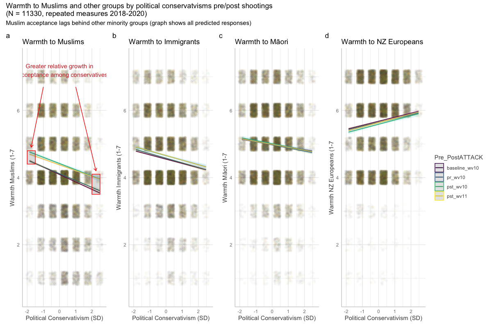

```{r figopen, echo=F}

```


```{r setup, include=FALSE}
# setup
knitr::opts_chunk$set(
  echo = TRUE,
  warning = FALSE,
  message = FALSE,
  layout = "l-body-outset",
  fig.width = 12,
  fig.height = 10,
  collapse = TRUE,
  R.options = list(width = 60
  )
)
```

```{r  libraries, echo=FALSE}
### Libraries
library("tidyverse")
library("ggplot2")
library("patchwork")
library("lubridate")
library("kableExtra")
library("gtsummary")
library("lubridate")
library("equatiomatic")
library("ggdag")
library("brms")
library("rstan")
library("rstanarm")
library("bayesplot")
library("easystats")
library("kableExtra")
library("broom")
library("tidybayes")
library("bmlm")
library("metafor")
library("scales")
library("kableExtra")
library("knitr")
if (!require(metafor)) {
  install.packages("metafor")
}
# rstan options
rstan_options(auto_write = TRUE)
options(mc.cores = parallel::detectCores ())
theme_set(theme_classic())
```

```{r  nzdata, include=FALSE, cache  = TRUE}
# read data
nz_0 <- as.data.frame(readr::read_csv2(
  url(
    "https://raw.githubusercontent.com/go-bayes/psych-447/main/data/nzj.csv"
  )
))

# relevel kessler 6 indicators
f <-
  c(
    "None Of The Time",
    "A Little Of The Time",
    "Some Of The Time",
    "Most Of The Time",
    "All Of The Time"
  )

# Relevel covid timeline 2019
ord_dates_class_2019_only <- c("PreCOVID",
                               "JanFeb",
                               "EarlyMarch",
                               "Lockdown",
                               "PostLockdown")
# get data into shape
nz_cr <- nz_0 %>%
  dplyr::mutate_if(is.character, factor) %>%
  select(
    -c(
      SWB.Kessler01,
      SWB.Kessler02,
      SWB.Kessler03,
      SWB.Kessler04,
      SWB.Kessler05,
      SWB.Kessler06
    )
  ) %>%
  dplyr::mutate(Wave = as.factor(Wave)) %>%
  dplyr::mutate(FeelHopeless = forcats::fct_relevel(FeelHopeless, f)) %>%
  dplyr::mutate(FeelDepressed = forcats::fct_relevel(FeelDepressed, f)) %>%
  dplyr::mutate(FeelRestless = forcats::fct_relevel(FeelRestless, f)) %>%
  dplyr::mutate(EverythingIsEffort = forcats::fct_relevel(EverythingIsEffort, f)) %>%
  dplyr::mutate(FeelWorthless = forcats::fct_relevel(FeelWorthless, f)) %>%
  dplyr::mutate(FeelNervous = forcats::fct_relevel(FeelNervous, f)) %>%
  dplyr::mutate(Wave = as.factor(Wave)) %>%
  dplyr::mutate(male_id = as.factor(Male)) %>%
  dplyr::mutate(date = make_date(year = 2009, month = 6, day = 30) + TSCORE) %>%
  dplyr::mutate(
    FeelWorthless_int = as.integer(FeelWorthless),
    FeelNervous_int =  as.integer(FeelNervous),
    FeelHopeless_int =  as.integer(FeelHopeless),
    EverythingIsEffort_int =  as.integer(EverythingIsEffort),
    FeelRestless_int =  as.integer(FeelRestless),
    FeelDepressed_int =  as.integer(FeelDepressed),
    HLTH.Fatigue_int = as.integer(HLTH.Fatigue + 1)
  ) %>%
  dplyr::mutate(yearS = TSCORE - min(TSCORE, na.rm = TRUE)) %>%
  dplyr::mutate(KESSLER6sum = as.integer(KESSLER6sum))


nz <- nz_cr %>%
  dplyr::filter(YearMeasured == 1) %>%
  dplyr::filter(Wave == 2019) %>%
  dplyr::group_by(Id) %>%
  dplyr::ungroup(Id) %>%
  dplyr::mutate(Covid_Timeline_cr =
                  as.factor(ifelse(
                    TSCORE %in% 3896:3921,
                    # feb 29 - march 25th
                    "EarlyMarch",
                    ifelse(
                      TSCORE %in% 3922:3954,
                      "Lockdown",
                      #march 26- Mon 27 April 2020
                      ifelse(
                        TSCORE > 3954,
                        # after april 27th 20202
                        "PostLockdown",
                        ifelse(TSCORE %in% 3842:3895,
                               # jan 6 to feb 28
                               "JanFeb",
                               "PreCOVID")
                      )
                    )
                  ))) %>%
  dplyr::mutate(Covid_Timeline_cr = forcats::fct_relevel(Covid_Timeline_cr, ord_dates_class_2019_only))

dplyr::glimpse(nz)


## Long data #####################
ord_dates_class <- c("Baseline",
                     "PreCOVID",
                     "JanFeb",
                     "EarlyMarch",
                     "Lockdown",
                     "PostLockdown")

nzl <- nz_cr %>%
  dplyr::filter(YearMeasured == 1) %>%
  dplyr::filter(Wave == 2018 | Wave == 2019) %>%
  dplyr::group_by(Id) %>%
  dplyr::filter(n() > 1) %>%
  dplyr::filter(n() != 0) %>%
  dplyr::ungroup(Id) %>%
  dplyr::mutate(yearS = TSCORE - min(TSCORE, na.rm = TRUE)) %>%
  dplyr::mutate(WSCORE = as.factor(WSCORE)) %>%
  dplyr::mutate(Covid_Timeline =
                  as.factor(ifelse(
                    TSCORE %in% 3896:3921,
                    # feb 29 - march 25th
                    "EarlyMarch",
                    ifelse(
                      TSCORE %in% 3922:3954,
                      "Lockdown",
                      #march 26- Mon 27 April 2020
                      ifelse(
                        TSCORE > 3954,
                        # after april 27th 20202
                        "PostLockdown",
                        ifelse(
                          TSCORE %in% 3842:3895,
                          # jan 6 to feb 28
                          "JanFeb",
                          ifelse(TSCORE %in% 3665:3841 &
                                   Wave == 2019,
                                 "PreCOVID",
                                 "Baseline"  # 3672 TSCORE or  20 July 2019))))))))
                          )
                        )
                      )
                    ))))%>%
  dplyr::mutate(Covid_Timeline = forcats::fct_relevel(Covid_Timeline, ord_dates_class))
  
# View data           
# dplyr::glimpse(nzl)
```

## Objectives

- To unify meta-analysis within the framework of multilevel modeling.
- To extend multilevel modelling to included group-varying slopes (as well as intercepts).
- To understand how to interpret and report results. 


## Meta-analysis 

Matti Vuorre provides and explanation for how to do metanalysis using the BRMS package [here](https://mvuorre.github.io/posts/2016-09-29-bayesian-meta-analysis/). See also, Matti's brmstools package [here](https://github.com/mvuorre/brmstools).  We will follow his approach. 


The `metafor` package has data prepared for meta-analysis.  We import the data:

```{r}
# call data
# data("dat.bangertdrowns2004", package = "metafor")
# 
# # obtain first 15 studies and rename columns
# dat <- dat.bangertdrowns2004 %>%
#   mutate(study = paste0(author, " (", year, ")"), sei = sqrt(vi)) %>%
#   select(study, yi, sei) 
# 
# # Truncate
# dat <- dat[,-c(5:10)] %>% as_tibble()
# 
# # Remove commas in study names
# dat$study <-
#   str_replace(dat$study, ",", "")  
# 

dat <- escalc(measure="ZCOR", ri=ri, ni=ni, data=dat.molloy2014)
dat <- dat[,-c(5:10)] %>% as_tibble()
dat$yi <- as.numeric(dat$yi)
dat$vi <- as.numeric(dat$vi)
dat <- as_tibble(dat)
names(dat) <- c("study", "year", "ni", "ri", "yi", "vi")
dat$study <- paste0(dat$study, " (", dat$year, ")")
dat$sei <- as.numeric(sqrt(dat$vi))
dat$study <- as.character(dat$study)
# Major pain in reordering
dat$study[5] <- "Christensen et al. (1995)"
tmp <- dat[5,]
dat[5,] <- dat[4,]
dat[4,] <- tmp
```

Here, `yi` is the observed outcome in effect size units, and `sei` is the observed sampling variances ($\sigma_i^2$). 
(You can read more about the metafor package [here](https://wviechtb.github.io/metafor/)).

In metanalysis we assume:

$$y_i \sim N(\theta_i, \sigma_i)$$
Where $\theta_i$ is the unknown true effect-size corresponding to $y_i$, where $\theta$ has a standard deviation that is equal to the obeserved standard error $\sigma_i$.

In metanalysis, we assume that there is an underlying parameter which identifies the effect size of the hypothetical population of studies from which the sample of studies collected was drawn. Recall, a parameter is an abstract concept -- it is the property of population that we never observe. As such, 

$$\theta_i \sim N(\mu, \tau)$$

Where $\mu$ is the population average effect size, and $\tau$ is the population standard devaition (or if you prefer: $\tau^2$, the population variance, or between study heterogeneity. 

We can write the metanalytic model as a random intercept model: 

$$y_i \sim N(\mu + \theta_i, \sigma_i)\\
\sigma_i \sim N(0,\tau)$$


### Model

The metanalytic model is written

```{r}
m_meta <- brm(
  yi | se(sei) ~ 1 + (1 | study),
  data = dat,
  control = list(adapt_delta = .99),
  file = here::here("models", "metanalyis")
)
```

```{r}
options(width = 120)

# Shows the prior
summary(m_meta, prior = TRUE)
```


### Hypothesis

Probably that the effect size is great than .2 is .08 (or 8%)

```{r echo = -1}
options(width = 120)
hypothesis(m_meta, "Intercept > 0.2")
```

### Forest plot

The forest plot graphs the posterior distribution of each estimated $\theta_i$. 

The graph shows the meta-analytic effect size $\mu$ in the bottom row. 

Here's Matti's code for making this graph, the observed effect size is the little 'o', and we can the property of partial pooling (or shrinkage) causing the estimates to move to the weighted average of the group means. 


```{r}
library(tidybayes)
library(ggdist)
# Study-specific effects are deviations + average
out_r <- spread_draws(m_meta, r_study[study,term], b_Intercept) %>% 
  mutate(b_Intercept = r_study + b_Intercept) 
# Average effect
out_f <- spread_draws(m_meta, b_Intercept) %>% 
  mutate(study = "Average")

out_f
# Combine average and study-specific effects' data frames
out_all <- bind_rows(out_r, out_f) %>% 
  ungroup() %>%
  # Ensure that Average effect is on the bottom of the forest plot
  mutate(study = fct_relevel(study, "Average")) %>% 
  # tidybayes garbles names so fix here
  mutate(study = str_replace_all(study, "\\.", " "))


# Data frame of summary numbers
out_all_sum <- group_by(out_all, study) %>% 
  mean_qi(b_Intercept)
# Draw plot
out_all %>%   
  ggplot(aes(b_Intercept, study)) +
  # Zero!
  geom_vline(xintercept = 0, size = .25, lty = 2) +
  stat_halfeye(.width = c(.8, .95), fill = "dodgerblue") +
  # Add text labels
  geom_text(
    data = mutate_if(out_all_sum, is.numeric, round, 2),
    aes(label = str_glue("{b_Intercept} [{.lower}, {.upper}]"), x = 1.75),
    hjust = "inward"
  ) +
  # Observed as empty points
  geom_point(
    data = dat %>% mutate(study = str_replace_all(study, "\\.", " ")), 
    aes(x=yi), position = position_nudge(y = -.2), shape = 1 
  )
```


## Varying slopes

Last week, we considered how group-level intercepts allow us to more pool information across clusters. We have just considered how modelling a group-level intercept is the engine behind meta-analysis. Nex we consider how to effectively variability in the slope of an effect across clusters. This requires estimation of a multivariate distribution for both the intercepts of the cluster and slope of an effect between the the clusters. In a vary-ing intercept/varying slope multilevel model we must estimate the *covariance* of group-level intercepts and slopes. 


$$\begin{pmatrix}
\text{variances of the intercepts} &  \text{co-variances of the intercepts and slopes}   \\
\text{co-variances of the intercepts and slopes}    &  \text{variances of the slopes} &
\end{pmatrix}$$


Using mathematical notation for the matrix: 


$$\begin{pmatrix}
\sigma_\alpha^2 &  \sigma_\alpha\sigma_\beta \rho  \\
 \sigma_\alpha\sigma_\beta \rho  &  \sigma_\beta^2 &
\end{pmatrix}$$


The varianceses for the intercepts and slopes are along the diagonal, and their co-variances are along the off-diagonal. The co-variances are the products of the  standard deviations $\times$ their correlation

Here we folllow a simulation from Richard McElreath's *Statistical Rethinking*, which simulates a dataset in which the average wait times for a coffee in the morning at a cafe are correlated with the average wait times for a coffee in the afternoon at the same cafe. 

First the basic set up of the code:

```{r code_folding = FALSE}
a <- 3.5 # average morning wait time
b <- (-1) # average difference afternoon wait time
sigma_a <- 1 # std dev in intercepts
sigma_b <- 0.5 # std dev in slopes
rho <- (-0.7) #correlation between intercepts and slopes”

# mean 

Mu <- c( a , b )

# Covariance of a and b
cov_ab <- sigma_a * sigma_b * rho

# Create a matrix with variances along the diagnols and the covariances on the off diagnols: 

Sigma <- matrix( c(sigma_a^2,cov_ab,cov_ab,sigma_b^2) , ncol=2 )


## Note that we can treat the correlations and the covariances separately, which is useful for assigning priors. We won't need to assign priors today, but it is useful to have the code.
sigmas <- c(sigma_a,sigma_b) # standard deviations
Rho <- matrix( c(1,rho,rho,1) , nrow=2 ) # correlation matrix

# nmatrix multiply to get covariance matrix -- this is the same Sigma matrix as above:

Sigma <- diag(sigmas) %*% Rho %*% diag(sigmas)
```

Next we simulate the data

Simulate cafes and their average properties:

```{r}
n_cafes <- 20 

# For generating multivariate normal distributions
library(MASS)
set.seed(5) # used to replicate example

# Matrix with 20 rows and 2 columns

vary_effects <- mvrnorm( n_cafes , Mu , Sigma )
vary_effects
```

Each row is a cafe. The first column contains the intercepts and the second column contains the slopes.  We can graph the correlation

```{r}
a_cafe <- vary_effects[,1] # intercept
b_cafe <- vary_effects[,2] # slope
```

```{r}
library(rethinking)
plot( a_cafe , 
      b_cafe , 
      col=rangi2 ,
      xlab= "intercepts (a_cafe)" , 
      ylab = "slopes (b_cafe)" 
      )

# overlay population distribution
library(ellipse)
for ( l in c(0.1,0.3,0.5,0.8,0.99) )
lines(
  ellipse(Sigma,
              centre = Mu,
              level=l),
      col=col.alpha("black",0.2)
      )


```

Next we simulate sampling from these cafes

```{r code_folding = FALSE}

set.seed(22)
n_visits <- 10

afternoon <- rep(0:1, n_visits * n_cafes/2)

cafe_id <- rep( 1:n_cafes , each = n_visits )

mu <- a_cafe[cafe_id] + b_cafe[cafe_id] * afternoon

sigma <- 0.5 # std dev within cafes

wait <- rnorm( n_visits * n_cafes , mu , sigma )

d <- data.frame( cafe=cafe_id , afternoon = afternoon , wait = wait )

head(d)
```

We can write out the math:

$$wait_i \sim N(\mu_i, \sigma) \\
\mu_i = \alpha_{\text{cafe}_i} + \beta_{\text{cafe}_i}A_i\\
\begin{bmatrix}
\alpha_{\text{cafe}} \\
\beta_{\text{cafe}} 
\end{bmatrix}
\sim 
\text{MVNormal} \begin{pmatrix}
\begin{bmatrix}
\alpha_{\text{cafe}} \\
\beta_{\text{cafe}} 
\end{bmatrix}
\boldsymbol{S},
\end{pmatrix} \\
\boldsymbol{S} = \begin{pmatrix}
\sigma_{\text{cafe}} & 0  \\
0  &  \sigma_{\text{cafe}}\end{pmatrix} \boldsymbol{R} \begin{pmatrix}
\sigma_{\text{cafe}} & 0  \\
0  &  \sigma_{\text{cafe}}
\end{pmatrix}\\$$ 


Each cafe has an intercept $\alpha_i$ and a slope $\beta_i$ that samples from a two dimensional Gaussian distribution with means $\alpha$ and $\beta$ and a covariance matrix $\boldsymbol{S}$. The $\boldsymbol{S}$ matrix factors into the a matrix for the separate standard deviations of $\alpha$ and $\beta$,  $\sigma_{alpha}$ and $\sigma_{beta}$ and the correlation matrix $\boldsymbol{R}$


Recall that we assume our paramters are sampling from distributions. In bayesian estimation we can be explicit about this: 


$$
\alpha \sim N(5,2) \\
\beta \sim N(-1,5) \\
\sigma \sim exp(1) \\
\sigma_a \sim exp(1) \\
\sigma_b \sim exp(1) \\
\boldsymbol{R} \sim LKJcorr(1) \\
$$

The LKJcorr prior assumes:

$$\boldsymbol{R}  = 
\begin{pmatrix}
1 & \rho  \\
\rho  &  1
\end{pmatrix}$$


Here are some correlations distributions

LJK = 1

```{r}
R <- rlkjcorr( 1e4 , K=2 , eta=1)
dens( R[,1,2] , xlab= "correlation" )
```


LJK = 2

```{r}
R <- rlkjcorr( 1e4 , K=2 , eta=2)
dens( R[,1,2] , xlab= "correlation" )
```


LJK = 4

```{r}
R <- rlkjcorr( 1e4 , K=2 , eta=3)
dens( R[,1,2] , xlab= "correlation" )
```


We can estimate the model (at last)

```{r code_folding = FALSE}
m_vslopes  <-
  brm(
    wait ~ 1 + afternoon + (1 + afternoon | cafe),
    prior = c(
      prior(normal(5, 2), class = Intercept),
      prior(normal(-1, 10), class = b),
      prior(exponential(1), class = sd),
      prior(exponential(1), class = sigma),
      prior(lkj(2), class = cor)
    ),
    file = here::here("models", "multi-level-var-slopes"),
    data = d,
    family = gaussian
  )
```


```{r}
options(width = 120)
# Shows the prior
summary(m_vslopes, prior = TRUE)
```

```{r}
sjPlot::tab_model(m_vslopes)
```


```{r code_folding=FALSE}
p1 <- brms::mcmc_plot(m_vslopes, 
               type = "areas",
               prob = .89)
p1
```


Compare to a model with no prior:

```{r code_folding = FALSE}
m_vslopes_np  <-
  brm(
    wait ~ 1 + afternoon + (1 + afternoon | cafe),
    file = here::here("models", "multi-level-var-slopes-no-prior"),
    data = d,
    family = gaussian
  )
```


```{r}
options(width = 120)
# Shows the prior
summary(m_vslopes_np, prior = TRUE)
```


```{r code_folding=FALSE}
p2 <- brms::mcmc_plot(m_vslopes_np, 
               type = "areas",
               prob = .89)

# Comparison graph
p1 + p2 + plot_annotation(title = "Priors (a) vs Default Priors (b)", tag_levels = "a")
```


<!-- We can graph the results: -->

<!-- ```{r cache = TRUE} -->
<!-- plot( -->
<!--   conditional_effects( -->
<!--    m_vslopes, -->
<!--    spaghetti = TRUE, -->
<!--     nsamples = 100, -->
<!--     categorical = T, -->
<!--     prob = 0.89, -->
<!--     re_formula = TRUE, -->
<!--   ), -->
<!--   points = TRUE, -->
<!--   point_args = list(alpha = 0.1, -->
<!--                     width = .02) -->
<!-- ) #  note this command controls which facet -->
<!-- ``` -->


### Just the syntax please

See: [glmmFAQ](https://bbolker.github.io/mixedmodels-misc/glmmFAQ.html)


E.g. intercept varying among crossed grouping effects (e.g. site, year)

```{r eval = FALSE}
lme4::lmer(y ~ intercept + beta1 + beta2  + (1|group) + (1|group))
```

Correlated intercepts and slopes varying between crossed grouping effects

```{r eval = FALSE}
lme4::lmer(y ~ intercept + beta1 + beta2  + (1|group) + (1|group))
```

Recall that we have the equatiomatic package:

```{r}
library(lme4)
library(equatiomatic)
fm1 <- lmer(Reaction ~ Days + (Days|Subject), sleepstudy)
equatiomatic::extract_eq(fm1)
```


### Within and between group estimation


Example from the parameters package {here](https://easystats.github.io/parameters/articles/demean.html)


```{r}
library(ggplot2)
library(dplyr)
library(see)

set.seed(123)
n <- 5
b <- seq(1, 1.5, length.out = 5)
x <- seq(2, 2 * n, 2)

di <- do.call(rbind, lapply(1:n, function(i) {
  data.frame(
    x = seq(1, n, by = .2),
    y = 2 * x[i] + b[i] * seq(1, n, by = .2) + rnorm(21),
    grp = as.factor(2 * i)
  )
}))

dp <- di %>%
  group_by(grp) %>%
  mutate(x = rev(15 - (x + 1.5 * as.numeric(grp)))) %>%
  ungroup()

labs <- c("very slow", "slow", "average", "fast", "very fast")
levels(dp$grp) <- rev(labs)

dp <- cbind(dp, 
           demean(dp, 
                  c("x", "y"),
                  group = "grp")
           )

d <- dp %>%
  dplyr::mutate(x_c = scale(x, center = TRUE, scale = FALSE))%>%
  dplyr::mutate(x_between_c = scale(x_between, center = TRUE, scale = FALSE))  
```


Graph data


```{r}
ggplot2::ggplot(data = d,
                aes(x = x,
                    y = y)) + 
  geom_point() + 
  geom_smooth(method = "lm") + xlab("speed") + ylab("errors")
```


When we assess the relationship within a group

```{r}
ggplot2::ggplot(data = d,
                aes(x = x,
                    y = y,
                    colour = grp)) + 
  geom_point() + 
  geom_smooth(method = "lm")
```


```{r code_folding = FALSE}
head(d)
m0 <- lme4::lmer(y ~ x_between_c + x_within +  (1 + x_within| grp), data = d)

model_parameters(m0)
#equatiomatic::extract_eq(m1)
```


```{r code_folding = FALSE}
head(d)
m1 <- brms::brm(y ~ x_between_c + x_within +  (1 + x_within| grp), 
                data = d,
                file = here::here("models","ml_within"))
```


```{r}
options(width = 120)
# Shows the prior
summary(m1, prior = TRUE)
```

```{r code_folding=FALSE}
color_scheme_set("red")
p_m1 <- bayesplot::mcmc_intervals(m1, 
              regex_pars  = c("b_x_between","b_x_within"))
p_m1
```

```{r code_folding=FALSE}
color_scheme_set("red")
p_m1 <- bayesplot::mcmc_intervals(m1, 
              regex_pars  = c("r_"))
p_m1
```


What if we were to ignored between and within indicators? 


```{r code_folding = FALSE}

m2 <- brms::brm(y ~ x_c +  (1 + x_c| grp), 
                data = d,
                file = here::here("models","ml_no_within"))

```


```{r}
options(width = 120)
# Shows the prior
summary(m2, prior = TRUE)
```

Greater speed = greater errors, faster groups = fewer errors:

```{r code_folding=FALSE}
color_scheme_set("red")
p_m2 <- bayesplot::mcmc_intervals(m2, 
              regex_pars  = c("r_","b_"))
p_m2
```


Spag. Plot

```{r}
out_f <- conditional_effects(
  m2,
  "x_c"
  )[[1]]
out_r <- conditional_effects(
  m2,
  "x_c", 
  conditions = distinct(d, grp),
  re_formula = NULL
  )[[1]]
out_r %>% 
  ggplot(aes(x_c, estimate__)) +
  geom_ribbon(
    data = out_f,
    aes(ymin = lower__, ymax = upper__),
    alpha = .33
  ) +
  geom_line(data = out_f, size = 2, jitter =.1) +
  geom_line(aes(group = grp))
```


<!-- ```{r} -->
<!-- mcmc_dens_overlay(m2,  -->
<!--                   regex_pars  = "r_", -->
<!--                   facet_args = list(ncol = 1), -->
<!--                   strip.position = "left") -->
<!-- ``` -->

