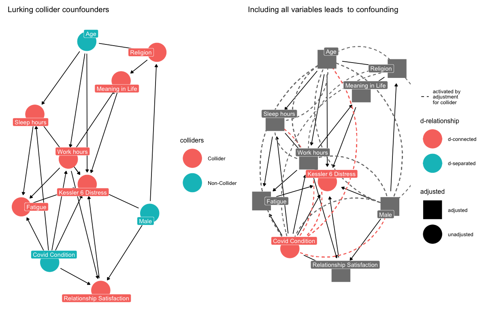

```{r echo=F}
knitr::include_graphics("op.png")
```

## Required readings

Required readings are as follows:

-   @rohrer2018 [link](https://journals.sagepub.com/doi/full/10.1177/2515245917745629)
-   @barrett2021 [link](https://cran.r-project.org/package=ggdag)
-   @mcelreath2020[link](https://tewaharoa.victoria.ac.nz/discovery/fulldisplay?docid=alma99179374299902386&context=L&vid=64VUW_INST:VUWNUI&search_scope=MyInst_and_CI&tab=all&lang=en)


```{r echo = TRUE, include = FALSE}
# packages
# install_rethinking
# function for installing dependencies
ipak <- function(pkg){
new.pkg <- pkg[!(pkg %in% installed.packages()[, "Package"])]
if (length(new.pkg)) 
    install.packages(new.pkg, dependencies = TRUE) 
sapply(pkg, require, character.only = TRUE)
}
# usage
packages <- c("coda", "plyr", "mvtnorm", "scales", "dagitty")
ipak(packages)
# next install rethinking
if (!require(rethinking)) {
  devtools::install_github("rmcelreath/rethinking")
}
#next install ggdag
if (!require(rethinking)) {
  devtools::install_github("malcolmbarrett/ggdag")
}
if (!require(rethinking)) {
  devtools::install_github("larmarange/labelled")
}
# installed from previous lectures
library("equatiomatic")
library("tidyverse")
library("ggdag")
library("brms")
library("rstan")
library("rstanarm")
library("tidybayes")
library("bayesplot")
library("easystats")
# rstan options
rstan_options(auto_write=TRUE)
options(mc.cores=parallel::detectCores ())
theme_set(theme_classic())
```

## Objectives 

- To clarify the concepts of causal inference and causal confounding
- To use these concepts, in combination with the `ggdag` package, to develop a workflow for causal inference that mitigates the risks of causal confounding. 
- To introduce tools for multiple-imputation, which addresses missing data problems that may lead to causal confounding. 


## What is causal inference? 

Up to this point in the course, we have been using regression for prediction, asking: 

> what is the expected change in why conditional on different levels or increments of x

Prediction is useful for many practical questions:

- "Which candidate is more likely to win the election?"
- "Are people getting happier as they get older?"
- "Does having meaning and purpose in life predict lower psychological distress.  

However, scientists seek causal explanations: 

- Why did people who in 2012 voted for Barack Obama switch party vote in 2016 to support Donald Trump? (If the pattern of variation of stability and change is not random what causes the pattern?)

To address the question of stability and change in political allegiance we need a theory of political motivation, and we must test its predictions. 

- Observing that people who are older are happier does not settle clarify why older people are happier. Similarly we need a theory to test. 

- Observing that meaning of life is associated with lower distress does not clarify the direction of causation. 


Most of the theories in psychological science are causal explanations: they make claims about how people think and why they act.  Regression enables use to examine the correlations outcome variables and predictor variables. As such, it is an exquisite crystal ball into the future. However, to use regression to answer "Why" causal inference we need to undertand how regression enables us to test causal theories, and we need to address the pitfalls. 

### The difference between prediction and explanation?

## What is causal confounding?

```{r figopen, echo=F}

```

## Examples of confounding


Familiar case

* m$\to$x
* m$\to$y 

```{r}
library(ggdag)
theme_set(theme_dag())
confounder_triangle()%>%
  ggdag_dconnected()
```

Simulate the DAG

```{r echo = FALSE, include = FALSE}
set.seed(123)
N <-100
z <- rnorm( N )# sim A
x <- rnorm( N , -z ) # sim A -> M
y <- rnorm( N , z ) # sim A -> D
df <- data.frame(x,z,y)
plot(y ~ x)
```

```{r}
m0<-lm(y ~ x, data = df)
parameters::model_parameters(m0)
```


We are familiar with this need to "control for" z.

```{r}
m1<-lm(y ~ x + z, data = df)
parameters::model_parameters(m1)
```

By adding the "control" in the model, we remove the spurious relationship between x and z.

We can use the following code in ggdag to test the familiar case:

```{r}
ggdag_0<-dagify(y ~ z,
       x ~ z,
       exposure = "x",
       outcome = "y") %>% 
  tidy_dagitty(layout = "tree")
ggdag::ggdag_adjustment_set(ggdag_0)
```

The graph tells us to obtain an unbiased estimate of y on x we must condition on z. 


## Mediation 

What do we do if we are have this model:

```{r}
dag_1 <- dagify(y ~ x + m,
       m ~ x,
       exposure = "x",
       outcome = "y") %>% 
  tidy_dagitty(layout = "tree")

dag_1%>%
  ggdag()
```


This is the code for assessing adjustment sets:

```{r}
ggdag::ggdag_adjustment_set(dag_1)
```

The answer is we just regress y on x. Why? x is already and unbiased predictor of z.

```{r}
ggdag::ggdag_dconnected(dag_1)
```

To test this, we can simulate the DAG

```{r echo = FALSE, include = FALSE}
set.seed(123)
N <-100
x <- rnorm( N )# sim x
m <- rnorm( N , x ) # sim A -> M
y <- rnorm( N , x + m ) # sim A -> D
df2 <- data.frame(x,m,y)

df2<- df2%>%
  dplyr::mutate(x_s = scale(x),
         m_s = scale(m))
```

```{r}
m2<-lm(y ~ x_s, data = df2)
parameters::model_parameters(m2)
```

And if we include both, we recover both effects: 

```{r}
m2<-lm(y ~ x_s + m_s, data = df2)
parameters::model_parameters(m2)
```

However, note that we didn't need to condition on m to estimate the *causal* effect of x.


Consider another form of mediation:

```{r}
mediation_triangle(x = NULL, y = NULL, m = NULL, x_y_associated = FALSE)%>%
  ggdag()
```

We are interested in the effect of x on y.  What do we condition on? 

Imagine it is an experiment. A ritual activity (x) influences charity towards others a way that that is fully mediated by social cohesion.

ritual $\to$ social cohesion $\to$ charity


Lets simulate:

```{r echo = FALSE, include = FALSE}
set.seed(71)
# Participants
N <-100

# intial charitable giving
c0 <- rnorm(N ,10 ,2)

# assign treatments and simulate charitable giving and increase in social cohesion
ritual <- rep( 0:1 , each = N/2 )
cohesion <- ritual * rnorm(N,.5,.2)

# increase in charity
c1 <- c0 + ritual * cohesion 

# dataframe
d <- data.frame( c0 = c0 , 
                 c1=c1 , 
                 ritual = ritual , 
                 cohesion = cohesion )

rethinking::precis(d)
```

Does the ritual increase charity? 


```{r}
parameters::model_parameters(
  lm(c1 ~  c0 + ritual, data = d)
  )
```


Does the ritual increase charity adjusting for social cohesion? 


```{r}
parameters::model_parameters(
  lm(c1 ~  c0 + ritual + cohesion, data = d)
  )
```

## NZ example


```{r echo = FALSE, include = FALSE}
N <-100
age <- rnorm( N )# sim A
mar <- rnorm( N , -age ) # sim A -> M
div <- rnorm( N , age ) # sim A -> D
df <- data.frame(age,mar,div)
plot(age ~ mar)
md<-lm(mar ~ age, data = df)
summary(md)
```


```{r echo = FALSE, include = FALSE}
N <-100
age <- rnorm( N )# sim A
mar <- rnorm( N , -age ) # sim A -> M
div <- rnorm( N , age ) # sim A -> D
df <- data.frame(age,mar,div)
plot(age ~ mar)
md<-lm(mar ~ age, data = df)
summary(md)
sjPlot::plot_model(md)
```

```{r echo = FALSE, include = FALSE}
## Confound 
south<-rnorm(N)
waffles <-rnorm(N, south)
age <- rnorm(N, south)
mar <- rnorm( N, -age ) # sim A -> M
div <- rnorm( N,  age ) # sim A -> D
df <- data.frame(age,mar,div,south,waffles)
md<-lm(div ~ waffles + mar + south, data = df)
summary(md)
sjPlot::plot_model(md)
```

The New Zealand Attitudes and Values Study that is relevant to evaluating the theory of whether prototypicality of Māori group membership "moderates" the effect of perceived discrimination on ethnic identity in Māori.^[I place "moderates" in shutter quotations because it is not clear what this means: moderates as in predicts or moderates as in causes.] 

The variables are from *Wave 4* of the NZAVS jitter2 data set are:

- T4.MAORI.GME  (Māori Group membership and evaluation)
- T4.MAORI.VEM (Māori Perceived Appearance)
- Perc.Discrim.T04 (Perceived discrimination - ethnicity)
  * I Feel that I am often discriminated against because of my ethnicity.
  * I feel that I am often discriminated against because of my ethnicity.


```{r}
# importa data:
```


<!-- <- rnorm( N ) # sim x -->
<!-- o <- rnorm( N , x ) # sim A -> M -->
<!-- y <- rnorm( N , m ) # sim A -> D -->
<!-- df3 <- data.frame(x,m,y) -->

<!-- df3<- df3 %>% -->
<!--   dplyr::mutate(x_s = scale(x), -->
<!--          m_s = scale(m)) -->
<!-- ```{r} -->
<!-- m3<-lm(y ~ x_s + m_s, data = df3) -->
<!-- parameters::model_parameters(m3) -->
<!-- ``` -->
