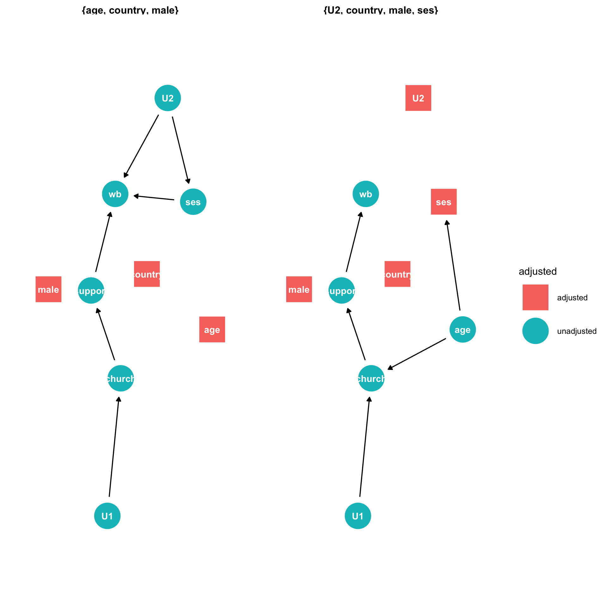

```{r echo=F}

```

## Required readings

Required readings are as follows:

-   @rohrer2018 [link](https://journals.sagepub.com/doi/full/10.1177/2515245917745629)
-   @barrett2021 [link](https://cran.r-project.org/package=ggdag)
-   @mcelreath2020[link](https://tewaharoa.victoria.ac.nz/discovery/fulldisplay?docid=alma99179374299902386&context=L&vid=64VUW_INST:VUWNUI&search_scope=MyInst_and_CI&tab=all&lang=en)

```{r echo = TRUE, include = TRUE}
# packages
# install_rethinking
# function for installing dependencies
ipak <- function(pkg){
new.pkg <- pkg[!(pkg %in% installed.packages()[, "Package"])]
if (length(new.pkg)) 
    install.packages(new.pkg, dependencies = TRUE) 
sapply(pkg, require, character.only = TRUE)
}
# usage
packages <- c("coda", "plyr", "mvtnorm", "scales", "dagitty")
ipak(packages)
# next install rethinking
if (!require(rethinking)) {
  devtools::install_github("rmcelreath/rethinking")
}
#next install ggdag
if (!require(ggdag)) {
  devtools::install_github("malcolmbarrett/ggdag")
}


# installed from previous lectures
library("tidyverse")
library("ggdag")
library("brms")
library("rstan")
library("rstanarm")
library("tidybayes")
library("bayesplot")
library("easystats")
# rstan options
rstan_options(auto_write=TRUE)
options(mc.cores=parallel::detectCores ())
theme_set(theme_classic())
```

```{r echo = FALSE}
knitr::opts_chunk$set(
  echo = TRUE,
  warning = FALSE,
  message = FALSE,
  layout = "l-body-outset",
  fig.width = 12,
  fig.height = 10,
  collapse = TRUE,
  R.options = list(width = 60)
)
```

## Objectives

-   To clarify the concepts of causal inference and causal confounding
-   To use these concepts, in combination with the `ggdag` package, to develop a workflow for causal inference that mitigates the risks of causal confounding. <!-- - To introduce tools for multiple-imputation, which addresses missing data problems that may lead to causal confounding.  -->

## What is causal inference?

Up to this point in the course, we have been using regression for prediction, asking:

> what is the expected change in why conditional on different levels or increments of x

Prediction is useful for many practical questions:

-   "Which candidate is more likely to win the election?"
-   "Are people getting happier as they get older?"
-   "Does having meaning and purpose in life predict lower psychological distress.

However, scientists seek causal explanations:

-   Why did people who in 2012 voted for Barack Obama switch party vote in 2016 to support Donald Trump? (If the pattern of variation of stability and change is not random what causes the pattern?)

To address the question of stability and change in political allegiance we need a theory of political motivation, and we must test its predictions.

-   Observing that people who are older are happier does not settle clarify why older people are happier. Similarly we need a theory to test.

-   Observing that meaning of life is associated with lower distress does not clarify the direction of causation.

Most of the theories in psychological science are causal explanations: they make claims about how people think and why they act. Regression enables use to examine the correlations outcome variables and predictor variables. As such, it is an exquisite crystal ball into the future. However, to use regression to answer "Why" causal inference we need to understand how regression enables us to test causal theories, and we need to address the pitfalls.

## Omitted variable bias

Familiar case:

```{r}
library(ggdag)
theme_set(theme_dag())
# create confounded triangle
confounder_triangle() %>%
  ggdag_dconnected()
```

What do we need to do if there is an omitted variable linking x to y?

```{r}
set.seed(123)
N <- 100
z <- rnorm(N)# sim z
x <- rnorm(N , -z) # sim z -> x
y <- rnorm(N , z) # sim z -> y
df <- data.frame(x, z, y)

# There appears to be a relationship between x --> y
plot(x, y)
```

We can regress x on y:

```{r}
m0 <- lm(y ~ x, data = df)
parameters::model_parameters(m0)
```

We are familiar with this need to "control for" z. When we included the omitted variable, z, it breaks the association between x and y:

```{r}
m1 <- lm(y ~ x + z, data = df)
parameters::model_parameters(m1)
```

The `ggdag` package is useful for identifying potential confounding in your dataset. Warning: assessing causal inference requires assumptions that are *not* in your dataset.

For now, let's use ggdag to identify confounding arising from omitting z in our regression of x on y.

First we write out the DAG as follows:

```{r}
# code for creating a DAG
ggdag_0_full <- dagify(y ~ z,
                       x ~ z,
                       exposure = "x",
                       outcome = "y") %>%
  tidy_dagitty(layout = "tree")

# plot the DAG
ggdag_0_full %>%
  ggdag()
```

Next we ask ggdag which variables we need to condition on to obtain an unbiased estimate of the outcome from the exposure:

```{r}
# use this code
ggdag::ggdag_adjustment_set(ggdag_0_full)
```

The graph tells us to obtain an unbiased estimate of y on x we must condition on z.

## Mediation and causation

Suppose we are interested in the causal effect of x on y. We have a direct effect of x on y as well as an indirect effect of x on y through m.

```{r}
dag_1 <- dagify(y ~ x + m,
                m ~ x,
                exposure = "x",
                outcome = "y") %>%
  tidy_dagitty(layout = "tree")

dag_1 %>%
  ggdag()
```

What should we condition on if we are interested in the causal effect of changes in x on changes in y?

We can pose the question to ggdag:

```{r}
ggdag::ggdag_adjustment_set(dag_1)
```

The answer is we just regress y on x. There is no backdoor path from x to y that would bias our estimate.

Putting this another way, x and y are `d-connected`:

```{r}
ggdag::ggdag_dconnected(dag_1)
```

To test this, we can simulate the DAG

```{r echo = FALSE, include = FALSE}
set.seed(123)
N <- 100
x <- rnorm(N)# sim x
m <- rnorm(N , x) # sim A -> M
y <- rnorm(N , x + m) # sim A -> D
df2 <- data.frame(x, m, y)

df2 <- df2 %>%
  dplyr::mutate(x_s = scale(x),
                m_s = scale(m))
```

The model

```{r}
m2 <- lm(y ~ x_s, data = df2)
parameters::model_parameters(m2)
```

And if we include both x_s and m_s, we recover both the direct effect of x on y, as well as the mediation effect of m on y:

```{r}
m2 <- lm(y ~ x_s + m_s, data = df2)
parameters::model_parameters(m2)
```

Recall that we could write a mediation model

```{r}
path_m <- brms::bf(m_s ~ x_s)
path_y <- brms::bf(y ~ x_s + m_s)

m1 <- brms::brm(
  path_m + path_y + set_rescor(FALSE),
  data = df2,
  file = here::here("models","mediation-lect11-1")
)

parameters::model_parameters(m1)
```

Recalling:

```{r}
bmlm::mlm_path_plot(xlab = "Focal\n(X)",
              mlab = "Mediator\n(M)",
              ylab = "Outcome\n(Y)")
```

We recover the indirect, direct and total effects as follow:

```{r}
post <- brms::posterior_samples(m1)
post2 <- post %>% 
  transmute(
    a = b_ms_x_s ,
    b = b_y_m_s,
    cp = b_y_x_s,
    me = a * b,
    c = cp + me,
    pme = me / c
  )
mcmc_intervals(post2)
```

So we can ask how x affected y in relation to x's effect on m. However, to obtain an unbiased causal estimate of x on y we only needed to include x_s. We didn't need to condition on m to estimate the *causal* effect of x.

## Pipe confounding (full mediation)

Suppose we are interested in the effect of x on y, in a scenario when m fully mediates the relationship of x on y.

```{r}
mediation_triangle(x = NULL, y = NULL, m = NULL, x_y_associated = FALSE)%>%
  ggdag()
```

What variables do we need to include to obtain an unbiased estimate of x on y?

Let's fill out this example out by imagining an experiment. We want to know whether a ritual action condition (x) influences charity (y), and assume this happens entirely through perceived social cohesion:

ritual $\to$ social cohesion $\to$ charity

Lets simulate some data

```{r echo = FALSE, include = FALSE}
set.seed(123)
# Participants
N <-100

# initial charitable giving
c0 <- rnorm(N ,10 ,2)

# assign treatments and simulate charitable giving and increase in social cohesion
ritual <- rep( 0:1 , each = N/2 )
cohesion <- ritual * rnorm(N,.5,.2)

# increase in charity
c1 <- c0 + ritual * cohesion 

# dataframe
d <- data.frame( c0 = c0 , 
                 c1=c1 , 
                 ritual = ritual , 
                 cohesion = cohesion )

# this code is handy from the rethinking package
rethinking::precis(d)
```

Does the ritual increase charity?

If we only include the ritual condition in the model, we find that ritual condition reliable predicts increases in charitable giving:

```{r}
parameters::model_parameters(
  lm(c1 ~  c0 + ritual, data = d)
  )
```

Does the ritual increase charity adjusting for levels of social cohesion?

```{r}
parameters::model_parameters(
  lm(c1 ~  c0 + ritual + cohesion, data = d)
  )
```

The answer is that the (direct) effect of ritual entirely drops out when we include both ritual and social cohesion. Why is this? The answer is that once our model knows `m` it does not obtain any new information by knowing `x`.

If we were interested in assessing x$\to$y but x were to effect y through m (i.e x$\to$m$\to$y) then conditioning on m would **block the path** from x$\to$y. Including m leads to **Pipe Confounding**.

In experiments we should never condition on a post-treatment variable.

## Masked relationships

Imagine two variables were to affect an outcome. Both are correlated with each other. One affects the outcome positively and the other affects the outcome negatively. How shall we investigate the causal role of the focal predictor?

Consider two correlated variables that jointly predict Political conservatism (C), religion (R). Imagine that one variable has a positive effect and the other has a negative effect on distress (K6).

First consider this relationship, where conservatism causes religion

```{r}
dag_m1 <- dagify(K ~ C + R,
                 R ~ C,
                 exposure = "C",
                 outcome = "K") %>%
  tidy_dagitty(layout = "tree")

dag_m1%>%
  ggdag()
```

We can simulate the data:

```{r}
# C -> K <- R
# C -> R
set.seed(123)
n <- 100
C <- rnorm( n )
R <- rnorm( n , C )
K <- rnorm( n , R - C )

d_sim <- data.frame(K=K,R=R,C=C)
```

First we only condition on conservatism

```{r}
ms1 <- parameters::model_parameters(
  lm(K  ~ C, data = d_sim)
)
plot(ms1)
ms1
```

Next only religion:

```{r}
ms2<- parameters::model_parameters(
  lm(K  ~ R, data = d_sim)
)
plot(ms2)
```

We we add both, we see them "pop," as is typical of masking:

```{r}
ms3<- parameters::model_parameters(
  lm(K  ~ C + R, data = d_sim)
)
plot(ms3)
```

Mediation model

```{r}
path_m <- brms::bf(R ~ C)
path_y <- brms::bf(K ~ C + R)

m2 <- brms::brm(
  path_m + path_y + set_rescor(FALSE),
  data = d_sim,
  file = here::here("models","mediation-lect11-2")
)

parameters::model_parameters(m2)
```

Recalling:

```{r}
bmlm::mlm_path_plot(xlab = "Focal\n(X)",
              mlab = "Mediator\n(M)",
              ylab = "Outcome\n(Y)")
```

We recover the indirect, direct and total effects as follow:

```{r}
post <- brms::posterior_samples(m2)
post2 <- post %>% 
  transmute(
    a = b_R_C ,
    b = b_K_R,
    cp = b_K_C,
    me = a * b,
    c = cp + me #,
  #  pme = me / c
  )
mcmc_intervals(post2)
```

Note that when you ask ggdag to assess how to obtain an unbiased estimate of C on K it will tell you you don't need to condition on R.

```{r}
dag_m1%>%
  ggdag_adjustment_set()
```

Yet recall when we just assessed the relationship of C on K we got this:

```{r}
plot(ms1)
```

Is the DAG wrong? No. The fact that C$\to$R is positive and R$\to$K is negative means that if we were to increase C, we wouldn't reliably increase K. The total effect of C just isn't reliable.

## Collider Confounding.

The selection-distortion effect (Berkson's paradox) (From Statistical Rethinking).

Imagine in science there is no relationship between the newsworthiness of science and its trustworthiness. Imagine further that selection committees make decisions on the basis of the both newsworthiness and the trustworthiness of scientific proposals.

This presents us with the following graph

```{r code_folding = TRUE}
dag_sd <- dagify(S ~ N,
                 S ~ T,
                 labels = c("S" = "Selection",
                            "N" = "Newsworthy",
                            "T" = "Trustworthy")) %>%
  tidy_dagitty(layout = "nicely")

dag_sd %>%
  ggdag(text = FALSE, use_labels = "label")
```

When two arrows enter into an variable, it opens a path of information between the two variables.

```{r  code_folding = TRUE}
ggdag_dseparated(
  dag_sd,
  from = "T",
  to = "N",
  controlling_for = "S",
  text = FALSE,
  use_labels = "label"
)
```

We can use the `ggdag package` to find colliders among our variables:

```{r}
ggdag::ggdag_collider(dag_sd,
                      text = FALSE,
                      use_labels = "label")
```

The following simulation (by Solomon Kurz) illustrates the selection-distortion effect, which Richard McElreath discusses in *Statistical Rethinking*:

First simulated uncorrelated variables and a process of selection for sub-populations score high on both indicators.

```{r  code_folding = TRUE}
# simulate selection distortion effect, following Solomon Kurz
# https://bookdown.org/content/4857/the-haunted-dag-the-causal-terror.html
set.seed(123)
n <- 1000  # number of grant proposals
p <- 0.05  # proportion to select

d <-
  # uncorrelated newsworthiness and trustworthiness
  tibble(
    newsworthiness  = rnorm(n, mean = 0, sd = 1),
    trustworthiness = rnorm(n, mean = 0, sd = 1)
  ) %>%
  # total_score
  mutate(total_score = newsworthiness + trustworthiness) %>%
  # select top 10% of combined scores
  mutate(selected = ifelse(total_score >= quantile(total_score, 1 - p), TRUE, FALSE))
```

Next filter out the high scoring examples, and assess their correlation.

Note that the act of selection *induces* a correlation within our dataset.

```{r}
d %>% 
  filter(selected == TRUE) %>% 
  select(newsworthiness, trustworthiness) %>% 
  cor()
```

This makes it seems as if there is a relationship between Trustworthiness and Newsworthiness in science, even when there isn't any.

```{r  code_folding = TRUE}
# we'll need this for the annotation
text <-
  tibble(
    newsworthiness  = c(2, 1),
    trustworthiness = c(2.25, -2.5),
    selected        = c(TRUE, FALSE),
    label           = c("selected", "rejected")
  )

d %>%
  ggplot(aes(x = newsworthiness, y = trustworthiness, color = selected)) +
  geom_point(aes(shape = selected), alpha = 3 / 4) +
  geom_text(data = text,
            aes(label = label)) +
  geom_smooth(
    data = . %>% filter(selected == TRUE),
    method = "lm",
    fullrange = T,
    color = "lightblue",
    se = F,
    size = 1
  ) +
  # scale_color_manual(values = c("black", "lightblue")) +
  scale_shape_manual(values = c(1, 19)) +
  scale_x_continuous(limits = c(-3, 3.9), expand = c(0, 0)) +
  coord_cartesian(ylim = range(d$trustworthiness)) +
  theme(legend.position = "none") +
  xlab("Newsworthy") +
  ylab("Trustworthy")
```

Once we know a proposal has been selected, it if is newsworthy we can predict that it is less trustworthy. Our simulation produces this prediction even though we simulated a world in which there is no relationship between trustworthiness and newsworthiness.

Selection bias is commonplace. Imagine a world in which there is no relationship between merit and one's tendency to complain about marks. Then imagine a selection process in which people get good marks either from merit or because they complain. What does complaining tell us about the merit of a student?

## Collider bias within experiments

We noted that conditioning on a post-treatment variable can induce bias by blocking the path between the experimental manipulation and the outcome. However, such conditioning can open a path even when there is no experimental effect.

```{r  code_folding = TRUE}
dag_ex2 <- dagify(
  C1 ~ C0 + U,
  Ch ~ U + R,
  labels = c(
    "R" = "Ritual",
    "C1" = "Charity-post",
    "C0" = "Charity-pre",
    "Ch" = "Cohesion",
    "U" = "Religiousness (Unmeasured)"
  ),
  exposure = "R",
  outcome = "C1",
  latent = "U"
) %>%
  control_for(c("Ch","C0"))  

dag_ex2 %>%
  ggdag( text = FALSE,
    use_labels = "label")
```

How do we avoid collider bias here?

Note what happens if we condition on cohesion?

```{r}
dag_ex2 %>%
  ggdag_collider(
    text = FALSE,
    use_labels = "label"
  )  +
  ggtitle("Cohesion is a collider that opens a path from ritual to charity")
```

Don't condition on a post-treatment variable!

```{r}
dag_ex3 <- dagify(
  C1 ~ C0,
  C1 ~ U,
  Ch ~ U + R,
  labels = c(
    "R" = "Ritual",
    "C1" = "Charity-post",
    "C0" = "Charity-pre",
    "Ch" = "Cohesion",
    "U" = "Religiousness (Unmeasured)"
  ),
  exposure = "R",
  outcome = "C1",
  latent = "U"
)
ggdag_adjustment_set(dag_ex3)
```

## Taxonomy of confounding

Good news. There are only four basic types of confounding

### The Fork (omitted variable bias)

```{r}
confounder_triangle(x = "Coffee",
                    y = "Lung Cancer",
                    z = "Smoking") %>%
  ggdag_dconnected(text = FALSE,
                   use_labels = "label")
```

### The Pipe

```{r}
mediation_triangle(
  x = NULL,
  y = NULL,
  m = NULL,
  x_y_associated = FALSE
) %>%
  tidy_dagitty(layout = "nicely") %>%
  ggdag()
```

### The Collider

```{r}
collider_triangle() %>%
  ggdag_dseparated(controlling_for = "m")
```

### The Descendant

If we "control for" a descendant of a collider we will introduce collider bias.

```{r}
dag_sd <- dagify(
  Z ~ X,
  Z ~ Y,
  D ~ Z,
  labels = c(
    "Z" = "Collider",
    "D" = "Descendant",
    "X" = "X",
    "Y" = "Y"
  ),
  exposure = "X",
  outcome = "Y"
) %>%
  control_for("D") 

dag_sd %>%
  ggdag_dseparated(
    from = "X",
    to = "Y",
    controlling_for = "D",
    text = FALSE,
    use_labels = "label"
  )  +
  ggtitle("X --> Y, controlling for D",
          subtitle = "D induces collider bias")
```

## Rules for avoiding confounding

From *Statistical Rethinking*, p.286

> List all of the paths connecting X (the potential cause of interest) and Y (the outcome).

> Classify each path by whether it is open or closed. A path is open unless it contains a collider.

> Classify each path by whether it is a backdoor path. A backdoor path has an arrow entering X.

> If there are any open backdoor paths, decide which variable(s) to condition on to close it (if possible).

Practically speaking this can be a nightmare. Why? because there are typically so many paths to consider:

Briefly, here is an example from a cross cultural experiment I was part of this year:

```{r}
# Susan's model
# call ggdag model
# write relationships:

library(ggdag)
dg_1 <- ggdag::dagify(
  b ~  im + ordr + rel + sr  + st,
  rel ~  age + ses + edu + male + cny,
  ses ~ cny + edu + age,
  edu ~ cny + male + age,
  im ~ mem + rel + cny,
  mem ~ age + edu + ordr,
  exposure = "sr",
  outcome = "b",
  labels = c(
    "b" = "statement credibility",
    "sr" = "source",
    "st" = "statement",
    "im" = "importance",
    "mem" = "memory",
    "s" = "source",
    "rel" = "religious",
    "cny" = "country",
    "mem" = "memory",
    "male" = "male",
    "ordr" = "presentation order",
    "ses" = "perceived SES",
    "edu" = "education",
    "age" = "age"
   )
)%>%
  control_for("rel")
```

Note the colliders induced from the "controls" that we had included in the study:

```{r}
p3 <- ggdag::ggdag_dseparated(
  dg_1,
  from = "sr",
  to = "b",
  controlling_for = c("ses", "age", "cny", "im", "edu", "mem", "male", "rel"),
  text = FALSE,
  use_labels  = "label"
) +
  theme_dag_blank() +
  labs(title = "Collider Confounding occurs when we `control for` a bunch of variables")
p3
```

How do we fix the problem? I let ggdag do the work.

```{r}
# find adjustment set
p2 <- ggdag::ggdag_adjustment_set(
  dg_1,
  text = FALSE,
  use_labels  = "label"
) +
  theme_dag_blank() +
  labs(title = "Adjustment set",
       subtite = "Model for Source credibility from belief ")
p2
```

## Inference depends on assumptions that are not contained in the data.

> regression itself does not provide the evidence you need to justify a causal model. Instead, you need some science." -- Richard McElreath: "Statistical Rethinking, chapter 6"

> "...the data alone can never tell you which causal model is correct"- Richard McElreath: "Statistical Rethinking" chapter 5

> "The parameter estimates will always depend upon what you believe about the causal model, because typically several (or very many) causal models are consistent with any one set of parameter estimates." "Statistical Rethinking" chapter 5

Excerpt From: McElreath, Richard;. "Statistical Rethinking." Apple Books.

Suppose we assume that the source condition affects religion, say through priming. We then have the following dag:

```{r}
## adding religion to effect on edu
dg_3 <- ggdag::dagify(
  b ~  im + ordr + rel  + st + sr,
  rel ~  age + ses + edu + male + cny + sr,
  ses ~ cny + edu + age,
  edu ~ cny + male + age,
  im ~ mem + rel + cny,
  mem ~ age + edu + ordr,
  exposure = "rel",
  outcome = "b",
  labels = c(
    "b" = "statement credibility",
    "sr" = "source",
    "st" = "statement",
    "im" = "importance",
    "mem" = "memory",
    "s" = "source",
    "rel" = "religious",
    "cny" = "country",
    "mem" = "memory",
    "male" = "male",
    "ordr" = "presentation order",
    "ses" = "perceived SES",
    "edu" = "education",
    "age" = "age"
   )
)%>%
  control_for("rel")

ggdag(dg_3, text = FALSE, use_labels  = "label")
```

We turn to our trusted oracle, and and ask: "What do we condition on to obtain an unbiased causal estimate?"

The oracle replies:

```{r}
ggdag::ggdag_adjustment_set(
  dg_3,
  exposure = "sr",
  outcome = "b",
  text = FALSE,
  use_labels  = "label"
) +
  theme_dag_blank() +
  labs(title = "Adjustment set",
       subtite = "Model for Source credibility from belief ")
```

Your data cannot answer your question.

## More examples of counfounding/de-confounding

Here's another example from recent NZAVS research

```{r}
tidy_ggdag <- dagify(
  WB ~ belief + age_within + age_between + partner + nzdep + urban + male + pols + empl,
  WB ~~ partner,
  belief ~ age_within + age_between + male + ethn,
  partner ~ nzdep + age_within + age_between + belief, 
  nzdep ~ empl + age_within + age_between,
  pols ~ age_within + age_between + empl + ethn,
  empl ~  edu + ethn + age_within + age_between,
  exposure =  "belief",
  outcome =   "WB")%>%
  tidy_dagitty()

tidy_ggdag %>%
  ggdag()
```

We can examine which variables to select, conditional on the causal assumptions of this dag


```{r}
# graph adjustment sets
ggdag::ggdag_adjustment_set(tidy_ggdag, node_size = 14) + 
  theme(legend.position = "bottom") + theme_dag_blank()
```

This method reveals two adjustments sets: {age, employment, male,
political conservativism, and time}, and {age, ethnicty, male, and
time.} We report the second set because employment is likely to contain
more measurement error: some are not employed because they cannot find
employment, others because they are not seeking employment (e.g.
retirement).


See [here](https://ggdag.malco.io/)

### Unmeasured causes

Return to the previous example of R and C on K6 distress, but imagine an underlying common cause of both C and R (say childhood upbringing) called "U":

```{r}
dag_m3 <- dagify(
  K ~ C + R,
  C ~ U,
  R ~ U,
  exposure = "C",
  outcome = "K",
  latent = "U"
) %>%
  tidy_dagitty(layout = "nicely")

dag_m3 %>%
  ggdag()
```

How do we assess the relationship of C on K?

We can close the backdoor from U through R by conditioning on R

```{r}
ggdag::ggdag_adjustment_set(dag_m3)
```

Aside, we can simulate this relationship using the following code:

```{r}
# C -> K <- R
# C <- U -> R
n <- 100
U <- rnorm( n )
R <- rnorm( n , U )
C <- rnorm( n , U )
K <- rnorm( n , R - C )
d_sim3 <- data.frame(K = K, R = R, U = U, C = C )
```

### What is the relationship between smoking and cardiac arrest?

This example is from the ggdag package, by Malcolm Barrett

```{r}
smoking_ca_dag <- dagify(
  cardiacarrest ~ cholesterol,
  cholesterol ~ smoking + weight,
  smoking ~ unhealthy,
  weight ~ unhealthy,
  labels = c(
    "cardiacarrest" = "Cardiac\n Arrest",
    "smoking" = "Smoking",
    "cholesterol" = "Cholesterol",
    "unhealthy" = "Unhealthy\n Lifestyle",
    "weight" = "Weight"
  ),
  latent = "unhealthy",
  exposure = "smoking",
  outcome = "cardiacarrest"
)

ggdag(smoking_ca_dag,
      text = FALSE,
      use_labels = "label")
```

What do we condition on to close any open backdoor paths, while avoiding colliders? We imagine that unhealthy lifestyle is unmeasured.

```{r}
ggdag_adjustment_set(
  smoking_ca_dag,
  text = FALSE,
  use_labels = "label",
  shadow = TRUE
)
```

What if we control for cholesterol?

```{r}
ggdag_dseparated(
  smoking_ca_dag,
  controlling_for = c("weight", "cholesterol"),
  text = FALSE,
  use_labels = "label",
  collider_lines = FALSE
)
```

> Controlling for intermediate variables may also induce bias, because it decomposes the total effect of x on y into its parts. (ggdag documentation)

### Selection bias in sampling

This example is from <https://ggdag.malco.io/articles/bias-structures.html>

> Let's say we're doing a case-control study and want to assess the effect of smoking on glioma, a type of brain cancer. We have a group of glioma patients at a hospital and want to compare them to a group of controls, so we pick people in the hospital with a broken bone, since that seems to have nothing to do with brain cancer. However, perhaps there is some unknown confounding between smoking and being in the hospital with a broken bone, like being prone to reckless behavior. In the normal population, there is no causal effect of smoking on glioma, but in our case, we're selecting on people who have been hospitalized, which opens up a back-door path:

```{r}
coords <- tibble::tribble(
  ~name,           ~x,  ~y,
  "glioma",         1,   2,
  "hospitalized",   2,   3,
  "broken_bone",    3,   2,
  "reckless",       4,   1,
  "smoking",        5,   2
)

dagify(hospitalized ~ broken_bone + glioma,
       broken_bone ~ reckless,
       smoking ~ reckless,
       labels = c(hospitalized = "Hospitalization",
                  broken_bone = "Broken Bone",
                  glioma = "Glioma",
                  reckless = "Reckless \nBehavior",
                  smoking = "Smoking"),
       coords = coords) %>% 
  ggdag_dconnected("glioma", "smoking", controlling_for = "hospitalized", 
                   text = FALSE, use_labels = "label", collider_lines = FALSE)
```

> Even though smoking doesn't actually cause glioma, it will appear as if there is an association. Actually, in this case, it may make smoking appear to be protective against glioma, since controls are more likely to be smokers.

### Selection bias in longitudinal research

Suppose we want to estimate the effect of ethnicity on ecological orientation in a longitudinal dataset where there is selection bias from homeownership (it is easier to reach homeowners by the mail.)

Suppose the following DAG:

```{r}
dag_sel <- dagify(
  retained ~ homeowner,
  homeowner ~ income + ethnicity,
  ecologicalvalues ~  ethnicity + income,
  labels = c(
    retained = "retained",
    homeowner = "homeowner",
    ethnicity = "ethnicity",
    income = "income",
    ecologicalvalues = "Ecological \n Orientation"
  ),
  exposure = "ethnicity",
  outcome = "ecologicalvalues"
) %>%
  control_for("retained")


dag_sel %>%
  ggdag_adjust(
    "retained",
    layout = "mds",
    text = FALSE,
    use_labels = "label",
    collider_lines = FALSE
  )
```

Notice that "retained" falls downstream from a collider, "home ownership"

```{r}
ggdag_collider(dag_sel)
```

Because we are stratifying on "retained" we introduce collider bias in our estimate of ethnicity on ecological values.

```{r}
ggdag_dseparated(
  dag_sel,
  controlling_for = "retained",
  text = FALSE,
  use_labels = "label",
  collider_lines = TRUE
)
```

```{r}
ggdag_adjustment_set(dag_sel)
```

## Summary

-   We control for variables to avoid omitted variable bias
-   Omitted variable bias is real, but a commonplace is included variable bias
-   Included variable biases arise from "pipes", "colliders", and conditioning on descendant of colliders.
-   
