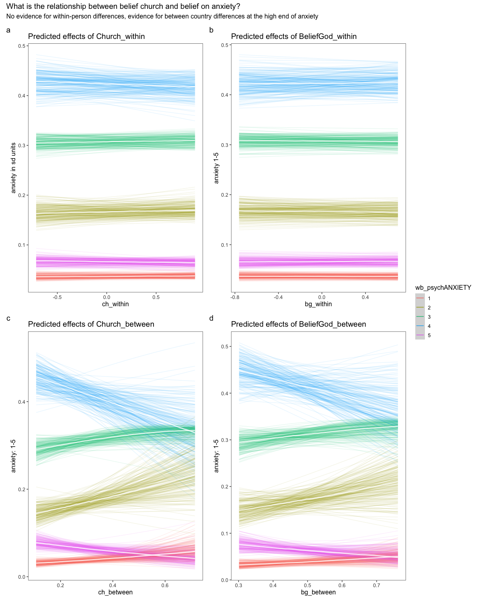

```{r setup, echo = FALSE}
knitr::opts_chunk$set(
  echo = TRUE,
  warning = FALSE,
  message = FALSE,
  layout = "l-body-outset",
  fig.width = 12,
  fig.height = 10,
  collapse = TRUE,
  R.options = list(width = 60)
)
```

```{r libraries, echo = FALSE}
# libraries

if (!require(ggdag)) {
  devtools::install_github("malcolmbarrett/ggdag")
}
if (!require(Amelia)) {
 install.packages("Amelia")
}
if (!require(Amelia)) {
 install.packages("mice")
}

# installed from previous lectures
library("tidyverse")
library("ggdag")
library("brms")
library("rstan")
library("rstanarm")
library("tidybayes")
library("bayesplot")
library("easystats")
library("naniar")
library("lubridate")
# rstan options
rstan_options(auto_write=TRUE)
options(mc.cores=parallel::detectCores ())
theme_set(theme_classic())
```

```{r  nzdata, echo =FALSE, cache  = TRUE}
# read data
nz_0 <- as.data.frame(readr::read_csv2(
  url(
    "https://raw.githubusercontent.com/go-bayes/psych-447/main/data/nzj.csv"
  )
))

# relevel kessler 6 indicators
f <-
  c(
    "None Of The Time",
    "A Little Of The Time",
    "Some Of The Time",
    "Most Of The Time",
    "All Of The Time"
  )

# Relevel covid timeline 2019
# ord_dates_class_2019_only <- c("PreCOVID",
#                                "JanFeb",
#                                "EarlyMarch",
#                                "Lockdown",
#                                "PostLockdown")
# get data into shape
nz_cr <- nz_0 %>%
  dplyr::mutate_if(is.character, factor) %>%
  select(
    -c(
      SWB.Kessler01,
      SWB.Kessler02,
      SWB.Kessler03,
      SWB.Kessler04,
      SWB.Kessler05,
      SWB.Kessler06
    )
  ) %>%
  dplyr::mutate(Wave = as.factor(Wave)) %>%
  dplyr::mutate(FeelHopeless = forcats::fct_relevel(FeelHopeless, f)) %>%
  dplyr::mutate(FeelDepressed = forcats::fct_relevel(FeelDepressed, f)) %>%
  dplyr::mutate(FeelRestless = forcats::fct_relevel(FeelRestless, f)) %>%
  dplyr::mutate(EverythingIsEffort = forcats::fct_relevel(EverythingIsEffort, f)) %>%
  dplyr::mutate(FeelWorthless = forcats::fct_relevel(FeelWorthless, f)) %>%
  dplyr::mutate(FeelNervous = forcats::fct_relevel(FeelNervous, f)) %>%
  dplyr::mutate(Wave = as.factor(Wave)) %>%
  dplyr::mutate(male_id = as.factor(Male)) %>%
  dplyr::mutate(date = make_date(year = 2009, month = 6, day = 30) + TSCORE) %>%
  dplyr::mutate(
    FeelWorthless_int = as.integer(FeelWorthless),
    FeelNervous_int =  as.integer(FeelNervous),
    FeelHopeless_int =  as.integer(FeelHopeless),
    EverythingIsEffort_int =  as.integer(EverythingIsEffort),
    FeelRestless_int =  as.integer(FeelRestless),
    FeelDepressed_int =  as.integer(FeelDepressed),
    HLTH.Fatigue_int = as.integer(HLTH.Fatigue + 1)
  ) %>%
  dplyr::mutate(yearS = TSCORE - min(TSCORE, na.rm = TRUE)) %>%
  dplyr::mutate(KESSLER6sum = as.integer(KESSLER6sum)) %>%
  dplyr::mutate(Id = factor(Id)) %>%
  dplyr::mutate(WSCORE = as.factor(WSCORE))


nz12 <- nz_cr %>%
  dplyr::filter(YearMeasured == 1) %>%
  dplyr::filter(Wave != 2009) %>%
  dplyr::group_by(Id) %>%
  dplyr::filter(n() > 9) %>%
  dplyr::ungroup(Id) %>%
  droplevels() %>%
  dplyr::mutate(yearS = TSCORE - min(TSCORE, na.rm = TRUE))

# View data
#dplyr::glimpse(nz12)
```

```{r figopen2, echo=F}

```

## Multiple-Imputation as a way of handling Missing Data (JB)

### Reading for Multiple-Imputation:

@honaker2011

@bhaskaran2014

@blackwell2017

@mcelreath2020

<https://gking.harvard.edu/category/research-interests/methods/missing-data>

Missing data poses a problem. Missingness biases inference. However missingness it is not intractable problem if we assume that the mechanism giving rise to the missing data is random *conditional on known features of the datset*. Statistitians call this assumption "MAR: Missing at Random".[^1]

[^1]: For a wonderful explanation, see: [here](https://www.ncbi.nlm.nih.gov/pmc/articles/PMC4121561/#:~:text='Missing%20completely%20at%20random'%20means,missing%20and%20observed%20blood%20pressures.)

Let us visualise in a subset of the the longitudional NZ dataset

First how many Id's per wave in this dataset:

```{r}
df <- nz12 %>%
  select(
    Id,
    CharityDonate,
    Emp.JobSecure,
    Male,
    Employed,
    Relid,
    Wave,
    yearS,
    KESSLER6sum,
    Age,
    yearS
  )

# always inspect your dataframe
glimpse(df)
```

```{r}
nz12 %>%
  group_by(Wave) %>%
  summarise(Unique_Id = n_distinct(Id))
```

That's not many, but the data will be useful to explore the multiple-imputation approach

We can visualise the data, using the `naniar` package

```{r}
library(naniar)
vis_miss(df)
```

We can see substantial missingness for `Emp.JobSecure`.

Let's explore this:

```{r}
df%>%
  select(Wave, Emp.JobSecure) %>%
  group_by(Wave)%>%
  tally(is.na(Emp.JobSecure))
```

Lot's of missingness in `Emp.JobSecure` and the question was not included in 2016

```{r}
table1::table1(~ Wave|Emp.JobSecure, data = df, overall = FALSE)
```

There are various methods for multiple imputation. First, let's look at the Amelia package

```{r }
library(Amelia)
# set seed
set.seed(1234)

# we need to pass a dataframe to Amelia
prep <- as.data.frame(df) # tibble won't run in amelia !!


# this is the key code
prep2 <- Amelia::amelia(
  prep,
  #dataset to impute
  m = 10,
  # number of imputations
  cs = c("Id"),
  # the cross sectional variable
  ts = c("yearS"),
  # Time series, allowing polynomials
  #ords =  none in this dataset, but use this command for ordinal data
  #logs = ,  # big numbers better to use the natural log
  sqrt = c("KESSLER6sum", "CharityDonate"),
  # skewed positive data such as K6
  noms = c("Male",  # nominal vars
           "Employed"),
  idvars = c("Wave"),
  # not imputing outcomes
  polytime = 3
) #https://stackoverflow.com/questions/56218702/missing-data-warning-r


# Impute again but do not impute the outcome


# this is the key code
prep2.1 <- Amelia::amelia(
  prep,
  #dataset to impute
  m = 10,
  # number of imputations
  cs = c("Id"),
  # the cross sectional variable
  ts = c("yearS"),
  # Time series, allowing polynomials
  #ords =  none in this dataset, but use this command for ordinal data
  #logs = ,  # big numbers better to use the natural log
  sqrt = c("KESSLER6sum"),
  # skewed positive data such as K6
  noms = c("Male",  # nominal vars
           "Employed"),
  idvars = c("Wave","CharityDonate"), # We do not impute the outcome this time
  # not imputing outcomes
  polytime = 3
) #https://stackoverflow.com/questions/56218702/missing-data-warning-r


```


We can center and scale our variables using the following code head(df)

```{r  imputation_make_data}
prep3.1 <- Amelia::transform.amelia(
  prep2.1,
  Id = as.factor(Id),
  # redundant
  Age.10yrs = (Age / 10),
  years_s = scale(yearS, center = TRUE, scale = TRUE),
  years = yearS,
  KESSLER6sum_S = scale(KESSLER6sum, center = TRUE, scale =TRUE),
  Employed = factor(Employed),
  Relid = scale(Relid, scale = TRUE, center = TRUE),
  Male = as.factor(Male),
  Emp.JobSecure_S = scale(Emp.JobSecure, center = TRUE, scale = FALSE),
  CharityDonate = as.integer(CharityDonate)
)

# center an d scale age
out.1 <- Amelia::transform.amelia(prep3.1, Age_in_Decades_C = scale(Age.10yrs,scale =FALSE, center=TRUE))
```


We can use trace plots to examine how Amelia imputed and with how much uncertainty:

Here are the imputations for Job Security (a random selection)

```{r amelia_trace_3}
Amelia::tscsPlot(
  prep2,
  cs = c("15", "19", "20", "39", "549", "1078"),
  main = "Imputation of Job security",
  var = "Emp.JobSecure",
  ylim = c(0, 30)
)
```

Here are the imputations for Charity (another random selection). Note that there is a fair amount of uncertainty here:

```{r amelia_trace2}
Amelia::tscsPlot(
  prep2,
  cs = c("394", "1039", "1082", "340", "365", "1149", "1238" , "1253","1229"),
  main = "Impuatation of Charity",
  var = "CharityDonate",
  ylim = c(0, 10000)
)
```

Which variables do we need to include to estimate the causal effect of job security on charity?

Write your dag!

```{r dag}
library(ggdag)
dg <-
  dagify(
    charity ~ jobsecure + employed + age + male + relid + years,
    jobsecure ~ employed + distress + male + years + age,
    distress ~ male  + employed + years + age,
    relid ~ male + years,
    age ~ years,
    labels = c(
      "charity" = "charity",
      "jobsecure" = "job security",
      "employed" = "employed",
      "age" = "age",
      "male" = "male",
      "relid" = "religious identity",
      "years" = "years"
    ),
    exposure = "jobsecure",
    outcome = "charity"
  ) %>%
  tidy_dagitty(layout = "nicely")

ggdag::ggdag_adjustment_set(dg)
```

To obtain an unbiased estimate of jobsecurity on charity we must condition on employed, male, age, and years.

We can write the model using the `lme4` package, which is fast. I wrote a little function, recall that we have 8 data sets

```{r imputation_model}
# first write out the model equation
library(lme4)
mod_eq <-  'CharityDonate  ~  Emp.JobSecure_S  + Employed + Age_in_Decades_C +  Male  +  years_s +  (1|Id)' 

# run models iterating over imputed data
loop_glmer_model <-
  function(x, y) {
    # x is the mod equation, y is the data
    m <- 10
    mod <- NULL
    for (i in 1:m) {
      mod[[i]] <- glmer(x, data = y$imputations[[i]], family = "poisson")
    }
    return(mod)
  }

m_list <- loop_glmer_model(mod_eq, out)

# try with out the outcome imputed

m_list1 <- loop_glmer_model(mod_eq, out.1)
```

Here is a function for obtaining the results:

```{r table_impute, cache = TRUE}
# table of effects
loop_lmer_model_tab <- function(x) {
  mp <- lapply(x, model_parameters)
  out <- parameters::pool_parameters(mp)
  return(out)
}

# create table
tab_impute <- loop_lmer_model_tab(m_list)
tab_impute

# create graph
plot_impute <- plot(tab_impute)
plot_impute
```

We can plot the effects using a coefficient plot

```{r graph_impute, cache =TRUE}
library(ggeffects)
library(gghighlight) # not used here, useful for interactions 
graph_predictions_imputed <- function(x, y) {
  # x = model objects
  m <- 10
  out <- NULL
  for (i in 1:m) {
    out[[i]] <-
      ggeffects::ggpredict(x[[i]], terms = c("Emp.JobSecure_S"))
  }
  plots <- NULL
  for (i in 1:m) {
    plots[[i]] <-
      plot(out[[i]], facets = T) # + scale_y_continuous(limits=c(6.35,6.85) )
  }
  plots[[10]] +
    gghighlight::gghighlight() +
    ggtitle(y)
}

# graph
graph_predictions_imputed(m_list,"Effect of Jobsecurity on Charity (not reliable")
```


```{r cache =TRUE}
loop_lmer_model_tab <- function(x) {
  mp <- lapply(x, model_parameters)
  out <- parameters::pool_parameters(mp)
  return(out)
}

# create table
tab_impute1 <- loop_lmer_model_tab(m_list1)
tab_impute1

# create graph
plot_impute1 <- plot(tab_impute1)

library(patchwork)

plot_impute + plot_impute1 + plot_annotation()
```


If you want a LaTeX table, you can use this code:

```{r huxtable_latextable, eval = FALSE}
library(huxtable)

huxtable::as_hux( your_model_here ) %>%
  select("Parameter", "Coefficient", "CI_low", "CI_high", "p") %>%
  set_number_format(3) %>%
  set_left_padding(20) %>%
  set_bold(1, everywhere) %>%
  quick_latex()

```

### Compare imputation results with row-wise deleted results

When you run a regression with missing data, R automateically deletes the missing cases.

Let's look at the results from the row-wise deleted data:

```{r row_wise_deleted, cache=TRUE}
# prepare data as we did for the imputated dataset
df2 <- df %>%
  dplyr::mutate(
    Age.10yrs = (Age / 10),
    Age_in_Decades_C = scale(Age.10yrs, scale = FALSE, center = TRUE),
    years_s = scale(yearS, center = TRUE, scale = TRUE),
    years = yearS,
    KESSLER6sum_S = scale(KESSLER6sum, center = TRUE, scale = TRUE),
    Employed = factor(Employed),
    Relid = scale(Relid, scale = TRUE, center = TRUE),
    Male = as.factor(Male),
    Emp.JobSecure_S = scale(Emp.JobSecure, center = TRUE, scale = FALSE)
  )

# run model
m_no_impute <- glmer(mod_eq, data = df2, family = "poisson")

# create table
tab_no <-
  parameters::model_parameters(m_no_impute, effects = c("all"))
tab_no

# create graph
plot_no <- plot(tab_no)
plot_no
```

When we compare the graphs, we see that the multiply imputed datasets shrink estimates towards zero.

Multiple imputation is sometimes avoided because people don't like to "invent" data. However, creating multiply imputed datasets and integrating over their uncertainty during model tends to increase uncertainty in a model. That's generally a good thing when we want to predict features of the population.

```{r comparison_graph}
library(patchwork)

plot_impute / plot_no +
  plot_annotation(title = "Comparison of regressions using (a) multiple-imputed  and (b) row-wise deleted datasets",
                  tag_levels = 'a')

```

However it would be a mistake to think that multiple imputation is sufficient. Note that the case-wise deleted data is confident that men give less to charity than do women and other genders. However the model is tending to inflate estimates for men, perhaps because men tend to disproportionately leave this question unanswered. Let's check this intuition:


```{r}
df %>%
  dplyr::mutate(CharityNa = is.na(CharityDonate)) %>%
  count(Male, CharityNa) %>%
  group_by(Male) %>%
  mutate(freq = n / sum(n))
  
```

No, the intution was wrong. However, it is important to realise that missingness might not be completely at random conditional on variables in the model. In this case, you dataset cannot avoid its biases by multiple imputation. 

Recall that it is generally useful to include more variables for accurate prediction. For this reason, when multiply imputing outcomes it is generally useful to include more variables. 


### Appendix 1: Imputation using BRMS

### Multiple imputation in BRMS (warning: these models take 10x longer)

```{r prepare_bayesian_dataset}
# prepare data
# you must create a list of the imputed datasets, like so:

brmdat <- list(
  out$imputations$imp1,
  
  out$imputations$imp2,
  
  out$imputations$imp3,
  
  out$imputations$imp4,
  
  out$imputations$imp5,
  
  out$imputations$imp6,
  
  out$imputations$imp7,
  
  out$imputations$imp8,
  
  out$imputations$imp9,
  
  out$imputations$imp10
)


brmdat1 <- list(
  out.1$imputations$imp1,
  
  out.1$imputations$imp2,
  
  out.1$imputations$imp3,
  
  out.1$imputations$imp4,
  
  out.1$imputations$imp5,
  
  out.1$imputations$imp6,
  
  out.1$imputations$imp7,
  
  out.1$imputations$imp8,
  
  out.1$imputations$imp9,
  
  out.1$imputations$imp10
)
```

We write the model as follows:

```{r Bayesian_impuation_model}
# model equation
# note the `bf` command

bf_mod_eq <- bf(mod_eq)

# we use the `brm_multiple` syntax and feed in the brmdat

fit_imp1 <-
  brm_multiple(
    bf_mod_eq,
    data = brmdat,
    family = "poisson",
    file = here::here("models", "bayes-imp-1")
  )

# table
summary(fit_imp1)
plot(fit_imp1)  # VERY POOR MIXING
```

Mixing is a problem, indeed I don't think I have ever run a model that has mixed worse than this one. 

We see the trouble in the coefficient plots:

```{r bayes-1-plot}
#plot posteriors
plot_bayes_1 <- brms::mcmc_plot(fit_imp1,
                                type = "areas",
                                prob = .89)

plot_bayes_1 +
  plot_impute +
  plot_annotation(title = "Comparison of regressions using  (a) Bayesian Imputationand and (b) Lmer models",
                  tag_levels = 'a')


```

We can model missing-ness in BRMS in one step (for continuous missing variables). Let's try that next:


```{r one-step-brms-impute-22}
# Emp.JobSecure_S  + Employed + Age_in_Decades_C +  Male  +  years_s

#Note that BRMS can only impute continuous data. That's not a problem. Your factors are converted to integars anyway.
df3 <- df2%>%
  dplyr::mutate(Employed = as.numeric(as.character(Employed)),
         Male = as.numeric((Male))-1) # male as zero or 1

glimpse(df3)


df3%>%
  dplyr::count(CharityDonate ==0)

## Write the model, note the `mi`s: each `mi` needs to appear as the outcome of a model. 
## note that for simplicity, these models claim that mi is random conditional on year and individual. We might obtain better predictions of missingness by including more information. 

# Note that brms can only take identity link functions when handling missing data. The "lognormal" is better than the normal because the variances are estimated using a log link. 

bform <- 
  bf(CharityDonate + 1 | mi() ~ mi(Emp.JobSecure_S) + mi(Employed) + mi(Age_in_Decades_C)  + mi(Male)  + (1 + years_s | Id), family = "lognormal") +
  bf(Emp.JobSecure_S | mi() ~ mi(Employed) + mi(Age_in_Decades_C)  + mi(Male)  + (1 + years_s| Id)) +
  bf(Employed | mi() ~ (1 + years_s| Id)) +
  bf(Age_in_Decades_C | mi() ~  (1 + years_s| Id))+
  bf(Male | mi() ~ (1 + years_s | Id)) +
  set_rescor(FALSE)

## fit the model 
fit_imp2 <- brm(bform, 
                data = df3, 
                file = here::here("models", "bayes-imp-2"))
summary(fit_imp2)
```

Again, the model is a all over the place:

```{r}
plot(fit_imp2)
```

Mixing was a problem. Minimally we'd need to include more variables. However there might be deeper problems with the data, or our approach.  Analysis is iterative. We need to return to the data and scrutinise it more carefully. 

```{r one-step-brms-impute}
plot_bayes_2 <- brms::mcmc_plot(fit_imp2,
                                type = "areas",
                                prob = .89)

plot_bayes_2

# again we run into trouble. 
plot(fit_imp2)
```


## Try wthout imputing outcome and allow for overdispersion

```{r}
fit_imp3 <-
  brm_multiple(
    bf_mod_eq,
    data = brmdat1,
    family = "zero_inflated_negbinomial",
    file = here::here("models", "bayes-imp-3")
  )

# table
summary(fit_imp1)
plot(fit_imp1)  # VERY POOR MIXING
```


### Appendix 2. Probability

We have been working with probability throughout this course.

Suppose there is a test that is 99% accurate at detecting COVID if you have it.

Very rarely it throws up a false positive,say one in a thousand.

You just tested positve. What is the probability that you have COVID? Our intuition is that we probably have COVID. However, let's assume COVID is rare. Currently in NZ, there are about 50 cases, so 1 in 100,000. The background rate matters.

Bayes rule says

$$ Pr(COVID|Positive) = \frac{Pr(Positive|COVID)\times Pr (COVID}{Pr(Positive)}
$$

We plug in the numbers:

```{r}
Pr_Positive_COVID <- 0.99
Pr_Positive_Healthy <- 0.01
Pr_COVID <- 0.00001

# Calculate the background probability of testing positive

Pr_Positive <- Pr_Positive_COVID * Pr_COVID + Pr_Positive_Healthy * ( 1 - Pr_COVID )

# Now calculated your probability of testing positive

Pr_COVID_Positive <- Pr_Positive_COVID * Pr_COVID / (Pr_Positive )
Pr_COVID_Positive # 1 in 1000
```

<!-- library(tidyverse) -->

<!-- # column of n randomly sampled responses -->

<!-- likert_col <- function(n = 10) { -->

<!--   sample(7, size = 10, replace = TRUE) -->

<!-- } -->

<!-- # toy data -->

<!-- dat <- tibble( -->

<!--   cat_1 = likert_col(), -->

<!--   cat_2 = likert_col(), -->

<!--   cat_3 = likert_col(), -->

<!--   dog_1 = likert_col(), -->

<!--   dog_2 = likert_col() -->

<!-- ) -->

<!-- dat %>% transmute(cat = rowSums(across(starts_with("cat"))), dog = rowSums(across(starts_with("dog")))) -->
