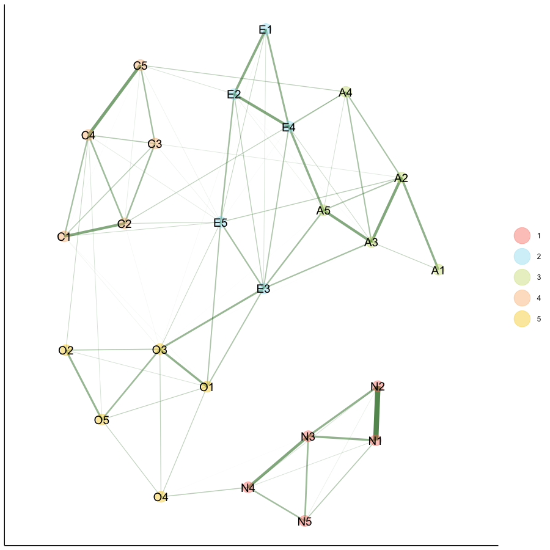
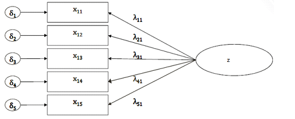

```{r setup, echo = FALSE}
knitr::opts_chunk$set(
 # echo = TRUE,
  warning = FALSE,
  message = FALSE,
  layout = "l-body-outset",
  fig.width = 12,
  fig.height = 10,
  collapse = TRUE,
  R.options = list(width = 60)
)
```

```{r libraries, echo = FALSE}
# libraries

if (!require(ggdag)) {
  devtools::install_github("malcolmbarrett/ggdag")
}
if (!require(Amelia)) {
 install.packages("Amelia")
}
if (!require(Amelia)) {
 install.packages("mice")
}

# installed from previous lectures
library("tidyverse")
library("ggdag")
library("brms")
library("rstan")
library("rstanarm")
library("tidybayes")
library("bayesplot")
library("easystats")
library("naniar")
library("lubridate")
library("ufs")
library("psych")
library("bootnet")
library("EGAnet")
library("qgraph")
library("sna")

# rstan options
rstan_options(auto_write=TRUE)
options(mc.cores=parallel::detectCores ())
theme_set(theme_classic())
```

```{r  nzdata, echo = FALSE, cache  = TRUE}
# read data
nz_0 <- as.data.frame(readr::read_csv2(
  url(
    "https://raw.githubusercontent.com/go-bayes/psych-447/main/data/nzj.csv"
  )
))

# relevel kessler 6 indicators
f <-
  c(
    "None Of The Time",
    "A Little Of The Time",
    "Some Of The Time",
    "Most Of The Time",
    "All Of The Time"
  )

# Relevel covid timeline 2019
# ord_dates_class_2019_only <- c("PreCOVID",
#                                "JanFeb",
#                                "EarlyMarch",
#                                "Lockdown",
#                                "PostLockdown")
# get data into shape
nz_cr <- nz_0 %>%
  dplyr::mutate_if(is.character, factor) %>%
  select(
    -c(
      SWB.Kessler01,
      SWB.Kessler02,
      SWB.Kessler03,
      SWB.Kessler04,
      SWB.Kessler05,
      SWB.Kessler06
    )
  ) %>%
  dplyr::mutate(Wave = as.factor(Wave)) %>%
  dplyr::mutate(FeelHopeless = forcats::fct_relevel(FeelHopeless, f)) %>%
  dplyr::mutate(FeelDepressed = forcats::fct_relevel(FeelDepressed, f)) %>%
  dplyr::mutate(FeelRestless = forcats::fct_relevel(FeelRestless, f)) %>%
  dplyr::mutate(EverythingIsEffort = forcats::fct_relevel(EverythingIsEffort, f)) %>%
  dplyr::mutate(FeelWorthless = forcats::fct_relevel(FeelWorthless, f)) %>%
  dplyr::mutate(FeelNervous = forcats::fct_relevel(FeelNervous, f)) %>%
  dplyr::mutate(Wave = as.factor(Wave)) %>%
  dplyr::mutate(male_id = as.factor(Male)) %>%
  dplyr::mutate(date = make_date(year = 2009, month = 6, day = 30) + TSCORE) %>%
  dplyr::mutate(
    FeelWorthless_int = as.integer(FeelWorthless),
    FeelNervous_int =  as.integer(FeelNervous),
    FeelHopeless_int =  as.integer(FeelHopeless),
    EverythingIsEffort_int =  as.integer(EverythingIsEffort),
    FeelRestless_int =  as.integer(FeelRestless),
    FeelDepressed_int =  as.integer(FeelDepressed),
    HLTH.Fatigue_int = as.integer(HLTH.Fatigue + 1)
  ) %>%
  dplyr::mutate(yearS = TSCORE - min(TSCORE, na.rm = TRUE)) %>%
  dplyr::mutate(KESSLER6sum = as.integer(KESSLER6sum)) %>%
  dplyr::mutate(Id = factor(Id)) %>%
  dplyr::mutate(WSCORE = as.factor(WSCORE))


nz12 <- nz_cr %>%
  dplyr::filter(YearMeasured == 1) %>%
  dplyr::filter(Wave != 2009) %>%
  dplyr::group_by(Id) %>%
  dplyr::filter(n() > 9) %>%
  dplyr::ungroup(Id) %>%
  droplevels() %>%
  dplyr::mutate(yearS = TSCORE - min(TSCORE, na.rm = TRUE))

# View data
#dplyr::glimpse(nz12)
```

```{r figopen2, echo=F}

```

## Some thoughts on measurement

Psychology is dominated by the latent variable perspective. Most constructs we are interested in cannot be directly measured, but rather have to be inferred from a range of indicators (For an example see Figure \@ref(fig:latent)).

(ref:latent) Standard latent variable model.

```{r latent, echo=F, fig.cap = "(ref:latent)"}

```

```{r reliability_prep}

bfi <- psych::bfi
reverse_bfi <- c("A1", "C4", "C5", "E1", "E2", "O2", "O5")
bfi[reverse_bfi] <- lapply(bfi[reverse_bfi], function(x) {
  car::recode(x, "1 = 6; 2 = 5; 3 = 4; 4 = 3; 5 = 2; 6 = 1")
})

```

# What is reliability

Many students might learn what reliability is, but once they reach research praxis they often have forgotten the details and what remains is the $\alpha > .70$ rule. To address this issue first, this rule was not suggested by Cronbach. The cut-off was suggested by Nunnally [-@Nunnally1994]. Let's see what the original source says:

> "A satisfactory level of reliability depends on how a measure is being used. In the early stages of predictive or construct validation research, time and energy can be saved using instruments that have only modest reliability, e.g., .70. If significant correlations are found, corrections for attenuation will estimate how much the correlations will increase when reliabilities of measures are increased. If these corrected values look promising, it will be worth the time and effort to increase the number of items and reduce much beyond .80 in basic research is often wasteful of time and money. Measurement error attenuates correlations very little at that level. Strenuous and unnecessary efforts at standardization in addition to increasing the number of items might be required to obtain a reliability of, say, .90. In contrast to the standards used to compare groups, a reliability of .80 may not be nearly high enough in making decisions about individuals. Group research is often concerned with the size of correlations and with mean differences among experimental treatments, for which a reliability of .80 is adequate. However, a great deal hinges on the exact test scores when decisions are made about individuals. If, for example, children with IQs below 70 are to be placed in special classes, it may make a great deal of difference whether a child has an IQ of 65 or 75 on a particular test. When selection standards are quite rigorous, decisions depend on very small score differences, and so it is difficult to accept any measurement error. We have noted that the standard error of measurement is almost one-third as large as the overall standard deviation of test scores even when the reliability is .90. If important decisions are made with respect to specific test scores, a reliability of .90 is the bare minimum, and a reliability of .95 should be considered the desirable standard. However, never switch to a less valid measure simply because it is more reliable." (pp.264)

To boil down what Nunnally said; reliability can never replace validity, the reliability your measure should achieve is dependent on the context of application. The commonly applied rule of .70 is fitting for some contexts. Specifically contexts where one wants to save time and effort. Lance, Butts, and Michels [-@Lance2006] make the important point that this is not a context that applies in most published papers. In most contexts we would want $\alpha$ to be over .80 and over .90 \| .95 if we make judgments about individuals based on this test, such as personality questionnaires used for hiring.

In the discussion on the applicability of $\alpha$ Nunnally makes statements such as:

> "Coefficient a usually provides a good estimate of reliability because sampling of content is usually the major source of measurement error for static constructs and also because it is sensitive to the "sampling" of situational factors as well as item content." (p.252)

But what is the "usual" case which Nunnally assumes. We could assume that it is the case in which the underlying assumption of $\alpha$ are met. Let's have a look at these assumptions to better appreciate Nunnally's usual case. I am paraphrasing in this section from the excellent article by McNeish [-@McNeish2018] and I highly recommend reading it for a more detailed discussion.

1.  The scale is uni-dimensional.
2.  Scale items are on a continuous scale and normally distributed.
3.  The scale adheres to tau equivalence.
4.  The errors of the items do not covary.

Let's look at the reliability of our Extraversion scale

```{r alpha}
print(psych::alpha(bfi[paste0("E", 1:5)]))
```

Looks all good, but when we look at the assumptions of $\alpha$ this looks less good. Some items e.g. E2 show very high loadings and E5 shows a substantially lower loading.

```{r tau}
psych::fa(bfi[paste0("E", 1:5)], nfactors = 1)
```

So what are the alternatives to alpha. First I do not think that we need to replace alpha for now Raykov and Marcoulides [-@Raykov2017] make some interesting points on its contiued usage. So instead of replacing it, we could try supplementing it. Alternatives suggested by McNeish [-@McNeish2018] are omega total, and GLB. So how would we compute those reliabilities. We have a number of options from different packages, such as the *psych* package.

```{r omega, warning = F, message = F}

psy_omega <- psych::omega(bfi[paste0("E", 1:5)], nfactors = 3, poly = F)
psy_omega
```

I personally prefer the *ufs* package, which containts the niffty scaleStructure function. Importantly, there is a wide range of packages and a substantial number of papers that advance research in this [area](https://journals.sagepub.com/doi/full/10.1177/2515245920951747).

```{r science, warning = F, message = F}

print(ufs::scaleStructure(bfi[paste0("E", 1:5)]))
```

## Some alternatives to the latent variable perspective

In recent years network statistics have found increased use in psychology as conceptual alternatives to the latent variable model (even thought they are mathematical equivalents). In the network approach we assume that communities of items arise due to their interaction and not due to an underlying latent variable. The network approach commonly uses regularized partial correlations between variables to model the network. What this means is that first all variables are correlated while controling for all other variables in the dataset. Subsequently, we use a mathematical approach aimed at iteratively shrinking correlations that are close to 0 to exactely 0, reducing the complexity of the structure.

```{r bot_est, cache = TRUE}
net_mdl <- bootnet::estimateNetwork(select(bfi, -age, -education, -gender), "EBICglasso")
qgraph::qgraph(net_mdl$graph, layout = "spring")

```

```{r bootega, cache = TRUE}
ega_out <-
  EGAnet::bootEGA(
    select(bfi, -age, -education, -gender),
    plot.typicalStructure = T,
    iter = 1000
  )
```

## Measurement and validity

Do your measures describe facts about how people are? This is a mission critical question.  Yet there has been very little attention. 

We find this advice from Jessica Flake is helpful: <https://www.youtube.com/watch?v=Cq6n7AS_r8w>

To summarise: 

Include measurement in your research plan & pre-register that plan. Ask yourself:

1.  What is your construct? (What are you trying to measure?)
2.  Why and how did you select measures?

-   Jingle fallacy: two different contructs are the same if they have different names.
-   Jangle fallacy: two identical constructs are different because they have different names.

3.  How do you use and operationalise your construct?
4.  How do you quantify your measure?
5.  Did you modify your measure, if so, why? Report...
6.  Justify all measure modifications...

Points developed in this paper: <https://psyarxiv.com/c45t9/>

See also the work of Eiko Fried: <https://eiko-fried.com/>

### Validity, measurement error, and causal confounding.

#### Measurement error and recall bias:

> Measurement error is the degree to which we mismeasure a variable, which can lead to bias in a number of ways. If the error is dependent on the exposure or the outcome, (e.g. we measure the exposure with less accuracy for a group without a disease than with it), it is called differential measurement error. If the error has nothing to do with the exposure or outcome, it's called non-differential measurement error. Under most conditions, non-differential error will bias the estimate of effect towards the null. In this way, it's at least predictable, but for small effects or inadequately powered studies, it can make a true effect disappear. If there is error in both the exposure and outcome, the errors themselves can also be associated, opening a back-door path between the exposure and outcome. - Malcolm Barrett: <https://ggdag.malco.io/articles/bias-structures.html>

Barrett's recall of vitimans example: Does taking vitamins in childhood protect against bladder cancer? If people who have bladder cancer are more likely to recall vitam taking, then this can support the inference that vitams cause bladder cancer even if the opposite is true:

```{r measurement_error_confound, code_folding = TRUE}
library(ggdag)
coords <- tibble::tribble(
  ~name,            ~x,  ~y,
  "bladder_cancer",    1,   0,
  "vitamins",          0,   0,
  "diagnosed_bc",      1,   1,
  "recalled_vits",     0,   1,
  "bc_error",          1,   2,
  "vits_error",        0,   2,
)


bladder_dag <- dagify(
  diagnosed_bc ~ bc_error + bladder_cancer,
  recalled_vits ~ vitamins + vits_error,
  vits_error ~ bladder_cancer,
  exposure = "recalled_vits",
  outcome = "bladder_cancer",
  latent = c("bc_error","vits_error"),
  labels = c(
    bladder_cancer = "Bladder Cancer",
    vitamins = "Childhood Vitamin \nIntake",
    diagnosed_bc = "Diagnosed \nBladder Cancer",
    recalled_vits = "Memory of \nTaking Vitamins",
    bc_error = "Measurement Error, \nDiagnosis",
    vits_error = "Measurement Error, \nVitamins"
  ),
  coords = coords
)
ggdag(bladder_dag, text = FALSE, use_labels = "label", node_size = 20) + theme_dag_blank()
```


In this DAG, we can obtain an unbiased estimate when we do not adjust for baseline CES-D scores:

```{r adjust_blad_rror}
ggdag_adjustment_set(bladder_dag,
                     text = FALSE, use_labels = "label") + theme_dag_blank()
```

#### Measurement error in panel studies

The Centers for Epidemiological Studies--Depression (CES-D) scale assess depression, but the scale is known to have measurement error.

Question. Does completing Psych 477 affect change in depression changes after the course is finished. Assume no relationship. Nevertheless, conditioning on the baseline measure of CES-D will create bias in our model that arises from from measurement error.

Here is Barrett's example:

```{r measurement_error_longitudinal_confound, code_folding = TRUE}
# set coordinates
coords <- tibble::tribble(
  ~name,              ~x,  ~y,
  "honors",            1,   3,
  "depression",        2,   3,
  "cesd",              2,   2,
  "baseline_error",    2,   1,
  "depression_change", 3,   3,
  "cesd_change",       3,   2,
  "followup_error",    3,   1
)

cesd_dag <- dagify(
  depression ~ honors,
  cesd ~ depression + baseline_error,
  cesd_change ~ depression_change + followup_error + baseline_error,
  outcome = "depression_change",
  exposure  = "honors",
  latent = c("followup_error","baseline_error"),
  labels = c(
    honors = "447 Completion",
    depression = "Depression",
    cesd = "CES-D",
    cesd_change = "Change CES-D",
    depression_change = "Change in \nDepression",
    baseline_error = "Measurement Error, \nBaseline",
    followup_error = "Measurement Error, \nFollow-up"
  ),
  coords = coords
)# %>%
 # control_for(c("baseline_error","followup_error"))

cesd_dag %>%
  ggdag_dconnected(
    from = "honors",
    to = "cesd_change",
    controlling_for = "cesd",
    text = FALSE,
    use_labels = "label",
    collider_lines = FALSE
  ) + theme_dag_blank()
```

The DAG reveals we can obtain an unbiased estimate when we do not adjust for baseline CES-D scores:

```{r adjust_meas_error}
ggdag_adjustment_set(cesd_dag,
                     text = FALSE, use_labels = "label") + theme_dag_blank()
```

Of course the DAG might not be correct. Depressed people might be drawn to psych 447.

## Missing data is a form of measurement error

Missing data is an extreme form of measurement error.See: @mcelreath2020Reading

## Multiple-Imputation as a way of handling Missing Data.

### Methods for Multiple-Imputation:

@honaker2011

@bhaskaran2014

@blackwell2017

@mcelreath2020

<https://gking.harvard.edu/category/research-interests/methods/missing-data>

Missing data poses a problem. Missingness biases inference. However, missingness need not be intractable. We can use regression to predict missing values when the missing data are random *conditional on known features of the data,*[^1] Where MAR assumptions are satisfied we predict the missing observations using regression. Because regression is uncertain, we must generate multiple datasets with observations. This process of generating multiple datasets is called *multiple imputation.* Before proceeding with an explanation of the mechanics of multiple imputation, we take a moment to recollect two fundamental principles of data science that we have been discussing throughout this course:

[^1]: Statisticians call the assumption of of conditional randomness in missingness: "MAR: Missing at Random." The language is admittedly confusing -- what statisticians mean is "missing conditional on known predictors."

1.  The practice of statistical inference is educated guesswork. We never observe population parameters, we only observe samples. We assume that our samples are drawn randomly from an unobserved population. We we move from measured features of our sample to unmeasured features of a population we are projecting with uncertainty. Multiply imputing missing data is no different. multiple imputation is continuous with a data-scientist's larger mission of guessing wisely[\^1]: For a explanation, see: [here](https://www.ncbi.nlm.nih.gov/pmc/articles/PMC4121561/#:~:text='Missing%20completely%20at%20random'%20means,missing%20and%20observed%20blood%20pressures.)

2.  Regression is a tool for prediction and regression is also a tool for causal inference. How we go about using regression differs depending on weather we want to predict or whether we want to explain (i.e. casual inference). When we regress to predict, it is generally useful to include all relevant covariates in our dataset that might be related to the outcome and that are not co-linear with other indicators in our dataset [^2].

[^2]: Although it generally does no harm to include collinear indicators if our task is prediction

**Prediction**: we have discussed strategies for assessing improvements in model fit for prediction using criteria such as the BIC criterion, the WAIC criterion, and LOO.

Gelman and Hill offer the following advice about inclusion of variables when using regression to predict [@gelman2006 p.69]:

> Our general principles for building regression models for prediction are as follows:

> 1.  Include all input variables that, for substantive reasons, might be expected to be important in predicting the outcome.

> 2.  It is not always necessary to include these inputs as separate predictors---for example, sometimes several inputs can be averaged or summed to create a "total score" that can be used as a single predictor in the model.

> 3.  For inputs that have large effects, consider including their interactions as well.

> 4.  We suggest the following strategy for decisions regarding whether to exclude a variable from a prediction model based on expected sign and statistical significance (typically measured at the 5% level; that is, a coefficient is "statistically significant" if its estimate is more than 2 standard errors from zero):
>
> <!-- -->
>
> (a) If a predictor is not statistically significant and has the expected sign, it is generally fine to keep it in. It may not help predictions dramatically but is also probably not hurting them.
> (b) If a predictor is not statistically significant and does not have the expected sign (for example, incumbency having a negative effect on vote share), consider removing it from the model (that is, setting its coefficient to zero).
> (c) If a predictor is statistically significant and does not have the expected sign, then think hard if it makes sense. (For example, perhaps this is a country such as India in which incumbents are generally unpopular; see Linden, 2006.) Try to gather data on potential lurking variables and include them in the analysis.
> (d) If a predictor is statistically significant and has the expected sign, then by all means keep it in the model. These strategies do not completely solve our problems but they help keep us from making mistakes such as discarding important information. They are predicated on having thought hard about these relationships before fitting the model. It's always easier to justify a coefficient's sign after the fact than to think hard ahead of time about what we expect. On the other hand, an explanation that is determined after running the model can still be valid. We should be able to adjust our theories in light of new information [@gelman2006 p.69].

**Causal inference**: do not include all predictors that might be associated with the outcome. Doing so is an invitation to confounding causal inference. To obtain an unbaised estimate of an exposure's causal effect on the outcome(s) of interest we must close all backdoor paths from a predictor to an outcome and we must avoid conditioning on any colliders. As Richard McElreath writes [@mcelreath2020, p.46]

> But the approach which dominates in many parts of biology and the social sciences is instead CAUSAL SALAD.36 Causal salad means tossing various "control" variables into a statistical model, observing changes in estimates, and then telling a story about causation. Causal salad seems founded on the notion that only omitted variables can mislead us about causation. But included variables can just as easily confound us. When tossing a causal salad, a model that makes good predictions may still mislead about causation. If we use the model to plan an intervention, it will get everything wrong [@mcelreath2020, p.46].

To help assist us with the problems of unbiased causal inference we have discussed the utility of building causal DAGs, noting that inference is always conditional on the DAG that we have drawn. Frequently, the data under-determine the DAG. There are many DAGs consistent with our observations. Regression is a powerful tool for reliable causal inference but it is not sufficient for reliable inference.

So which approach to regression should we use for multiple imputation. The answer is that we should use the predictive approach. When we are imputing we are are *predicting* features of a population. We shoudl therefore follow the Gelman and Hill's advice to stratifying across all indicators that might improve predictive accuracy.

### Visualising missingness

When you are examining your data, make sure to assessing missing responses. A handy tool for assessing missingess is a missingness graph.

Let's consider subsample of the `nz-jitter` longitudinal dataset that has responded to multiple waves. Today we will ask whether employment insecurity is causally related to charitable donations. To predict missingness we should probably include other indicators besides those that I have included here, but these indicators will be sufficient for our purposes.

```{r mi_select}

df <- nz12 %>%
  select(
    Id,
    CharityDonate,
    Emp.JobSecure,
    Household.INC,
    Hours.Work,
    Male,
    Employed,
    Pol.Orient,
    Relid,
    Wave,
    yearS,
    KESSLER6sum,
    Partner,
    Age,
    yearS
  )%>%
  dplyr::mutate(Partner = factor(Partner))

# always inspect your data frame
glimpse(df)
```

How many individuals?

```{r mi_count}
nz12 %>%
  group_by(Wave) %>%
  summarise(Unique_Id = n_distinct(Id))
```

We can visualise the data, using the `naniar` package:

```{r mi_vismiss}
library(naniar)
vis_miss(df)
```

We can see substantial missingness for `Emp.JobSecure`.

Let's explore this:

```{r mi_count_na}
df%>%
  select(Wave, Emp.JobSecure) %>%
  group_by(Wave)%>%
  tally(is.na(Emp.JobSecure))
```

Lot's of missingness in `Emp.JobSecure` and the question was not included in 2016

```{r mi_table_emply}
table1::table1(~ Wave|Emp.JobSecure, data = df, overall = FALSE)
```

There are various methods for multiple imputation. First, let's look at the Amelia package

```{r mi_amelia_impute}
library(Amelia)
# set seed
set.seed(1234)

# we need to pass a data frame to Amelia
prep <- as.data.frame(df) # tibble won't run in amelia !!


# this is the key code
prep2 <- Amelia::amelia(
  prep,
  #dataset to impute
  m = 10,
  # number of imputations
  cs = c("Id"),
  # the cross sectional variable
  ts = c("yearS"),
  # Time series, allowing polynomials
  #ords =  none in this dataset, but use this command for ordinal data
  #logs = ,  # big numbers better to use the natural log
  sqrt = c("KESSLER6sum", "CharityDonate"),
  # skewed positive data such as K6
  noms = c("Male",  # nominal vars
           "Employed",
           "Partner"),
  idvars = c("Wave"),
  # not imputing outcomes
  polytime = 3
) #https://stackoverflow.com/questions/56218702/missing-data-warning-r


# Impute again but do not impute the outcome


# this is the key code
prep2.1 <- Amelia::amelia(
  prep,
  #dataset to impute
  m = 10,
  # number of imputations
  cs = c("Id"),
  # the cross sectional variable
  ts = c("yearS"),
  # Time series, allowing polynomials
  #ords =  none in this dataset, but use this command for ordinal data
  #logs = ,  # big numbers better to use the natural log
  sqrt = c("KESSLER6sum"),
  # skewed positive data such as K6
  noms = c("Male",  # nominal vars
           "Employed",
           "Partner"),
  idvars = c("Wave","CharityDonate"), # We do not impute the outcome this time
  # not imputing outcomes
  polytime = 3
) #https://stackoverflow.com/questions/56218702/missing-data-warning-r


```

We can center and scale our variables using the following code head(df)

```{r  imputation_make_data}

# prepare data with imputed outcome
prep3 <- Amelia::transform.amelia(
  prep2,
  Id = as.factor(Id),
  # redundant
  Age.10yrs = (Age / 10),
  years_s = scale(yearS, center = TRUE, scale = TRUE),
  years = yearS,
  KESSLER6sum_S = scale(KESSLER6sum, center = TRUE, scale =TRUE),
  Employed = factor(Employed),
  Relid = scale(Relid, scale = TRUE, center = TRUE),
  Male = as.factor(Male),
  Emp.JobSecure_S = scale(Emp.JobSecure, center = TRUE, scale = FALSE),
  CharityDonate = as.integer(CharityDonate)
)

# center an d scale age
out <- Amelia::transform.amelia(prep3, Age_in_Decades_C = scale(Age.10yrs,scale =FALSE, center=TRUE))


prep3.1 <- Amelia::transform.amelia(
  prep2.1,
  Id = as.factor(Id),
  # redundant
  Age.10yrs = (Age / 10),
  years_s = scale(yearS, center = TRUE, scale = TRUE),
  years = yearS,
  KESSLER6sum_S = scale(KESSLER6sum, center = TRUE, scale =TRUE),
  Employed = factor(Employed),
  Relid = scale(Relid, scale = TRUE, center = TRUE),
  Male = as.factor(Male),
  Emp.JobSecure_S = scale(Emp.JobSecure, center = TRUE, scale = FALSE),
  CharityDonate = as.integer(CharityDonate)
)

# center an d scale age
out.1 <- Amelia::transform.amelia(prep3.1, Age_in_Decades_C = scale(Age.10yrs,scale =FALSE, center=TRUE))
```

We can use trace plots to examine how Amelia imputed and with how much uncertainty:

Here are the imputations for Job Security (a random selection)

```{r amelia_trace_3}

Amelia::tscsPlot(
  prep2,
  cs = c("15", "19", "20", "39", "549", "861","1037","1078","1253"),
  main = "Imputation of Job security",
  var = "Emp.JobSecure",
  ylim = c(0, 30)
)
```

Here are the imputations for Charity (another random selection). Note that there is a fair amount of uncertainty here:

```{r amelia_trace2}
Amelia::tscsPlot(
  prep2,
  cs = c("394", "1039", "1082",  "1149", "1238" , "1253", "1229","15", "19", "20","1037","1078"),
  main = "Impuatation of Charity",
  var = "CharityDonate",
  ylim = c(0, 10000)
)
```

Which variables do we need to include to estimate the causal effect of job security on charity?

Write your dag!

```{r dag}
library(ggdag)
dg <-
  dagify(
    charity ~ jobsecure + employed + age + male + relid + years + polconserve,
    jobsecure ~ employed + distress + male + years + age,
    distress ~ male  + employed + years + age + partner,
    relid ~ male + years,
    age ~ years,
    labels = c(
      "charity" = "charity",
      "jobsecure" = "job security",
      "employed" = "employed",
      "polconserve"  = "political conservative",
      "partner" = "partner",
      "age" = "age",
      "male" = "male",
      "relid" = "religious identity",
      "years" = "years"
    ),
    exposure = "jobsecure",
    outcome = "charity"
  ) %>%
  tidy_dagitty(layout = "nicely")

ggdag::ggdag_adjustment_set(dg) + theme_dag_blank()
```

To obtain an unbiased estimate of jobsecurity on charity we must condition on employed, male, age, and years.

We can write the model using the `lme4` package, which is fast. I wrote a little function, recall that we have 8 data sets

```{r imputation_model, cache = TRUE}
# first write out the model equation
library(lme4)
mod_eq <-  'CharityDonate  ~  Emp.JobSecure_S  + Employed + Age_in_Decades_C +  Male  +  years_s +  (1|Id)' 

# run models iterating over imputed data
loop_glmer_model <-
  function(x, y) {
    # x is the mod equation, y is the data
    m <- 10
    mod <- NULL
    for (i in 1:m) {
      mod[[i]] <- lme4::glmer(x, data = y$imputations[[i]], family = "poisson")
    }
    return(mod)
  }

m_list <- loop_glmer_model(mod_eq, out)

# try with out the outcome imputed

m_list1 <- loop_glmer_model(mod_eq, out.1)
```

Here is a function for obtaining the results:

```{r table_impute, cache = TRUE}
# table of effects
loop_lmer_model_tab <- function(x) {
  mp <- lapply(x, model_parameters)
  out <- parameters::pool_parameters(mp)
  return(out)
}

# create table
tab_impute <- loop_lmer_model_tab(m_list)
tab_impute

# create graph
plot_impute <- plot(tab_impute)
plot_impute
```

We can plot the predictions:

```{r graph_impute, cache =TRUE}
library(ggeffects)
library(gghighlight) # not used here, useful for interactions 
graph_predictions_imputed <- function(x, y) {
  # x = model objects
  m <- 10
  out <- NULL
  for (i in 1:m) {
    out[[i]] <-
      ggeffects::ggpredict(x[[i]], terms = c("Emp.JobSecure_S"))
  }
  plots <- NULL
  for (i in 1:m) {
    plots[[i]] <-
      plot(out[[i]], facets = T) # + scale_y_continuous(limits=c(6.35,6.85) )
  }
  plots[[10]] +
    gghighlight::gghighlight() +
    ggtitle(y)
}

# graph
graph_predictions_imputed(m_list,"Prediction of jobsecurity on charity (not reliable")
```

What if we do not impute the outcome? Does that make a difference? Not much:

```{r loop_lmer_function, cache =TRUE}
loop_lmer_model_tab <- function(x) {
  mp <- lapply(x, model_parameters)
  out <- parameters::pool_parameters(mp)
  return(out)
}

# create table
tab_impute1 <- loop_lmer_model_tab(m_list1)
tab_impute1

# create graph
plot_impute1 <- plot(tab_impute1)

library(patchwork)

plot_impute / plot_impute1 + plot_annotation(title = "(a) Multiply imputed outcome vs (b) No-multiple imputation for the outcome", tag_levels = "a")
```

If you want a LaTeX table, you can use this code:

```{r huxtable_latextable, eval = FALSE}
library(huxtable)

huxtable::as_hux( your_model_here ) %>%
  select("Parameter", "Coefficient", "CI_low", "CI_high", "p") %>%
  set_number_format(3) %>%
  set_left_padding(20) %>%
  set_bold(1, everywhere) %>%
  quick_latex()

```

### Compare multiple imputation results with row-wise deleted results

When you run a regression with missing data, R automatically deletes the missing cases.

Let's look at the results from the row-wise deleted data:

```{r row_wise_deleted, cache=TRUE}
# prepare data as we did for the imputed dataset

df2 <- df %>%
  dplyr::mutate(
    Age.10yrs = (Age / 10),
    Age_in_Decades_C = scale(Age.10yrs, scale = FALSE, center = TRUE),
    years_s = scale(yearS, center = TRUE, scale = TRUE),
    years = yearS,
    KESSLER6sum_S = scale(KESSLER6sum, center = TRUE, scale = TRUE),
    Employed = factor(Employed),
    Relid = scale(Relid, scale = TRUE, center = TRUE),
    Male = as.factor(Male),
    Emp.JobSecure_S = scale(Emp.JobSecure, center = TRUE, scale = FALSE)
  )

# run the row-wise deletion model
m_no_impute <- glmer(mod_eq, data = df2, family = "poisson")

# create table
tab_no <-
  parameters::model_parameters(m_no_impute, effects = c("all"))
tab_no

# create graph
plot_no <- plot(tab_no)
```

```{r comparison_graph}
library(patchwork)

# compare models graphically
plot_impute / plot_no +
  plot_annotation(title = "Comparison of regressions using (a) multiple-imputed  and (b) row-wise deleted datasets", tag_levels = 'a')

```

When we compare the graphs, we see that the multiply imputed datasets shrink estimates towards zero.

Multiple imputation is sometimes avoided because people don't like to "invent" data. However, creating multiply imputed datasets and integrating over their uncertainty during model tends to increase uncertainty in a model. That's generally a good thing when we want to predict features of the population.

However it would be a mistake to think that multiple imputation is sufficient. Missingness might not have been completely at random conditional on variables in your model. In this case, your multiple imputation cannot help your dataset to avoid bias.

## FAQ for Multiple Imputation

Q: Is multiple imputation inventing data? MI is educated guesswork about the population from which your data are drawn. It is no different from ordinary statistical inference.

Q: Do I need to multiple-impute missing values? A: If your data satisfies the assumptions of MAR, you should multiply impute missing values. However, in many cases it makes no practical difference. Whether MI makes a difference is something you can't know in advance of trying, so to be safe, you should use MI.

Q: How many missing datasets should I impute? A: The documentation to Amelia suggests n = 5 datasets is sufficient. Here we used 10.

Q: How do I handle time series data? A: Here we have used the `cs` and `ts` commands in the `Amelia` package

Q: Can I use multiple imputation with Bayesian estimation packages. A: Yes, see me.

Q: Where can I go for help? A: See the resources provided at the introduction to this section.

## Course wrap up: 21 skills you've acquired

You've come very far in only twelve weeks. Among other things, you have acquired the following skills:

1.  You can use Rstudio, GitHub, and R-markdown to do data-science.
2.  You can get your data-into shape through data-wrangling in R.
3.  You can create publication-ready descriptive graphs and tables for your samples.
4.  You can do the same for your regression models.
5.  You can search for anomalies in your samples and in your regression outputs.
6.  You can compare model fits.
7.  You can select family distributions that are appropriate for your data.
8.  You can model ordinal predictors and ordinal outcomes.
9.  You can model outcomes that have an abundance of zeros 10 You an write non-linear models.
10. You can simulate data.
11. You can perform ANOVA, ANOVCA, and MANOVA in a regression setting.
12. You can perform model checks.
13. You can write multilevel models and interpret them.
14. You understand meta-analysis as a form of multi-level modelling.
15. You understand the difference between regression for prediction and regression for inference.
16. You understand how to reduce the dimensions of your data.
17. You understand how to check for confounding by writing a DAG.
18. You can create a distill website for free on GitHub.
19. You've learned about measurement reliability and measurement validity, and you understand how to reduce highly dimensional data.
20. You can multiply impute datasets to handle missing data, and you understand why this is a good thing.
21. Most of all we hope you've learned how to continue learning: this is the most important skill for data science.

<!-- ### Appendix 1: Imputation using BRMS -->

<!-- ### Multiple imputation in BRMS (warning: these models take 10x longer) -->

<!-- ```{r prepare_bayesian_dataset} -->

<!-- # prepare data -->

<!-- # you must create a list of the imputed datasets, like so: -->

<!-- brmdat <- list( -->

<!--   out$imputations$imp1, -->

<!--   out$imputations$imp2, -->

<!--   out$imputations$imp3, -->

<!--   out$imputations$imp4, -->

<!--   out$imputations$imp5, -->

<!--   out$imputations$imp6, -->

<!--   out$imputations$imp7, -->

<!--   out$imputations$imp8, -->

<!--   out$imputations$imp9, -->

<!--   out$imputations$imp10 -->

<!-- ) -->

<!-- brmdat1 <- list( -->

<!--   out.1$imputations$imp1, -->

<!--   out.1$imputations$imp2, -->

<!--   out.1$imputations$imp3, -->

<!--   out.1$imputations$imp4, -->

<!--   out.1$imputations$imp5, -->

<!--   out.1$imputations$imp6, -->

<!--   out.1$imputations$imp7, -->

<!--   out.1$imputations$imp8, -->

<!--   out.1$imputations$imp9, -->

<!--   out.1$imputations$imp10 -->

<!-- ) -->

<!-- ``` -->

<!-- We write the model as follows: -->

<!-- ```{r Bayesian_impuation_model} -->

<!-- # model equation -->

<!-- # note the `bf` command -->

<!-- bf_mod_eq <- bf(mod_eq) -->

<!-- # we use the `brm_multiple` syntax and feed in the brmdat -->

<!-- fit_imp1 <- -->

<!--   brm_multiple( -->

<!--     bf_mod_eq, -->

<!--     data = brmdat, -->

<!--     family = "poisson", -->

<!--     file = here::here("models", "bayes-imp-1") -->

<!--   ) -->

<!-- # table -->

<!-- summary(fit_imp1) -->

<!-- plot(fit_imp1)  # VERY POOR MIXING -->

<!-- ``` -->

<!-- Mixing is a problem, indeed I don't think I have ever run a model that has mixed worse than this one.  -->

<!-- We see the trouble in the coefficient plots: -->

<!-- ```{r bayes-1-plot} -->

<!-- #plot posteriors -->

<!-- plot_bayes_1 <- brms::mcmc_plot(fit_imp1, -->

<!--                                 type = "areas", -->

<!--                                 prob = .89) -->

<!-- plot_bayes_1 + -->

<!--   plot_impute + -->

<!--   plot_annotation(title = "Comparison of regressions using  (a) Bayesian Imputationand and (b) Lmer models", -->

<!--                   tag_levels = 'a') -->

<!-- ``` -->

<!-- We can model missing-ness in BRMS in one step (for continuous missing variables). Let's try that next: -->

<!-- ```{r one-step-brms-impute-22} -->

<!-- # Emp.JobSecure_S  + Employed + Age_in_Decades_C +  Male  +  years_s -->

<!-- #Note that BRMS can only impute continuous data. That's not a problem. Your factors are converted to integars anyway. -->

<!-- df3 <- df2%>% -->

<!--   dplyr::mutate(Employed = as.numeric(as.character(Employed)), -->

<!--          Male = as.numeric((Male))-1) # male as zero or 1 -->

<!-- glimpse(df3) -->

<!-- df3%>% -->

<!--   dplyr::count(CharityDonate ==0) -->

<!-- ## Write the model, note the `mi`s: each `mi` needs to appear as the outcome of a model.  -->

<!-- ## note that for simplicity, these models claim that mi is random conditional on year and individual. We might obtain better predictions of missingness by including more information.  -->

<!-- # Note that brms can only take identity link functions when handling missing data. The "lognormal" is better than the normal because the variances are estimated using a log link.  -->

<!-- bform <-  -->

<!--   bf(CharityDonate + 1 | mi() ~ mi(Emp.JobSecure_S) + mi(Employed) + mi(Age_in_Decades_C)  + mi(Male)  + (1 + years_s | Id), family = "lognormal") + -->

<!--   bf(Emp.JobSecure_S | mi() ~ mi(Employed) + mi(Age_in_Decades_C)  + mi(Male)  + (1 + years_s| Id)) + -->

<!--   bf(Employed | mi() ~ (1 + years_s| Id)) + -->

<!--   bf(Age_in_Decades_C | mi() ~  (1 + years_s| Id))+ -->

<!--   bf(Male | mi() ~ (1 + years_s | Id)) + -->

<!--   set_rescor(FALSE) -->

<!-- ## fit the model  -->

<!-- fit_imp2 <- brm(bform,  -->

<!--                 data = df3,  -->

<!--                 file = here::here("models", "bayes-imp-2")) -->

<!-- summary(fit_imp2) -->

<!-- ``` -->

<!-- Again, the model is a all over the place: -->

<!-- ```{r} -->

<!-- plot(fit_imp2) -->

<!-- ``` -->

<!-- Mixing was a problem. Minimally we'd need to include more variables. However there might be deeper problems with the data, or our approach.  Analysis is iterative. We need to return to the data and scrutinise it more carefully.  -->

<!-- ```{r one-step-brms-impute} -->

<!-- plot_bayes_2 <- brms::mcmc_plot(fit_imp2, -->

<!--                                 type = "areas", -->

<!--                                 prob = .89) -->

<!-- plot_bayes_2 -->

<!-- # again we run into trouble.  -->

<!-- plot(fit_imp2) -->

<!-- ``` -->

<!-- ## Try without imputing outcome and allow for overdispersion -->

<!-- ```{r} -->

<!-- fit_imp3 <- -->

<!--   brm_multiple( -->

<!--     bf_mod_eq, -->

<!--     data = brmdat1, -->

<!--     family = "zero_inflated_negbinomial", -->

<!--     file = here::here("models", "bayes-imp-3") -->

<!--   ) -->

<!-- # table -->

<!-- summary(fit_imp3) -->

<!-- plot(fit_imp3)   -->

<!-- ``` -->

<!-- ### Appendix 2. Probability -->

<!-- We have been working with probability throughout this course. -->

<!-- Suppose there is a test that is 99% accurate at detecting COVID if you have it. -->

<!-- Very rarely it throws up a false positive,say one in a thousand. -->

<!-- You just tested positive. What is the probability that you have COVID? Our intuition is that we probably have COVID. However, let's assume COVID is rare. Currently in NZ, there are about 50 cases, so 1 in 100,000. The background rate matters. -->

<!-- Bayes rule says -->

<!-- $$ Pr(COVID|Positive) = \frac{Pr(Positive|COVID)\times Pr (COVID}{Pr(Positive)} -->

<!-- $$ -->

<!-- We plug in the numbers: -->

<!-- ```{r} -->

<!-- Pr_Positive_COVID <- 0.99 -->

<!-- Pr_Positive_Healthy <- 0.01 -->

<!-- Pr_COVID <- 0.00001 -->

<!-- # Calculate the background probability of testing positive -->

<!-- Pr_Positive <- Pr_Positive_COVID * Pr_COVID + Pr_Positive_Healthy * ( 1 - Pr_COVID ) -->

<!-- # Now calculated your probability of testing positive -->

<!-- Pr_COVID_Positive <- Pr_Positive_COVID * Pr_COVID / (Pr_Positive ) -->

<!-- Pr_COVID_Positive # 1 in 1000 -->

<!-- ``` -->

<!-- library(tidyverse) -->

<!-- # column of n randomly sampled responses -->

<!-- likert_col <- function(n = 10) { -->

<!--   sample(7, size = 10, replace = TRUE) -->

<!-- } -->

<!-- # toy data -->

<!-- dat <- tibble( -->

<!--   cat_1 = likert_col(), -->

<!--   cat_2 = likert_col(), -->

<!--   cat_3 = likert_col(), -->

<!--   dog_1 = likert_col(), -->

<!--   dog_2 = likert_col() -->

<!-- ) -->

<!-- dat %>% transmute(cat = rowSums(across(starts_with("cat"))), dog = rowSums(across(starts_with("dog")))) -->
