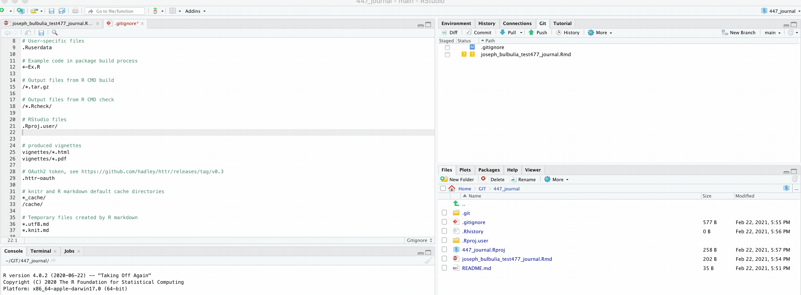

```{r setup, include=FALSE}
knitr::opts_chunk$set(
  echo = FALSE, cache = TRUE, fig.align = 'center', message = FALSE
)
```

```{r functions, include=F, message=F, warning=F}
library(tidyverse)
library(Rmisc)
library(linguisticsdown)
colorize <- function(x, color) {
  if (knitr::is_latex_output()) {
    sprintf("\\textcolor{%s}{%s}", color, x)
  } else if (knitr::is_html_output()) {
    sprintf("<span style='color: %s;'>%s</span>", color, 
      x)
  } else x
}
```

## To do:

### Download R

R is freely available for download at:
<https://www.r-project.org/>
Please make sure that you have a current version of R-studio desktop on your machine

<aside>
```{r rlogo, echo=F}
knitr::include_graphics("Rlogo.png")
```
</aside>

### Download R-Studio desktop

Rstudio desktop is also freely available for download at:

<https://rstudio.com/products/rstudio/download/#download>

Please make sure that you have the current version of R-studio desktop on your machine

<aside>
```{r rstudiologo, echo=F}
knitr::include_graphics("rs.png")
```
</aside>

### Read about Rmarkdown

Read Danielle Navarro's brief account of Rmarkdown [here](https://slides.djnavarro.net/starting-rmarkdown/#8)

### Recommended reading

This is a thorough rmarkdown workshop. You might quickly feel lost. Don't worry about. We only expect you to acquire the basics this week.

[Rmarkdown workshop](https://resulumit.com/teaching/rmd_workshop.html#18)

<!-- ## R and you -->
<!-- We're excited to be teaching you statistics in R because we believe R will: -->
<!-- -   Provide you with a resource and community for life-long learning -->
<!-- -   Enable you to be come a more reflective and conscientious data scientist -->
<!-- -   Allow you to become more effective as a data scientist. -->
<!-- What R will not do: -->
<!-- -   There's no substitute for **thinking** -->
<!-- -   This course isn't about R. It is an introduction to graduate level statistical science using R -->
<!-- -   Your workflow can help your thinking, but it is no substitute for thinking. -->

### Who is this course for?

For those of you who always wanted to learn R but never thought they could, this course is for you.

### How will you benefit from this course?

You'll learn how to use R, and Github, and we'll teach you the fundamentals of statistics with a focus thinking not on rules.

You'll learn how to learn -- that is, how to obtain the resources you need to address a problem at hand.

By the end of the course, you'll know how to:

Data skills:

1.  perform your data analysis in R
2.  document your analysis and collaborate in GitHub
3.  create a publication-ready article, with tables and graphs
4.  create a free personal website on github.

Statistical skills:

1.  learn the importance of knowing your question
2.  learn how to collect data that bears on your question
3.  learn how to explore your data visually
4.  learn how to avoid common modelling pitfalls
5.  learn how to improve your inference using multi-level models

## Our approach to teaching and learning

<!-- This course is designed to develop your skills for independent learning. Independent learning is important because research tools are constantly changing, To be an applied researcher requires a combination of **modelling skills**, **analytic skills**, **creativity**, and **reasoning**. This is all in addition to the specialist scientific knowledge that forms the backbone of any scientific research programme. -->

<!-- If these skills are the engine room of learning, it is an *interest* in learning, that will be essential to your progress in data science. We're both fascinated with learning, and it is this fascination that has motivated us to teach this course for you. -->

This course is designed to provide you with basic understanding, useful tips, and some guide rails for learning. Our main task is to give you the confidence, and the inspiration, for independent learning.

## What is R?

### In a nutshell
R is a free programming language and software environment for statistical computing (for download links see here: [Windows](https://cran.r-project.org/bin/windows/base/), [Mac](https://cran.r-project.org/bin/macosx/)).

### History 

R is the brainchild of [Ross Ihaka](https://www.stat.auckland.ac.nz/~ihaka/) and [Robert Gentleman]([https://en.wikipedia.org/wiki/Robert_Gentleman\_(statistician)](https://en.wikipedia.org/wiki/Robert_Gentleman_(statistician)){.uri}. It was created at the University of Auckland, where Ross Ihaka remains a professor of statistics.

### Purpose

R was conceived to be a flexible language for data analysis usable by researchers. Since the initial beta release of R in 2000 the language has gained substantial popularity inside and outside of academia ([have a look at this blog post for an interesting analysis](https://stackoverflow.blog/2017/10/10/impressive-growth-r/)). New versions of R are released periodically and can be downloaded and installed to replace the older R version.

## What is R Studio?

### The IDE

The are many ways for using R on your computer. For the purposes of getting started, we will be using the Integrated Development Environment (IDE): [R Studio](https://rstudio.com/).

R Studio provides an interface with a number of user-friendly options, including a separate console and editor that has various help and syntax-auto-complete functions, and various tools for plotting, history, data visualization, debugging and work space management. It is important to remember that R and R Studio are not the same thing.

<!-- There are a wide range of alternative IDEs that allow you to run R code, such as [Atom](https://atom.io/), [Sublime](https://www.sublimetext.com/), or [Visual Studio Code](https://code.visualstudio.com/), but in this course we will use Rstudio as it is the most straightforward for beginners. -->


### A quick walk through R Studio

<iframe width="560" height="315" src="https://www.youtube.com/embed/haYxa3vWA28" frameborder="0" allow="accelerometer; autoplay; clipboard-write; encrypted-media; gyroscope; picture-in-picture" allowfullscreen>

</iframe>


## GitHub

### What is Git/GitHub? 

Github is a version control system.  It's similar to Google docs, though for code. It is useful for collaboration because code easily breaks. It is only rarely possible to simultaneously work in real time on the same code because it will eventually break. Where and how is not easy to assess. 

A second function of GitHub is that it allows us to reconstruct histories of analysis. This is critical for open and reproducible science. This is the main function that we will be examining here. 

A third function, which pertains to single users, is that when writing code you can rewind and recover from your mistakes. This will save you a whole lot of time in the end.

Note that GitHub has an interface with Rstudio. You will be using GitHub with Rstudio throughout this course. 


### Install Git

We suggested installing the educational version because this will allow you to have private repositories. 

If you haven't done that, but want to get started you can open a free account and retrospectively add your educational account later. 

**PRO TIP** Pick a user name that will be OK for professional purposes. If in doubt use your name. 


Directions for installing Git can be found [http://github.com](http://github.com)


### Create a repository 

First create a repository on GitHub
```{r}
knitr::include_graphics("git1.gif")
```


### Next copy the location

```{r}
knitr::include_graphics("git2.gif")
```

### Then open a new project in Rstudio as a git project

```{r}
knitr::include_graphics("git3.gif")
```


## Then open an Rmarkdown document, write and save it


First, make sure that Rmarkdown is installed:

```{r  message=FALSE, warning=FALSE, echo = TRUE}
# run this code
if (!requireNamespace("devtools"))
  install.packages('devtools')
devtools::install_github('rstudio/rmarkdown')
```


Next, create a document

```{r}
knitr::include_graphics("git4.gif")
```


Make sure you save your document

Press <kbd>&#8984;</kbd> + <kbd>S</kbd> </kbd>  is the command for "save"

###  Then commit your Rmarkdown document by including a message, and "pushing" to GitHub


Note that we don't want want to push .Rproj files to GitHub (this will mess up your collaborations), so I edited my `.gitignore`  file.  

Typically you won't want to be pushing large html files back and forth to GitHub (that can cause GitHub to freeze).

You can edit your gitingore file by adding a `*` like so:

`/*.html`


see: https://git-scm.com/docs/gitig


### Next commit!


```{r}

```


Voila!


### Extra information


#### JB's recommendations for using Git and Rstudio

This is a very good tutorial on github and Rstudio:
[link](https://github.com/llendway/github_for_collaboration/blob/master/github_for_collaboration.md)

Video
[link](https:///www.youtube.com/watch?v=QLFc9gw_Hfs)

A very brief setup video for Mac Users
[Link](https://www.youtube.com/watch?v=-c2uNqEE6-c)


#### JK's recommendations for using Git and Rstuio

[setup](https://www.youtube.com/watch?v=ub9GfRziCtU)


## RMarkdown

## What is Rmarkdown?

In the example above we breezed through Rmarkdown without exampling it. What is Rmarkdown? 

Rmarkdown is a format for combining data-analysis with ordinary writing using a simple markup language.

The Rmarkdown code we used to write the opening paragraph looks like this.

```{=html}
<style>
div.blue{ background-color:#e6f0ff}
</style>
```
::: {.blue}
    ## To do
    Read Danielle Navarro's brief account of 
    Rmarkdown [here](https://slides.djnavarro.net/starting-rmarkdown/#8)
:::

The:

> `##`

makes a heading. Then we write as we ordinarily would write:

> Read Danielle Navarro's brief account of Rmarkdown

and we include a link by typing

> `[here](https://slides.djnavarro.net/starting-rmarkdown/#8)`

Think of rmarkdown as writing in word but without having to use your mouse all the time, and you can write up your analysis while writing in a one0stop shop.

**Rmarkdown is just an efficient method for composing text without having to reach for your mouse, and a way of documenting and reporting your analysis**

### Why is Rmarkdown useful?

Rmarkdown merges two very powerful ideas: 1. R as a coding based tool to make your analysis repeatable; 2. markdown an approach to writing text that allows for the direct embedding of code output.

This is an immensely powerful approach that can be used for everything, from writing research papers, to writing complex technical documentation. This website is written Rmarkdown.

You will be creating a website similar to [Johannes Karl'swebsite](https://johannes-karl.com/) and [Joseph Bulbulia's website](https://josephbulbulia.netlify.app/)and you will do this by written using Rmarkdown).

You might think that writing in R markdown is only a nice technical trick for people really into coding, but in reality it addresses a central problem of statistical analysis.

The majority of errors in quantitative research papers (some meta-researchers indicate values as high as 80%) are human errors in transcribing values from the statistical software they are using to the final document (for a marginally entertaining story around this issue see this [post](https://www.mcgill.ca/oss/article/food-health-news-quirky-science/setting-facts-straight-about-iron-spinach)).

Resources:
[coding tips](https://holtzy.github.io/Pimp-my-rmd/) 
[Rmarkdown website](https://rmarkdown.rstudio.com/gallery.html)


<!-- ## Slide deck -->

<!-- Click [here](slides_1.hmm) to go to the slide deck. -->

<!-- ```{r embed-xaringan, layout="l-body-outset"} -->

<!-- xaringanExtra::embed_xaringan(url = "slides.html", ratio = "4:3") -->

<!-- ``` -->


<!-- ## GitHub -->
<!-- Now that we have our repeatable code, our repeatable document, the last thing we need is a transparent way to document what we are doing and share with others. For that we come to our last tool that in a similar confusing way to R and Rstudio is split in to parts; git and Github. -->
<!-- Rstudio has a great page for getting started: [link](https://support.rstudio.com/hc/en-us/articles/200532077-Version-Control-with-Git-and-SVN) -->
<!-- ### After you have set up GitHub -->
<!-- Pushing and pulling your work to your repository is (mostly) straightforward. Remember to: -->
<!--   - Save your progress -->
<!--   - Write a commit message -->
<!--   - Push your commit -->
<!-- Tips and tricks: -->
<!--   - Set up GitHub with an  -->
<!-- JB just uses GitHub desktop, as below: -->
<!-- ```{r gt-gif, echo=F, message=FALSE, warning=FALSE} -->
<!-- knitr::include_graphics("gt.gif") -->
<!-- ``` -->


### Tips and tricks (JB)

One day, someone might ask you to collaborate in $\LaTeX$  (pronounced "Lay-Tek").  $\LaTeX$ is a document preparation system developed by Leslie Lamport in the 1980s that uses $\TeX$, a typesetting system that Donald Knuth developed in the 1970s to create mathematical documents.  Writing in LaTeX is only a little more complicated than writing in markdown. For example, instead of writing `# Heading`, `## Subheading`, `## Subsubheading`, you would write `\section{Heading}` `\subsection{Subheading}`, `\subsubsection{Subsubheading}`.  However, the principles of mouseless composition that make Rmarkdown so nice, also make LaTeX nice.  Rmarkdown shares features for bibliographic referencing with LaTeX that we'll cover in later weeks. For now, since we are teaching you about Rmarkdown, we thought it'd be useful to teach about LaTeX too.  Stay tuned for more.


### Final thought: why quantitative psychology has to change (Why can't I use SPSS, JK)

Quantitative psychology has long struggled with replicability of it's results both in substantive and also statistical areas. Concerns around these topics have already been raised on works by authors such as Joseph Banks Rhine the founder of modern parapsychology in the 1930s. Numerous authors, even at the time criticized both methods of the experiment and of the analysis [@gulliksenExtraSensoryPerceptionWhat1938]. In modern times, Deryl Bem's article "Feeling the Future" that reported evidence in favor of Extra Sensory Perception revived this debate and led to an increased uptake of Open Science methods. Importantly, this is not only an issue in psychology, but instead affects all quantitative fields such as [biology](https://journals.plos.org/plosbiology/article?id=10.1371/journal.pbio.3000246), [chemistry](https://www.fosteropenscience.eu/content/what-could-open-science-really-mean-chemistry), and [physics](https://ioppublishing.org/open-access-week-2019/open-science-and-open-physics/). Out of the many issues that are addressed as part of the open science movement (if you are interested in getting active in it have a look at [ANZORN](https://www.anzopenresearch.org/)) we will focus mostly on aspects of reproducability in analysis.

Until recently IBMs SPSS (Statistical Package for the Social Sciences), which originally launched in 1968 dominated the research space in psychology. If you never had the fortune of working with SPSS this is what it looked like:

```{r spss-old, echo=F}
knitr::include_graphics("spss.PNG")
```

SPSS presented the user with a GUI (Graphical User Interface) through which they could run tests on their data. The big issue was that each statistical test has many different options researchers can choose (you will often hear people talk about researcher degrees of freedom) and a GUI makes it very difficult to accurately record every small setting a researcher has chosen. As a work around researchers could either store their output of the analysis which recorded some settings, but even for moderately complex analysis this output could stretch in the hundredth of pages. Alternatively, researchers could save the underlying code that SPSS used, but this was also very clunky and extremely arcane to understand. To give you a sense of scope below you see a snippet from a widely used analysis in SPSS aimed at examining the similarity of factor structures across groups. This code has a total of 130 lines that researchers would have needed to largely enter by hand and double check for any potential coding errors.

```{r spss-code, echo=F}
knitr::include_graphics("spss-code.PNG")
```

Additionally, some changes made by researchers were extremely difficult to account for. For example, when a researcher recoded a variable say reversing its direction there was no way of knowing that this had taken place if you later looked at the data set. Together with the rise in complex analysis in psychology this has led to a steady decline in the use of SPSS and most psychology departments, as well as private, and governmental stake holder now require a certain fluency in R or similar coding based languages.


## Weekly problem sets

\*\* Note we will be working with you in the first week's workshop to get you through this assessment task. We don't expect that you will be able to do any of this before the first week.

### Task 1 Apply for a github education account

-   apply here: <https://education.github.com/pack/offers>
-   set up a github account.
-   choose a username that will be OK for professional purposes (e.g. your name)

### Task 2 Download R for free here:

<https://www.r-project.org>

### Task 3 Download Rstudio for free here:

<https://rstudio.com/products/rstudio/download/#download>

Update R and Rstudio to the latest versions. Don't worry if you have problems, we'll be working through your problems in the first week, and throughout the course. We assume no prior experience with R or Git/GitHub

### Task 4 Create your first repository

### Task 5 Commit your first Rmarkdown journal

-   Create your first Rmarkdown document, and title it "My Journal"
-   Record your impressions of the process of getting set up with RStudio and GitHub
-   **Record any help you have offered to other people,** and any help you have sought from other people, along the way.
-   Save the document and commit it to GitHub.
-   Note: set your github repository to private if you wish the account to be private

### Grading points

-   Your Rmarkdown document must include each of the following

1.  

    > ## Heading

2.  

    > ~~crossed out text~~

3.  

    > link to a [website](https://www.theonion.com/)

4.  

    > A footnote [^1]

5.  

    > An inspirational quote

6.  

    > BONUS: figure out how to add a bibliographic citation, such as [@darwin1964origin]
    
7.  
   > A record of help you sought and offered. 

[^1]: Humanities scholars love footnotes.

### Submit a link to your journal on Blackboard.

Blackboard isn't our favourite tool, however, we need to respect the norms of our community. For this reason, presently all of your assessments need to be uploade through Blackboard. In future iterations of this course, we'll try to allow submissions by github. For now, we press on with Blackboard.

-   On Blackboard, pass us a link to your github document on Blackboard for weekly assessments
-   This journal will count as both your weekly journal entry and your weekly workbook -- double credits!
