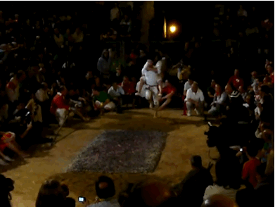
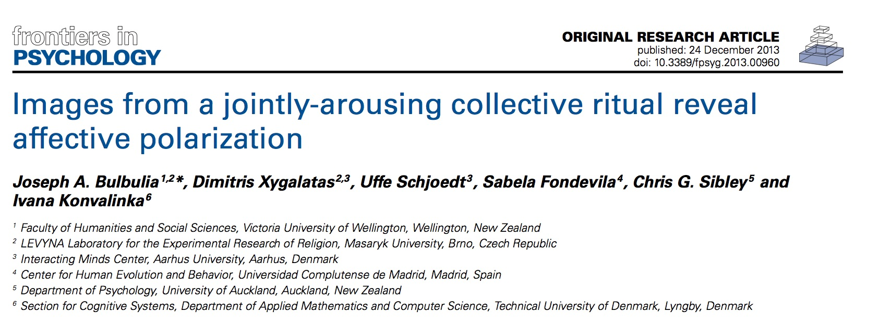
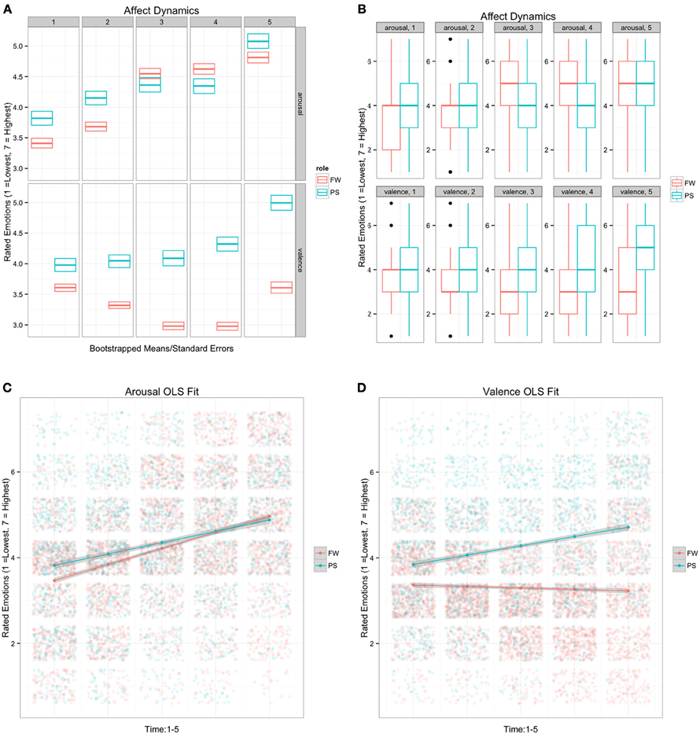

```{r setup, include=FALSE}
# Packages
library(scales)
library(here)
library(knitr)
library(kableExtra)
library(ggdist)
#library(bayesplot)
#library(tidyverse)
# knitr chunk options
opts_chunk$set(
  echo = FALSE, 
  cache = TRUE,
  message = FALSE,
  warning = FALSE,
  dev = "svg",
  fig.align = 'center'
  )
# Bayesplot color theme
#color_scheme_set("darkgray")
```

## Mihi

- Tihe mauri ora! 	  
- Ko (Uber) te waka	
- Ko (Chestnut Ridge
- Ko (Niagra) te awa 	 	
- Ko (Ameliká) te iwi 		
- Ko (Bulbulia) te hapū 	
- Ko (Joseph) ahau


## Your trial by fire in R

```{r out.width = "700px"}

```

<div class="notes">
I started learning R sometime ~ 2009. 
The process started at the San Pedro Firewalking Study (https://www.pnas.org/content/108/20/8514)
</div>

## My interested started with a Question| Are emotional expressions signals?

```{r  out.width = "700px"}
knitr::include_graphics("fw.png")
```


## Dynamics? {.flexbox .vcenter}

```{r out.width = "1000px", }
knitr::include_graphics("faces.png")
```


## Two years over the coals {.flexbox .vcenter}


```{r out.width = "1000px"}

```


## What happened? 

```{r out.width = "500px"}

```


## Topics

<div style="float: left; width: 50%;">
1. Course basics
2. Coding basics
3. Graphs
4. Consolidation of basic coding skills in R
5. (non)Linear Regression with 1 x covariate/2 x covariates
6. Confounding & causal dags 
</div>

<div style="float: right; width: 50%;">
7.  Binary, count, ordinal data
8.  Multilevel models: group-level intercept
9.  Multilevel models: group-level slopes
10. Timeseries data: within/between effects
11. Measurement + missing data
12. Bayesian inference/consolidation of statistics
</div>


## Where to find material

Weekly lectures and course resources are located [here](https://go-bayes.github.io/psych-447/)

**Problem sets are located at the *end* of each week's lecture page.**

Any readings will be linked in to the lecture page for the relevant day. If there are no readings that week we will specify: **no readings**


## Weekly journals

<div style="float: left; width: 50%;">
-  **Weekly journal entries** (about 100 - 200 words) 
(10 X journals = **10%**)

- These are **due every Friday** during term at midnight. 

- All submissions will be on Blackboard, but you may link the Blackboard submission to your GitHub page. (Not our rules!)
</div>

<div style="float: right; width: 50%;">


- Format: document your insights, questions, and frustrations in a weekly journal.  

- This record should include how you have sought help to address your questions, and how you have offered help. 

- **The purpose of the journals are to cultivate skills for interacting with the R community, and for documenting the research process.**
</div>

## Weekly problem sets

- You will find the problem sets at the end of a given week's lecture page.  
E.g. the first problem set is at the end of this page:
https://go-bayes.github.io/psych-447/posts/1_1/

- (10 x problem sets **= 50%**)

- There will be 12 problem sets, but you will only be marked on your best 10. 

- Problem sets are **due every Friday** during term at midnight. 

- Ordinarily we expect you to submit these on Blackboard -- but you can simply link to your GitHub page


## Assements page

See information under the `Assessments` url:
https://go-bayes.github.io/psych-447/assessments.html


## 1 x final project consisting of

  - 1 x short article (2500 word max): project due May 31 2021: 35%
  - 1 x github website profiling your CV: project CV due May 31 2021: 5%
  - NOTE: we require your project idea by the lab meeting on 31 March 2021.
  
  **= 40%**

The final project are due 31st May 2021. 


## Labs/workshops

Wednesdays: 3:30 -- 5:20 PM
Room: EA402

- Help with setting up 
- Problem sets (no we won't do them for you, but we can give you a steer)
- Follow up on lecture concepts
- You won't get full credit on your journal if you don't discuss your lab.


## Three interrelated tools: (1) Rstudio IDE {.flexbox .vcenter}


```{r out.width = "1000px"}
knitr::include_graphics("rstudio.png",)
```


## Three interrelated tools: (2a) GitHub {.flexbox .vcenter}

```{r out.width = "1000px"}
knitr::include_graphics("git1.gif",)
```


## Three interrelated tools: (2b) GitHub {.flexbox .vcenter}

```{r out.width = "1000px"}
knitr::include_graphics("git2.gif",)
```

## Three interrelated tools: (2c) GitHub {.flexbox .vcenter}

```{r out.width = "1000px"}
knitr::include_graphics("git3.gif",)
```

## Three interrelated tools: (2d) GitHub {.flexbox .vcenter}

```{r out.width = "1000px"}
knitr::include_graphics("git4.gif",)
```


## Three interrelated tools: (2e) GitHub {.flexbox .vcenter}

```{r out.width = "1000px"}
knitr::include_graphics("git5.gif",)
```


## Three interrelated tools: (3) Rmarkdown {.flexbox .vcenter}

```{r out.width = "1000px"}
knitr::include_graphics("cs.png")
```
# Discussion| time permitting

## Recall these faces? {.flexbox .vcenter}

```{r out.width = "1000px", }
knitr::include_graphics("faces.png")
```


## Strengths/weaknesses of these graphs?{.flexbox .vcenter}

```{r out.width = "500px"}

```


