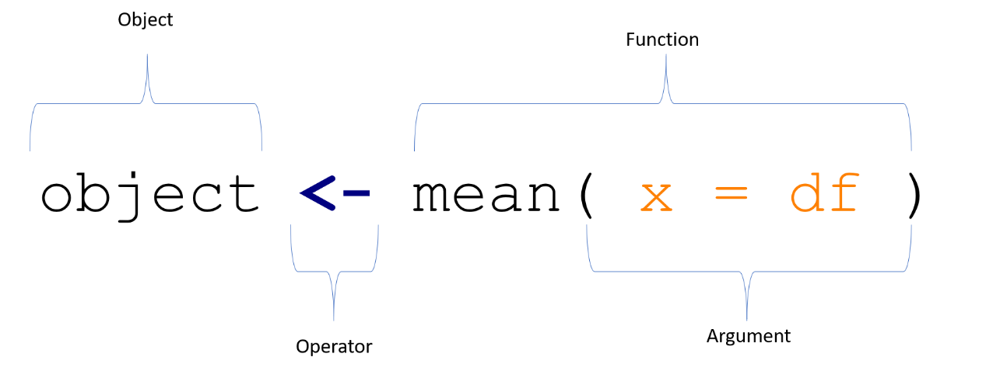

# Fundamentals of R


A `console`runs all your code in R

A `source page` runs all your code in R.

A `working directory` is where R will look for raw data and other material. 

In R-studio, (for starters) you can can use the `file` tab to import and save your material. 

Similarly, in R-studio, (for starters) you can can use install packages by clicking the `Install` tab  in the package pane (generally lower right pane) to install packagees.


## Using R as calculator

We can use R as a calculator. You can run any mathematical operation you would normally use by entering it into the console:

```{r calculator}
## Addition
x = 3 + 2
x

## Subtraction
x = 3 - 2
x

## Multiplication
x = 3 * 2
x

## Division
x = 3 / 2
x

## Modulus (Remainder from division)
x = 3 %% 2
x

## Exponentiation
x = 3 ^ 2
x

## Integer Division (Number of times denominator fits in numerator)
x = 3 %/% 2
x
```


## The basic structure of R commands

While using R as calculator might be interesting, it does not get us very far in analysing our data. 

To really unlock the full potential of R we first need to understand the basic structure of most R code and learn some terms.

The four main elements of every R code are:

  - objects, 
  - functions, 
  - <span style="color:orange">`arguments`</span>
  - <span style="color:blue">`operators`</span>. 
  
Figure \@ref(fig:syntax-figure) provides a simple example, that produces a new object which contains the mean of variable x.

```{r syntax-figure, echo = F, fig.cap = "\\label{fig:syntax-figure}The Basic Syntax of R"}

```

The function mean generates the arithmetic mean of an input object. 

The object needs to be specified inside of the function brackets as the x argument, in this case we define x = df . 

Last, we assign the result of this function for later us via the <- operator to an object which we decided to call object.


In other words, we create a new object that can be further manipulated and contains information about the mean of a previously created object "x". This structure represents the foundation of most operations in R.


Instead calling the mean function as above one could manually add all values of x dividing it by the number of x values. 

Nevertheless, this would be very cumbersome. 

For this reason, functions (pre-assembled lines of code) exist to reduce the amount of coding necessary. 

These functions can be bundled into **packages**.  R's capacity for creating packages is main appeal of R as a statistical tool because community developed functions are available from a central repository called CRAN in the form of packages. 

These packages can be installed in R with the command install.packages("package name"). 

It is important that you only need to install a package once on your machine, expect if you want to upgrade the package. Generally speaking you regularly want to upgrade your packages, but keep a permanent note in your code which version of a package you used when it was initially written.

## Recommended reading

[An introduction to R and Rstudio](https://crimebythenumbers.com/r-markdown.html)
