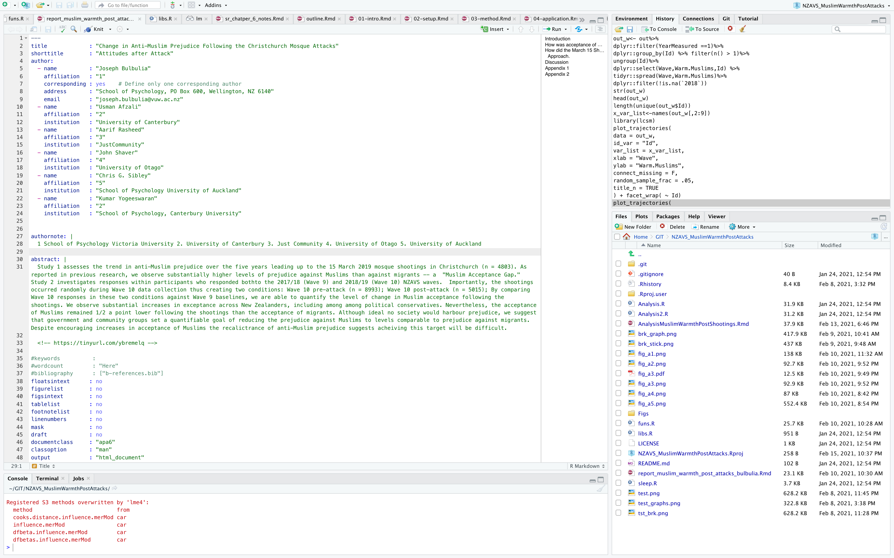

## TO DO

Read Daniell Navarro's brief account of Rmarkdown [here](https://slides.djnavarro.net/starting-rmarkdown/#8)


## Markdown is a format for writing

Rmarkdown is a format for combing code with ordinary writing.


The Rmarkdown code we used to write the opening paragraph looks like this.

<style>
div.blue{ background-color:#e6f0ff}
</style>
<div class = "blue"> 
~~~
## TO DO
Read Danielle Navarro's brief account of 
Rmarkdown [here](https://slides.djnavarro.net/starting-rmarkdown/#8)
~~~ 
</div>

The: 

>`##` 

makes a heading. We write as ordinary,

> Read Danielle Navarro's brief account of  Rmarkdown

and we include a link by typing

>`[here](https://slides.djnavarro.net/starting-rmarkdown/#8)`

Think of rmarkdown as writing in word but without having to use your mouse all the time. The really great thing about Rmarkdown is that you can write document and do the analysis in a single stop shop.  Figure \@ref(fig:ss) shows Rmarkdown in the rconsole (upper left).


```{r ss, fig.cap ="\\label{fig:ss}Screenshot of Rmarkdown document (upper left)", echo=F}

```


## Rmarkdown and You

Rmarkdown merges two very powerful ideas: 
  1. R as a coding based tool to make your analysis repeatable;
  2. markdown an approach to writing text that allows for the direct embedding of code output. 

This is an immensely powerful approach that can be used for everything, from writing research papers, to writing complex technical documentation. This website is written Rmarkdown.

You will be creating a website similar to [Johannes Karl'swebsite](https://johannes-karl.com/) and [Joseph Bulbulia's website](https://josephbulbulia.netlify.app/)and you will do this by written using Rmarkdown). 

You might think that writing in R markdown is only a nice technical trick for people really into coding, but in reality it addresses a central problem of statistical analysis. 

The majority of errors in quantitative research papers (some meta-researchers indiate values as high as 80%) are human errors in transcribing values from the statistical software they are using to the final document (for a marginally entertaining story around this issue see this [post](https://www.mcgill.ca/oss/article/food-health-news-quirky-science/setting-facts-straight-about-iron-spinach)).  

## How to keep track of everything

Now that we have our repeatable code, our repeatable document, the last thing we need is a transparent way to document what we are doing and share with others. For that we come to our last tool that in a similar confusing way to R and Rstudio is split in to parts; git and Github.


## Some useful sites

[coding tips](https://holtzy.github.io/Pimp-my-rmd/)
[Rmarkdown website](https://rmarkdown.rstudio.com/gallery.html)


