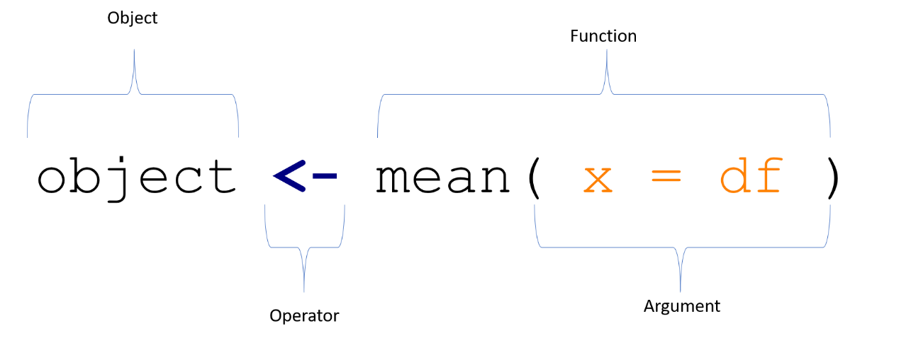

## To do:

A good, and free introduction to [R for Data Science](https://r4ds.had.co.nz/introduction.html) Read chapters: 2-8 (they are short chapters.)

## Fundamentals of R

A `console` runs all your code in R

A `source page` runs all your code in R.

A `working directory` is where R will look for raw data and other material.

In R-studio, (for starters) you can can use the `file` tab to import and save your material.

Similarly, in R-studio, (for starters) you can can use install packages by clicking the `Install` tab in the package pane (generally lower right pane) to install packagees.

## How to use R as calculator

We can use R as a calculator. You can run any mathematical operation you would normally use by entering it into the console:

```{r calculator}
## Addition
x = 3 + 2
x

## Subtraction
x = 3 - 2
x

## Multiplication
x = 3 * 2
x

## Division
x = 3 / 2
x

## Modulus (Remainder from division)
x = 3 %% 2
x

## Exponentiation
x = 3 ^ 2
x

## Integer Division (Number of times denominator fits in numerator)
x = 3 %/% 2
x
```

## Inspecting data

In a moment, we'll teach you how to import data into R. For now, let's work with a dataset that is already present in your R environment, the `iris` dataset.

Here are some useful commands for inspecting data

### check head of dataset sing `head`

```{r}
# the top rows and columns of the dataset
head(iris)
```

### check data types using `str`

```{r}
str(iris)
```

### names

```{r}
#names of the columns
names(iris)
```

### view rownames

```{r}
# view rownames
rownames(iris)
head(iris)
```

### table (and use of `$`)

```{r}
# create a table
table(iris$Species)
```

### change column names

```{r}
# change column names
# create new dataset for 
irisdat2 <- iris
# chage names of columns
names(irisdat2)[] <- c("s_l", "s_w", "p_l", "p_w", "sp")
#inspect
head(irisdat2)
```

## Basic data structures

### vectors of numbers ( and use of `c` and `i:x` )

```{r}
go_vector <- c(1:5)
go_vector
```

### vectors of characters

```{r}
go_vector2 <- c("hello", "world")
go_vector2
```

```{r}
as.vector(irisdat2$s_l)
```

### dataframes (2 dimensional square arrays of vectors)

2 x dimensional "square" array with equal column and row lengths. Can contain data with multiple formats characters, facotors, integers, etc.

```{r}
yuk <- data.frame(c("the", "enumeration", "of", "the", "constitution"), 6:10)
yuk
```

### rename columns of a data frame

```{r}
names(yuk)[] <- c("short", "best")
yuk
```

### matrix

Same as a dataframe but can only contain one format (e.g. numbers *or* characters)

```{r}
yok <- as.matrix(yuk)
yok
```

### lists

Arrays with constraints on "squareness" or data types.

```{r}
lok <- list(yok, yuk)
lok
```

## Classes in R

### `numeric` and `integer`

`numeric` means number

```{r}
is.numeric(4.2)
```

`integer` means a number that is not a fraction

```{r}
is.integer(4.2)
```

Note the default here:

```{r}
is.integer(4)
```

```{r}
is.integer(as.integer(4))
```

We'll need to ensure that certain numbers are integers later on, when we are estimating poisson models and/or doing bayesian data analysis.

#### characters

Characters are strings:

```{r}
# this is a character
is.character("chapeau")
# this is not
is.character(4)
```

### factors

A factor is a category. It can be ordered (e.g. an ordinal scale) or unordered (say a participant in a study, or a wave in a longitidunal study)

```{r}
str(iris)
```

It's really important to check that ordered categories are really ordered categories in your dataset.

There was is a famous retraction recently where a group found that religion was associated with immorality, however the countries in the the study had been coded as numbers, not as factors. The study's effect entirely disappeared once this error was corrected!

## Indexing in R

### columns

```{r}
# select second column of "yuk"
yuk[, 2]
```

### rows

```{r}
# select second row of yuk
yuk[2, ]
```

### rows and columns

```{r}
#select first row and first column of yuk
yuk[1, 2]
```

### selection by negation

```{r}
# negate the first column of yuk
yuk[, -1]
```

```{r}
# negate the second column of yuk
yuk[,-2]
```

## Basic data wrangling in R

#### `c`

```{r}
# select only the first and second cols of iris
iris_short2 <- iris[ ,c( 1, 2 ) ]
head(iris_short2)
```

#### `-c`

```{r}
# select all columns but the first and second of iris
iris_short <- iris[ ,-c( 1, 2 ) ]
head(iris_short)
```

#### `cbind`

```{r}
# for use with dataframes and matrices -- note that srings a are c
yokyuk<-cbind(yok,yuk)
yokyuk
str(yokyuk)
```

#### `rbind`

```{r}
rbind(yuk[,],yok[2:3])
```

#### use of `$` and []

```{r}
#select the fifth row of the column
iris_short$Petal.Width[5]
```

### use of `$` and [i:x]

```{r}
#select the 5th-25th row of the column
iris_short$Petal.Width[5:25]
```

## Indexing for logical operations

### definitions

-   `==` means "equals to"
-   `!=` means "not equals to"
-   `>` means "greater than"
-   `<` means "less than"
-   `>=`means "greater than or equal"
-   `<=` means "less than or equal"
-   `!` means "not"
-   `&` means "and"
-   `|` means "or"!
-   `is.na` means "is missing" (missing values are coded in R as NA)

<aside>

`> -9999 == 666` `> TRUE` !!! :)

</aside>

### evaluation using logical operators

#### create dataframe

```{r}
# create data frame
df<-data.frame( x = c(1:10),y = c(11:20) )
```

#### evaluate cases

```{r}
#evaluate cases in y that greater  than 15
df[,"y"] > 15
```

#### sum instances

```{r}
# count these cases
sum(df[,"y"] > 15)
```

#### sum instances with a different operator

```{r}
# count cases greater than or equal to 15
sum(df[,"y"] >= 15)
```

#### another methods

```{r}
# another approach
sum(df$y >= 15)
```

#### using the `or` function

```{r}
# combine operators
sum(df$y >= 15 | df$y <=11)
```

#### go meta

```{r}
# go "meta"
sum(df$y >= 15 | df$y <= 11) == sum(df$x >=5 | df$x <=1 )
```

#### go meta-meta!

```{r}
# go meta-meta
sum(sum(df$y >= 15 | df$y <= 11) == sum(df$x >=5 | df$x <=1 ))
```

#### use operators to modify data

```{r}
# using assignment to modify data
df$x[df$x >=5 ] <- NA
df
```

#### using `is.na` and `!is.na`

```{r}
sum(is.na(df$x))
```

```{r}
sum(!is.na(df$x))
```

```{r}
sum(is.na(df$x)) + sum(!is.na(df$x)) 
```

## The basic structure of R commands

The four main elements of every R code are:

-   objects,
-   functions,
-   [`arguments`]{style="color:orange"}
-   [`operators`]{style="color:blue"}.

Figure \@ref(fig:syntax-figure) provides a simple example, that produces a new object which contains the mean of variable x.

```{r syntax-figure, echo = F, fig.cap = "\\label{fig:syntax-figure}The Basic Syntax of R"}

```

### `mean`

The function `mean` generates the arithmetic mean of an input object:

```{r}
# a function to assess the mean of a Sepal.Length
mean(iris$Sepal.Length)
```

### `sd`

The function `sd` gives us the standard deviation:

```{r}
# standard deviation of Sepal.Length
sd(iris$Sepal.Length)
```

### `summary`

```{r}
# summary of the "Sepal Length" column
summary(iris$Sepal.Length)
```

```{r}
# summary of the Iris data set
summary(iris)
```

### Coding

The object needs to be specified inside of the function brackets as the x argument, in this case we define x = df .

Last, we assign the result of this function for later us via the \<- operator to an object which we decided to call object.

In other words, we create a new object that can be further manipulated and contains information about the mean of a previously created object "x". This structure represents the foundation of most operations in R.

Instead calling the mean function as above one could manually add all values of x dividing it by the number of x values.

Nevertheless, this would be very cumbersome.

For this reason, functions (pre-assembled lines of code) exist to reduce the amount of coding necessary.

These functions can be bundled into **packages**. R's capacity for creating packages is main appeal of R as a statistical tool because community developed functions are available from a central repository called CRAN in the form of packages.

These packages can be installed in R with the command install.packages("package name").

It is important that you only need to install a package once on your machine, expect if you want to upgrade the package. Generally speaking you regularly want to upgrade your packages, but keep a permanent note in your code which version of a package you used when it was initially written.

### Installing package

#### install these packages (we'll be using them later)

```{r eval=FALSE}
install.packages("devtools") # installing packages
```

```{r  eval=FALSE}
install.packages("remotes") # installing packages
```

```{r eval=FALSE}
install.packages("tidyverse") ## data wrangling and visualisation
```

```{r eval=FALSE}
install.packages("lme4") # multilevel modelling
```

```{r eval=FALSE}
install.packages("patchwork") # arranging multiple graphs
```

```{r eval=FALSE}
library(devtools)
devtools::install_github("strengejacke/sjPlot") # plots and tables
```

```{r eval=FALSE}
install.packages("papaja")  # writing APA documents
```

```{r eval=FALSE}
install.packages("table1") # summary tables
```

#### extra credit

```{r eval=FALSE}
devtools::install_github("easystats/easystats")
```

```{r eval=FALSE}
devtools::install_github("strengejacke/ggeffects")
```

#### super extra credit

```{r eval=FALSE}
if (!requireNamespace("remotes")) {
  install.packages("remotes")
}
remotes::install_github("paul-buerkner/brms")
```

```{r eval=FALSE}
devtools::install_github("stan-dev/cmdstanr")
```

## Rolling your own code

Let's use R to write a function. Recall that a factorial for a number $n$ is the product of all positive inters less than or equal to $n$. Thus the factorial for 5 = $$1 \times 2 \times 3 \times 4 \times 5$$

In R we can write a function:

```{r}
# create a function to perform the factorial operation 
go_factorial <- function(x) {
  y <- 1
  for (i in 1:x) {
    y <- y * ((1:x)[i])
  }
  print(y)
}
```

Let's try it out

```{r}
# test of the `go_factorial` function
go_factorial(5)
```

Let's see if this is the number that R's `factorial` function produces:

```{r}
# R's native factorial function
factorial(5)
```

We can use R's `==` relational operator to evaluate whether the two functions are the same

```{r}
# are the two functions equivalent for factorial five
go_factorial(5) == factorial(5)
```

<aside>

For more information about relational operators type the following into your console:

```{r, eval=FALSE}
?`==`
```

</aside>

We can make more complicated functions:

```{r}
# function for factorial that throws warnings when the data that are entered are not appropriate. 
go_bayes_factorial <- function (x) {
  # check is the number is negative, positive or zero
  if (x  < 0) {
    print("not even Ashley Bloomfield could make a factorial for a negative number")
  } else if (x == 0) {
    print("the factorial of zero is defined as 1")
  } else {
    for (i in 1:x)
      y <- 1
    for (i in 1:x) {
      y <- y * ((1:x)[i])
    }
    print(y)
  }
}
```

We'll come back to functions later. It's useful to look at an example of a function so that you can see that R is much more than a calcultor. It is a tool to empower you for doing data anlysis in new and creative ways.

### Coding etiquette

Keep your code legible and annotate

Why is this bad code?

```{r}
df1<-data.frame(a=rnorm(10,1,1),b=rnorm(10,4,8),c=rnorm(10,8,1),d=rnorm(10,7,2))
```

Why is this better code?

```{r}

# Create a data frame with four columns of randomly generated numbers specifying different means and standard deviations 
df1 <- data.frame(
  a = rnorm( 10, mean = 1, sd = 1 ),
  b = rnorm( 10, mean = 4, sd = 8 ),
  c = rnorm( 10, mean = 8, sd = 1 ),
  d = rnorm( 10, mean = 7, sd = 2 )
)
```

## using R!

### data summary

```{r}
# basic summary
summary(iris)
```

```{r}
table1::table1(~ Sepal.Length   + Sepal.Width   + Petal.Length  + Petal.Width |Species, data = iris  )
```

```{r}
# plot relationship (what is happening here? )
plot( Sepal.Length   ~ Sepal.Width , data = iris )
```

### model

```{r}
library("tidyverse")  # plotting
library("ggeffects")  # plotting
library("ggplot2")  # plotting
library("patchwork") # arrange multiple plots
library("sjPlot")  # tables and plots

# basic model
m1<- lm(Sepal.Length ~ Sepal.Width, data = iris)
summary(m1)
```

### results

```{r}
# better summary method
sjPlot::tab_model(m1)
```

```{r}
# plot the coefficients
sjPlot::plot_model(m1)
```

### graph predicted effects


```{r fig.fullwidth = TRUE, fig.width=12, fig.height=12}
# plot the predicted relationship of Sepal Width on Sepal Length
p1 <- ggeffects::ggpredict(m1, terms = "Sepal.Width")
plot(p1)
```

### What is the advantage of this graph? 

```{r}
pp1 <- plot(p1,
            add.data = TRUE,
            dot.alpha = .8,
            jitter = .2)
pp1
```

### try another model

```{r}
head(iris)
summary (m2 <- lm(Petal.Length ~ Petal.Width, data = iris)) 
```

```{r fig.fullwidth = TRUE, fig.width=12, fig.height=12}
pp2<-plot(
  p2 <- ggeffects::ggpredict(m2, terms = "Petal.Width"),
  add.data = TRUE,
  dot.alpha = .8,
  jitter = .2
) 
pp2
```


```{r fig.fullwidth = TRUE, fig.width=12, fig.height=12}
## arange plots
library(patchwork)
pp1 / pp2 + plot_annotation(title = "two plots", tag_levels = "i")
```


## to be continued
