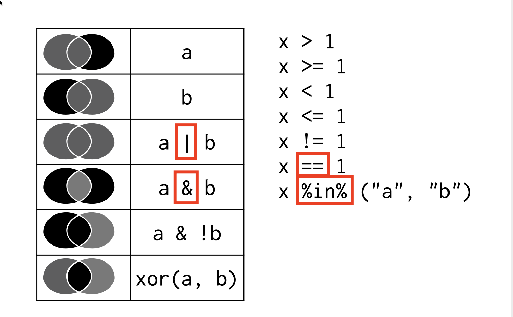

# Data visualisation with ggplot2


```{r spss-old, echo=F}
knitr::include_graphics("op.jpg")
```


## Introduction

In this lecture we'll first introduce you to the `ggplot2` package, and vocabulary, for creating graphs in R. We'll mostly follow the approach described in the book "R for data science," which can be found [here](https://r4ds.had.co.nz/data-visualisation.html).

We'll then turn to data-wrangling using the `dplyr` package. 

Both `ggplot2` and `dplyr` can be found in `library(tidyverse)`


## Creating a graph 

Step 1, load tidyverse:

```{r loaddat}
library("tidyverse")
```

Step 2, Make sure your dataset is loaded. We'll start with the `mpg` dataset

```{r inspectdat}
#inspect the mpg dataset
head(mpg)
```


Step 3. Inspect the"Negative relationship between highway fuel efficiency and a cars engine size (which is given by the variable `displ`).

```{r firstgraph}
# Create graph
ggplot(data = mpg) + 
  geom_point(mapping = aes(x = displ, y = hwy)) + 
  labs(title = "Negative relationship between engine displacement and fuel efficiency.")
```

A basic problem with this graph is that we don't know what it is representing. To avoid this problem, it is useful to get into the habit of adding titles to your graphs, and also of using informative axis labels. We do this by adding additional layers.

```{r graphlabels}
# Create graph and add title
ggplot(data = mpg) + 
  geom_point(mapping = aes(x = displ, y = hwy)) + 
  labs(title = "Negative relationship between engine displacement and fuel efficiency.") + 
  xlab("Engine displacement in (units)") + 
  ylab("Highway miles per liter")
```

Let's walk through the logic of the ggplot2 "grammar":

First we call the data

```{r, adddata, eval=FALSE}
# here we are calling up the data
ggplot(data = mpg)
```

Next, we add a layer of points, by calling the relevant columns and rows of this dataset

```{r addlayer1}
# Here, we add a layer of points, by calling the relevant columns and rows of this dataset
ggplot(data = mpg) + 
  geom_point(mapping = aes(x = displ, y = hwy))
```

Then we add the title

```{r,  addlayer2}
# Create graph and add title
ggplot(data = mpg) + 
  geom_point(mapping = aes(x = displ, y = hwy)) + 
  labs(title =  "Negative relationship between engine displacement and fuel efficiency.")
```

Then we add the labels

```{r, addlayer3}
# Create graph and add title
ggplot(data = mpg) + 
  geom_point(mapping = aes(x = displ, y = hwy)) + 
  labs(title ="Negative relationship between engine displacement and fuel efficiency.")   + 
  xlab("Engine displacement in (units)") + 
  ylab("Highway miles per liter") 
```

We can change the axis starting positions:

```{r, addlayer4}
# Create graph and add title
ggplot(data = mpg) + 
  geom_point(mapping = aes(x = displ, y = hwy)) + 
  labs(title ="Negative relationship between engine displacement and fuel efficiency.")   + 
  xlab("Engine displacement in (units)") + 
  ylab("Highway miles per liter") + expand_limits(x = 0, y = 0)
```


The generic method for adding layers is as follows: 

```{r, eval = FALSE}
ggplot(data = <DATA>) + 
  <GEOM_FUNCTION>(mapping = aes(<MAPPINGS>))
```


## Using ggplot 2 to highlight elements of interest. 


Here we can use the "color = " option.^[Removing the axis and labels here just to keep the code compact]

```{r, addfactor1}
# Which cases interest you in this graph?
ggplot(data = mpg) + 
  geom_point(mapping = aes(x = displ, y = hwy, color = class)) 
```

Here's a shape command

```{r, addfactor2}
# Which cases interest you in this graph?
ggplot(data = mpg) + 
  geom_point(mapping = aes(x = displ, y = hwy, shape = class)) 
```

Here's a size command

```{r, addfactor3}
# Which cases interest you in this graph?
ggplot(data = mpg) + 
  geom_point(mapping = aes(x = displ, y = hwy, size = cty)) 
```


Here's the fill command

```{r, addfactor4}
# Which cases interest you in this graph?
ggplot(data = mpg) + 
  geom_point(mapping = aes(x = displ, y = hwy, fill = cty)) 
```

Here's the alpha command

```{r, addfactor5}
# Which cases interest you in this graph?
ggplot(data = mpg) + 
  geom_point(mapping = aes(x = displ, y = hwy, alpha  = .1)) 
```


Here's the alpha command combined with the fill command

```{r, addfactor6}
# Which cases interest you in this graph?
ggplot(data = mpg) + 
  geom_point(mapping = aes(x = displ, y = hwy, alpha = cty, size = cty)) 
```


## Facets

We can create multiple graphs using `facets`

```{r facetwrap,  layout="l-body-outset", fig.width=12, fig.height=12}
ggplot(data = mpg) + 
  geom_point(mapping = aes(x = displ, y = hwy, color = class)) + 
   facet_wrap(~ class, nrow = 2)
```


We use facet_grid for graphing the Negative relationship between two variables. 

Note the difference betwen these two graphs:

Here the focus is on the negative relationship between class and the x variable, displacement

```{r facetgr2, layout="l-body-outset", fig.width=12, fig.height=12}
ggplot(data = mpg) + 
  geom_point(mapping = aes(x = displ, y = hwy, color = class)) +
  facet_grid(class ~ .)  + theme(legend.position = "none") 
```

Here the focus is on the relationship betwen class and the y variable, highway milage. 
```{r layout="l-body-outset", fig.width=12, fig.height=12}
ggplot(data = mpg) + 
  geom_point(mapping = aes(x = displ, y = hwy, color = class)) +
  facet_grid(. ~ class) + theme(legend.position = "none") 
```


We can focus on Negative relationship between class and the x and y variables simultaneously. Here we add the 'year` indicator and we do not see much of an improvement in highway milage for the different classes, adjusting for displacement:

```{r figfacet0, layout="l-body-outset", fig.width=12, fig.height=12}
ggplot(data = mpg) + 
  geom_point(mapping = aes(x = displ, y = hwy, color = class)) +
  facet_grid(class ~ year) + theme(legend.position = "bottom") +
  labs(title ="Negative relationship between engine displacement and fuel efficiency by class.") + 
  xlab("Engine displacement in (units)") + 
  ylab("Highway miles per liter") 
```


## Understanding your data through graphs


We can create a graph of relationships:
```{r}
# set better theme
theme_set(theme_classic())
ggplot(data = mpg) +
  geom_smooth(mapping = aes(x = displ, y = hwy)) + 
  labs(title ="Negative relationship between engine displacement and fuel efficiency.") +
  xlab("Engine displacement in (units)") +
  ylab("Highway miles per liter") 
```


Add points as a layer


```{r}
ggplot(data = mpg) +
  geom_point(mapping = aes(x = displ, y = hwy)) + 
  geom_smooth(mapping = aes(x = displ, y = hwy)) +
  theme(legend.position = "bottom") +
  labs(title ="Negative relationship between engine displacement and fuel efficiency.") +
  xlab("Engine displacement in (units)") +
  ylab("Highway miles per liter") 
```


We can write this more compactly, by including the mapping with the data layer

```{r}
ggplot(data = mpg, mapping = aes(x = displ, y = hwy)) + 
  geom_point() + 
  geom_smooth()
```


Then we can include mappings for specific layers

```{r}
ggplot(data = mpg, mapping = aes(x = displ, y = hwy)) + 
  geom_point(mapping = aes(color = class)) + 
  geom_smooth()
```


We can add a grouping factor e.g. for "drv", thus creating multiple lines 

```{r}
ggplot(data = mpg, mapping = aes(x = displ, y = hwy, group = drv)) + 
  geom_point(aes(color = class)) + 
  geom_smooth()
```


We can replace the smooths with linear models

```{r}
ggplot(data = mpg, mapping = aes(x = displ, y = hwy, linetype = drv)) + 
  geom_point(aes(color = class)) + 
  geom_smooth(method = "lm")
```


## Transforming data 

First we'll get the flights data 

```{r}
library(nycflights13)
head(flights)
```

Next we'll create some data frames to help us illustrate points

```{r}
df <- data.frame(
colour = c("blue", "black", "blue", "blue", "black"), value = 1:5)
head(df)
```


### Revisiting logical operators

Recall our logical operators. These will be essential for data wrangling

```{r logic}

```


### Command `filter`: keeps rows matching criteria

Keep only blue rows:


```{r}
df%>%
filter(colour == "blue")
```


Keep only values 1 and 4
```{r}
df%>%
  filter (value %in% c(1,4))
```


Keep values 1 through 4

```{r}
df %>%
  filter (value %in% c(1:4))
```

Another way to do the same


```{r}
df %>%
  filter (value != 5)
```


### Task

How can we find all flights that left in January? 

```{r}
head(flights)
```


```{r}
flights%>%
  dplyr::filter(month ==1)
```


Flights delayed by more than 15 mintutes that arrived on time

```{r}
flights%>%
  dplyr::filter (dep_delay >15 & arr_delay <=0)
```

### Command `select`: picks columns by column name


Select the colour column

```{r}
df%>%
  dplyr::select ( colour )
```

Another way? 


```{r}
df%>%
  dplyr::select ( !value )
```

or

```{r}
df%>%
  dplyr::select ( -c(value ))
```


### Command `arrange` reorders rows


```{r}
df %>%
  arrange(value)
```


```{r}
df %>%
  arrange(desc(value))
```


Task: how would we order flights by departure data and time ?

```{r}
flights %>%
  arrange(month, day, dep_time)
```

Task which flights have the greated difference between departure delay and arrival delay? 

```{r}
flights%>%
  arrange(desc(dep_delay - arr_delay))
```


Not this could be written briefly as this:

```{r}
arrange(flights, desc(dep_delay - arr_delay))
```

### Command `mutate` add new variable name

```{r}
df %>%
  mutate(double_value = 2 * value)
```

Order flights by greatest difference between departure delay and arrival delay? 

```{r}
flights %>%
  mutate(diff_dep_arr = dep_delay - arr_delay)%>%
  select(flight,diff_dep_arr)%>%
  arrange(desc(diff_dep_arr))
```

### Command `summarise` reduce variables to values

Sum all values in the df dataset

```{r}
df %>%
  summarise (total = sum(value))
```

Summaries the values by colour groups, and give the number of items per colour group 

```{r}
df %>%
  group_by(colour) %>%
  summarise(total = sum(value),
            n = n())
```

Useful summary functions are:

  * `min(x)`
  * `max(x)`
  * `mean(x)`
  * `n`
  * `n_distinct`
  * `sum(x)`
  * `sum(x > 10)`
  * ` mean(x > 10)`
  * `sd(x`)
  * `var(x)`
  

Task, how many flights flew on Christmas?

```{r}
head(flights)
```


```{r}
flights %>%
  filter( month == 12, day == 25)%>%
  summarise (n = n())

```

Calculate average delay:

```{r}
flights %>%
  summarise(delay = mean(dep_delay, na.rm = TRUE))
```


```{r}
summarise(flights, delay = mean(dep_delay, na.rm = TRUE))
```


### Multiple pipe operators

Here we: 

1. Group flights by destination.

2. Summarise to compute distance, average delay, and number of flights.

3. Remove Honolulu airport, because it is so far away

```{r}
delays <- flights %>% 
  group_by(dest) %>% 
  summarise(
    count = n(),
    dist = mean(distance, na.rm = TRUE),
    delay = mean(arr_delay, na.rm = TRUE)
  ) %>% 
  filter(dest != "HNL")
head(delays)
```


```{r}
flights %>% 
  filter(!is.na(dep_delay), !is.na(arr_delay)) %>% # not cancelled
   group_by(tailnum) %>% # group by unique aircraft
  summarise(
    delay = mean(arr_delay, na.rm = TRUE),
    n = n()
  ) %>%
  ggplot(mapping = aes(x = n, y = delay)) + 
  geom_point(alpha = 1/10)  + 
  labs(title = "Variation in average delay by tailnumber ") 
```


### Other functions 

Suppose you only wanted to keep your mutated variables, in this case you can use `transmute`

```{r}
new_flights <-transmute(flights,
  gain = dep_delay - arr_delay,
  hours = air_time / 60,
  gain_per_hour = gain / hours
)
head(new_flights)
```


To learn more, go to https://dplyr.tidyverse.org/


