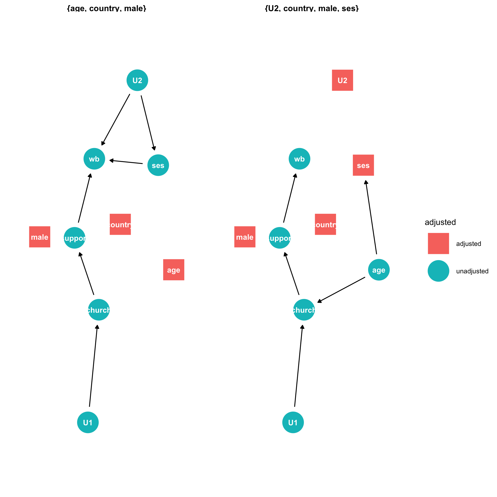

```{r echo=F}

```

## Required readings

Required readings are as follows:

-   @rohrer2018 [link](https://journals.sagepub.com/doi/full/10.1177/2515245917745629)
-   @barrett2021 [link](https://cran.r-project.org/package=ggdag)
-   @mcelreath2020[link](https://tewaharoa.victoria.ac.nz/discovery/fulldisplay?docid=alma99179374299902386&context=L&vid=64VUW_INST:VUWNUI&search_scope=MyInst_and_CI&tab=all&lang=en)

## Preamble

Make sure that you install the `rethinking` package and the `ggdag` package. Note that the rethinking package is not on cran.

```{r echo = TRUE, include = FALSE}
# packages
# ```{r install_rethinking}
# function for installing dependencies
ipak <- function(pkg){
new.pkg <- pkg[!(pkg %in% installed.packages()[, "Package"])]
if (length(new.pkg)) 
    install.packages(new.pkg, dependencies = TRUE) 
sapply(pkg, require, character.only = TRUE)
}
# usage
packages <- c("coda", "plyr", "mvtnorm", "scales", "dagitty")
ipak(packages)

# next install rethinking
if (!require(rethinking)) {
  devtools::install_github("rmcelreath/rethinking")
}

#next install ggdag
if (!require(rethinking)) {
  devtools::install_github("malcolmbarrett/ggdag")
}

# installed from previous lectures
library("equatiomatic")
library("tidyverse")
library("ggdag")
library("brms")
library("rstan")
library("rstanarm")
# library("tidybayes")
library("bayesplot")
library("easystats")
# rstan options
rstan_options(auto_write=TRUE)
options(mc.cores=parallel::detectCores ())
theme_set(theme_classic())
```

## What is a regression model

Before the break, we introduced basic concepts in statistical regression.

To refresh your memory, let's focus on the relationship between the speed of a car and the distance that it takes for a car to stop. We'll use the `cars` dataset which is automatically loaded when you start R. Note: the data were collected in the 1920s

Here is our model

```{r}
model_simple <- lm(dist ~ speed, data = cars)
```

Here we have the output:

```{r}
parameters::parameters(model_simple)
```

How do we interpret the results?

We can write this output in the following way:

```{r eval = FALSE, include = FALSE}
# this is how to quickly generate the equation
equatiomatic::extract_eq(model_simple,  use_coefs = TRUE)
```

$$
\operatorname{\widehat{dist}} = -17.58 + 3.93(\operatorname{speed})
$$

The model says that the expected stopping distance for a car is -17.58 feet when the speed of the car is set to zero, plus an additional 3.93 feet for each additional unit of speed (here in miles per hour).

What strikes you about this model?

If you are like me you probably feel confusion when you see the number "-17.58" predicting speed. Did car manufacturers of the 1920s invent a method for traversing space and time as we know it? Or is regression a hopeless tool for understanding the world and should you demand your money back for this course?

Let's look at the data more carefully:

```{r}

cars%>%
  dplyr::arrange(speed)%>%
  tibble()
```

Here we find that the lowest speed measured in this dataset is 4 miles per hour, at which distance the car stopped in 2 feet. Another car travelling at 4 mph took 10 feet to stop.

Let's plug these two numbers into the regression equation that we just estimated.

```{r}
coef(model_simple)[[1]] + coef(model_simple)[[2]] * min(cars$speed, na.rm = FALSE)
```

Is this any better? We're still getting a negative speed.

Plotting the data we have:

```{r}
ggplot2::ggplot(data = cars, 
                aes( x = speed,  y = dist )) +
  geom_smooth(method = "lm") + 
  geom_point()
```

Here, our linear model is minimising the average distance between between observed speed and observed distance in the sample. The model hits at most a few points in the dataset. Otherwise it estimates a response that is either too high or two low.

In this case, we render the meaningless intercept term `r coef(model_simple)[[1]]` interpretable by setting centering our predictor variable speed:

```{r}
# center and create new dataframe
schmars <- cars%>%
  dplyr::mutate(speed_s = scale(speed, center = TRUE, scale = FALSE))

model_simple2 <- lm(dist ~ speed_s, data = schmars)
parameters::parameters(model_simple2)
```

Notice that the estimated coefficient for speed is the same:

```{r}
# evaluate whether the two coefficients are the same at least to five decimal places
round(coef(model_simple)[[2]],5) == round(coef(model_simple2)[[2]],5)
```

And the graph is the same:

```{r}
ggplot2::ggplot(data = cars, 
                aes( x = speed,  y = dist )) +
  geom_smooth(method = "lm") + 
  geom_point()
```

This examples serves as a reminder about how a regression model works. However it also makes an important point to which we'll return repeatedly throughout this course:

The output of a statistical model is is **not** self evident. We must therefore **think** both before and after we write a statistical model. If we don't think, our statistical models will lead us astray.

In the remainder of this lecture I'm going to introduce a tool the concept of regression with multiple predictors. I used to think that multiple regression was easy. As we see, however, multiple regression can very easily lead us to the wrong inference if we do not think about our research question, our data, and what a statistical model is doing (or not doing) to clarify the relationship between our data and our research question.

To introduce multiple regression I'm going to follow Richard McElreath's **Statistical Rethinking**. We have an online version of this book in our library (see the link above.)


## Multiple regression 

We have already encountered multiple regression. Perhaps the most familiar case is prediction. Suppose we want to predict someones expected income based on their gender identification. Suppose we theory is true there might be an added income advantage from height.  We can include an additional term in our model and evaluate whether or theory is true.   Let's assess this question using the jittered NZAVS dataset 

```{r}
nz_0 <- readr::read_csv2(url("https://raw.githubusercontent.com/go-bayes/psych-447/main/data/nz/nz.csv"))
nz_0$Household.INC
nz <- nz_0 %>%
  dplyr::select(HLTH.Height,Household.INC, Male)

```


Multiple regression has many uses.  


## What is causal confounding?

```{r figopen, echo=F}
knitr::include_graphics("op2.png")
```

## The difference between prediction and explanation?

## Examples of confounding

```{r echo = FALSE, include = FALSE}
N <-100
age <- rnorm( N )# sim A
mar <- rnorm( N , -age ) # sim A -> M
div <- rnorm( N , age ) # sim A -> D
df <- data.frame(age,mar,div)

plot(age ~ mar)

md<-lm(mar ~ age, data = df)
summary(md)
sjPlot::plot_model(md)
```

```{r echo = FALSE, include = FALSE}
## Confound 
south<-rnorm(N)
waffles <-rnorm(N, south)
age <- rnorm(N, south)
mar <- rnorm( N, -age ) # sim A -> M
div <- rnorm( N,  age ) # sim A -> D
df <- data.frame(age,mar,div,south,waffles)

md<-lm(div ~ waffles + mar + south, data = df)
summary(md)
sjPlot::plot_model(md)
```
