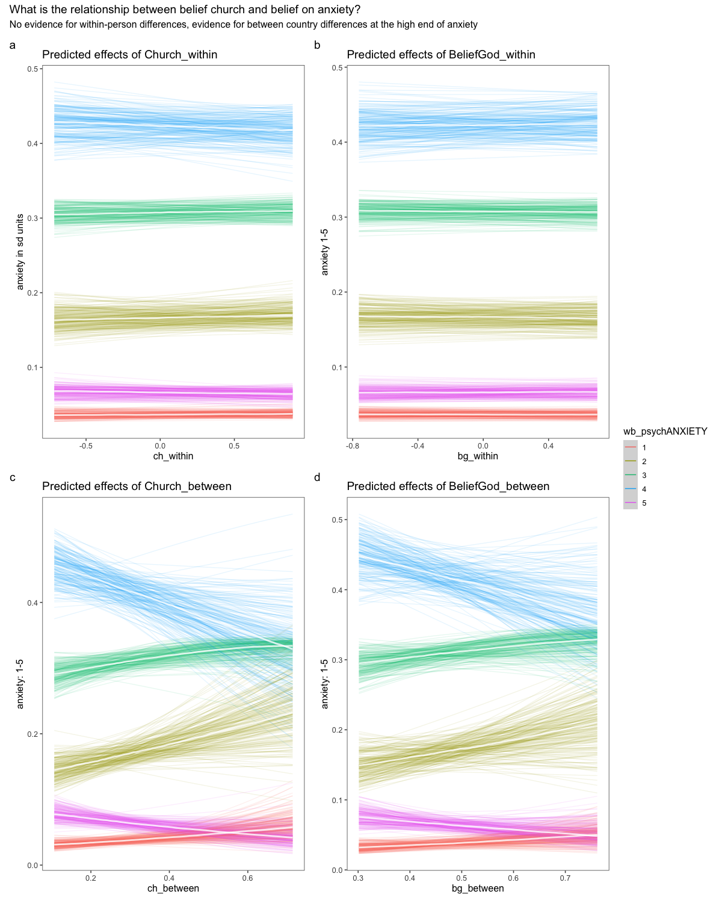

```{r setup, include=FALSE}
# setup
knitr::opts_chunk$set(
  echo = TRUE,
  warning = FALSE,
  message = FALSE,
  layout = "l-body-outset",
  fig.width= 12,
  fig.height= 10,
  collapse =TRUE,
  R.options = list(width = 60)
)
```

```{r  libraries}
### Libraries
library("tidyverse")
library("patchwork")
library("lubridate")
library("kableExtra")
library("gtsummary")
library("lubridate")
devtools::install_github("data-edu/tidyLPA")
if (!require(tidyLPA)) {
  install.packages("tidyLPA")
}


# installed from previous lectures
library("equatiomatic")
library("tidyverse")
library("ggdag")
library("brms")
library("rstan")
library("rstanarm")
# library("tidybayes")
library("bayesplot")
library("easystats")
library("kableExtra")
library("broom")
# rstan options
rstan_options(auto_write=TRUE)
options(mc.cores=parallel::detectCores ())
theme_set(theme_classic())
```

```{r  nzdata, cache=TRUE, include=FALSE}
# read data

nz_0 <- as.data.frame(readr::read_csv2(
  url(
    "https://raw.githubusercontent.com/go-bayes/psych-447/main/data/nzj.csv"
  )
))

# to relevel kessler 6 variables
f <-
  c(
    "None Of The Time",
    "A Little Of The Time",
    "Some Of The Time",
    "Most Of The Time",
    "All Of The Time"
  )

# get data into shape
nz <- nz_0 %>%
  dplyr::mutate_if(is.character, factor) %>%
  select(
    -c(
      SWB.Kessler01,
      SWB.Kessler02,
      SWB.Kessler03,
      SWB.Kessler04,
      SWB.Kessler05,
      SWB.Kessler06
    )
  ) %>%
  dplyr::mutate(Wave = as.factor(Wave)) %>%
  mutate(FeelHopeless = forcats::fct_relevel(FeelHopeless, f)) %>%
  mutate(FeelDepressed = forcats::fct_relevel(FeelDepressed, f)) %>%
  mutate(FeelRestless = forcats::fct_relevel(FeelRestless, f)) %>%
  mutate(EverythingIsEffort = forcats::fct_relevel(EverythingIsEffort, f)) %>%
  mutate(FeelWorthless = forcats::fct_relevel(FeelWorthless, f)) %>%
  mutate(FeelNervous = forcats::fct_relevel(FeelNervous, f)) %>%
  dplyr::mutate(Wave = as.factor(Wave)) %>%
  dplyr::mutate(male_id = as.factor(Male)) %>%
  dplyr::mutate(date = make_date(year = 2009, month = 6, day = 30) + TSCORE)%>%
  dplyr::filter(Wave == 2018)  # Filter wave 10 of the NZAVS

dplyr::glimpse(nz)
```

```{r figopen, echo=F}

```

## Objectives

1.  Understand why a linear model is a special case of a "generalised linear model."
2.  Understand how to write and interpret three families of generalised linear models:

-   logistic regression models, which apply to *binary* responses;
-   Poisson regression models, which apply to *rates*;
-   Zero-inflated poisson models, in which rates data contain an over-abundance of zeros. Here, we will also discuss over-dispersed poisson models.
<!-- -   Ordinal regression model, which apply to data with multi-nomial outcomes, for example survey responses (e.g. "little", "none", "more"). Here we will also discuss monotonic predictors. -->

## Introduction

Recall that a regression model combines data from a sample with the tools of probability theory to infer features of some unobserved population. We have discussing how the mechanics of moving from a sample to a population carries uncertainty. In a nutshell, regression is guesswork. Our task is to not to remove uncertainty but rather to quantify it. Our regression workflow is built on two imperatives: (1) to clarify our assumptions; (2) to clarify our decisions.


It is fortunate that we live in an ordered universe. Although at the level of particle physics, the universe might be random, at the scale of "medium-sized dry goods", to paraphrase J L Austen^[I think in *Sense and Sensibilia*?].

So far, our models have assumed that response data in our models are sampling from a normal distribution. There are two parameters that we need to estimate for a normal distribution, the mean, and the variance. The linear regression model is a special case of the generalised linear regression model, in which responses may sample from distributions other than the normal distribution.

## Generalised linear model implies a 'link' function

We can write our linear model in a different format, which makes its assumptions explicit (recall that we want to clarify our assumptions)"

$$
y_i \sim Normal ( \mu_i, \sigma)\\
\mu_i \sim \alpha + \beta x_i \\
\sigma \sim Exponentional (1) \\
$$


<aside>
The exponential distribution has good properties for estimating the standard deviation of the mean:

```{r}
exponential_distribution <- ( rexp(1000, 1) ) 
hist(exponential_distribution, breaks = 100)
```
see [here](https://cran.r-project.org/web/packages/brms/vignettes/brms_distreg.html#zero-inflated-models)
</aside>

Aside: In Bayesian estimation we often estimate the standard deviation of the mean $\sigma$ , however outside these circles people we describe the same parameter as the variance of the mean, or $\sigma^2$.

It doesn't really matter the parameters don't care how we express them. We can say, "Johannes is 2 meters tall," or we can say "Johannes is the square root of 4 meters tall" and his height will remain indifferent to our convention. So too, the world is indifferent to whether we write \$\\sigma\$ o r \$\\sigma\^2\$ 

The previous examples describes a regression model that assumes we are sampling from a normal distribution. There is no link function required to transform the expectation for the model estimates. If we are not sampling from a normal we require a link function. 

How do we know which distribution we are sampling from?  This, too, is a matter of uncertainty. We must clarify, and explore, and criticise our assumptions.

## Logistic regression


Let's begin an example. 

First let's graph the home ownership

```{r}
hist(nz$HomeOwner)
```

From the graph, we can see response distribution is fully bimodal (excluding the NAs).


### Link function for logistic regression


The model requires a binomial link function:

$$Home_i \sim Binomial (Ownership_i, Pr)$$

The binomial link function does two things:

-   first, it maps the range $(0, 1)$ to $-(\infty, -\infty)$.
-   second, it maps these values back to the unit range (see: @gelman2020 )

The logistic function satisfies the first task:

$logit(x) = log\frac{x}{(1-x)}$

and the inverse logit function does 2:

$logit^-1(x) = log\frac{e^x}{(1-e^x)}$

In R these functions are written:

```{r eval = FALSE}
logit <- qlogis 
invlogit <- plogis
```

For logistic regression, the functions are employed as follow:

$$
\Pr(y_i = 1) = p_i \\
logit(p_i) = \alpha + \beta x_i \\
\Pr(y_i = 1) = logit^{-1}(\alpha + \beta x_i)
$$

### Extimating the probability of home ownership in the population 

We can write a generalised linear model that predict home ownership as follows:

```{r}
home <- glm(HomeOwner ~ 1, data = nz, 
            family = "binomial")
```


Which gives us the following result

```{r}
parameters::model_parameters(home)
```

Or plugging this into the equation:

```{r eval = TRUE, include = TRUE}
# this is how to quickly generate the equation
equatiomatic::extract_eq(home,  use_coefs = TRUE)
```


### Intepretation

How do we interpret this result?

We can use the `plogis` function to obtain the probability

```{r}
plogis(coef(home)[[1]])
```

The probability of an NZAVS participant owning their own home is `r plogis(coef(home)[[1]])`


Notably, the logistic regression has estimated the sample mean to seven decimal places. 


```{r}
mean(nz$HomeOwner, na.rm=TRUE)
```

This might tempt you to think "why all the fuss?" 

What would a linear model return? 

```{r}
homeLM <- lm(HomeOwner ~ 1, data = nz)
```

And the estimate? 

```{r}
plogis(coef(homeLM)[[1]])
```

The linear model.  What is going on?  Let's consider a model with a covariate that predicts home ownership. 

 
## Logistic regression with a single co-variate.

### Workflow: center and scale continuous predictors

We do this as follows. 

```{r}
# work around for compatibility issue between ggeffects and dplyr. 
nz['Household.INC_s'] <- as.data.frame( scale(nz$Household.INC) )
```


To ge a reference point for a standard deviation of household income, let's find the standard deviation for the sample:

```{r}
# how much is a standard deviation -- which will represent a 1 unit change for the regression coefficient? 
sd( nz$Household.INC, na.rm = TRUE ) # 95,090
```

Let's ask about the mean household for income in 2018?

```{r}
mean( nz$Household.INC, na.rm = TRUE )
```

### Model syntax

We write a logistic regression model with a single covariate as follows:

```{r}
home2 <- glm(HomeOwner ~ Household.INC_s, data = nz, 
            family = "binomial")
```

Results:

```{r}
rs2<-parameters::model_parameters(home2)
rs2
plot(rs2)
```


```{r eval = TRUE, include = TRUE}
# this is how to quickly generate the equation
equatiomatic::extract_eq(home2,  use_coefs = TRUE)
```

### Interpretation

How do we interpret this model?

Let's use the report package

```{r}
report::report(home2)
```

There's lots of mention of p-values and power claims in the automated report, but what do these words practically mean?

### Workflow: graph your results.

We are cultivating a habit of graphing our results. Let's put this habit to virtuous use.

Here's a shortcut for obtaining a quick, investigative plot:

```{r}
plot(nz$Household.INC_s, nz$HomeOwner) 
curve(invlogit(coef(home2)[1] + coef(home2)[2]*x), add=TRUE)
```

The slightly longer syntax for a ggeffects graph is:

```{r}
plot(ggeffects::ggpredict(home2, terms = "Household.INC_s"), add.data = TRUE, alpha =.1)
```

And here we find a curious feature of our data. Income is diffuse. We have someone that makes over 25 standard deviations more than the average income.

```{r}
hist(nz$Household.INC, breaks = 1000)
```

Although we graph home ownership, we forgot to graph Household income.

**Before launching into a model, your workflow should include graphing your predictors as well as your responses**

The range of incomes is: `r range(nz$Household.INC, na.rm=TRUE)`.

Note that we also have `r sum(nz$Household.INC < 10000 , na.rm=TRUE)` who report making less than 10000,

#### Sensitivity of the data to outliers?

Let's re-run the model while eliminating the extremely rich, and restrict focus to 98% of the data. This restriction would appear to be justified. It would not be surprising if very rich people were to own their own homes.

```{r}
# Select 98 % of the range
nz2 <-  nz%>%
  dplyr::filter(Household.INC_s < 4)
##
nrow(nz2)/nrow(nz)
```

```{r}
home2.1 <- glm(HomeOwner ~ Household.INC_s, data = nz2, 
            family = "binomial")
parameters::model_parameters(home2.1)
```

Note that we need a sensible range. The lowest value is **not** 4 SD from the mean

```{r}
hist(nz2$Household.INC_s)
```

```{r}
range(nz2$Household.INC_s, na.rm = T)
```

Does this matter? Not necessarily. Linear regression does not require that the predictors sample from a normal distribution. This should be obvious, as we have used categorical predictors (e.g. Male/Not_Male). However it is worth explicitly stating. I have heard people who should know better express confusion on this point. Of course, that there are no parametric assumptions for your predictor variables does not let you off the hook. In this case, the extreme values might be distorting our inference.

Let's write a model with the diminished dataset.

```{r}
#range(nz$Household.INC_s, na.rm = T)

mp2 <- plot(ggeffects::ggpredict(home2,
                                 terms = "Household.INC_s[all]")) + scale_y_continuous(limits = c(0, 1)) +
  scale_x_continuous(limits = c(-1.2, 4))
mp2.1 <- plot(ggeffects::ggpredict(home2.1,
                                   terms = "Household.INC_s[all]")) + scale_y_continuous(limits = c(0, 1)) +
  scale_x_continuous(limits = c(-1.2, 4))

library(patchwork)
mp2 + mp2.1 + 
  plot_annotation(title = "Comparison of logistic regression models with tranformations",
                              tag_levels = 'a') 
```

Notice the trick that I used here:

`scale_x_continuous(limits = c(-1.2, 4))`

This code allowed me to constrain both graphs to the same x-axis scale. If I left this out the graphs would have looked like this:

```{r}
#range(nz$Household.INC_s, na.rm = T)

mp2 <- plot(ggeffects::ggpredict(home2,
                                 terms = "Household.INC_s[all]")) + scale_y_continuous(limits = c(0, 1)) 
mp2.1 <- plot(ggeffects::ggpredict(home2.1,
                                   terms = "Household.INC_s[all]")) + scale_y_continuous(limits = c(0, 1)) 

library(patchwork)
mp2 + mp2.1 + plot_annotation(title = "Comparison of logistic regression models with tranformations",
                              tag_levels = 'a') +
  plot_layout(guides = 'collect')
```

The models are for all intents and purposes identical.

You can perform further checks using the following code, however, it should be apparent from the preceding graph that the models two models do not vary.

```{r eval=FALSE}
check1 <- performance::check_model(home2)
check1
```

```{r eval=FALSE}
check2 <- performance::check_model(home2.1)
check2
```

Before leaving this example, what would an ordinary linear regression sampling from a normal distribution have returned? 

```{r}
home2LM <- lm(HomeOwner ~ Household.INC_s, data = nz)
home2LM_r <-parameters::model_parameters(home2LM)
home2LM_r
plot(home2LM_r)
```

Let's graph the results and compare the

```{r}
home2LM_p <- plot(ggeffects::ggpredict(home2LM,
                                   terms = "Household.INC_s[all]"),
                  add.data = TRUE) + 
  scale_y_continuous(limits = c(0, 2))  +
  scale_x_continuous(limits = c(-1.2, 4))+ theme_classic()
home2LM_p

home2_p <- plot(ggeffects::ggpredict(home2,
                                   terms = "Household.INC_s[all]"),
                  add.data = TRUE) + 
  scale_y_continuous(limits = c(0, 2))  +
  scale_x_continuous(limits = c(-1.2, 4))

home2LM_p + home2_p + plot_annotation(subtitle = "Comparison of ordinary least squares regression \n (a) with logistic regression (b) reveals n\ impossible predictions for OLS") +
  plot_layout(guides = "collect")
```


### Logistic regression with a categorical covariate

Let's use the `GenCohort` variable.

```{r}
mg1 <- glm(HomeOwner ~ GenCohort, data = nz, family = "binomial")
parameters::model_parameters(mg1)
```

What does this mean? Let's graph the results

```{r}
p_mg1 <-plot(ggeffects::ggpredict(mg1, terms = "GenCohort[all]"))
p_mg1
```

Lets stratify by income

Household.INC_s

```{r}
mg2 <- glm(HomeOwner ~ GenCohort + Household.INC_s, data = nz, family = "binomial")
parameters::model_parameters(mg2)
```

We really don't see income making a difference to home ownership for boomers. A little sepearation happens among those in Gen X.

```{r}
p_mg2 <-plot(ggeffects::ggpredict(mg2, terms = c("GenCohort[all]", "Household.INC_s[c(-1,0,3)]")))
p_mg2
```

### Notes

-   Additive indicators on the logit scale are *non-linear* on the data scale. We see this in the previous graph. There's a curve. This is typical of generalised linear models.

-   do not interpret the signs of the coefficients. For example, `plogis(-3)` is `r plogis(-3)`, which is a positive probability.

-   here are is no error term ($\sigma^2$) in logistic regression. We only estimate the mean. The variances cannot be estimated:

```{r}
sjPlot::tab_model(home2)
```

-   we can add points to our graph like this:

```{r}
plot(ggeffects::ggpredict(home2, 
                     terms = "Household.INC_s[all]"), add.data = TRUE) + scale_x_continuous(limits= c(-1.2,4))
```

Or to limit our points to the meaningful range:

```{r}
plot(ggeffects::ggpredict(home2, 
                     terms = "Household.INC_s[all]"), add.data = TRUE) + scale_x_continuous(limits= c(-1.2,4))
```

-   center (and where it eases interpretation, also scale) your predictor variables.

Uncertainty arises because we only have 17 people in this jittered nz dataset born after 1996:

```{r}
table(nz$GenCohort)
```

```{r}
ggplot(nz, (aes(GenCohort, Household.INC))) + geom_jitter(alpha = .5)
```

Which model should we prefer?

The model `mg2` grealy improves on the BIC performance, indicating that we should prefer this model.

```{r}
per_home <-performance::compare_performance(home2,mg1,mg2)
per_home
```

Here's a graph:

```{r}
plot(per_home)
```

Note that we do not include the model that used fewer cases because, from the vantage point of information theory, this would be comparing apples with organges.

We can use the performance package to check the accuracy of the our models

Compare:

```{r}
performance_accuracy(mg1)
```

With:

```{r}
performance_accuracy(mg2)
```

And this reveals little difference, indicating that with this many data, the outliers don't affect inference.


## Poisson regression (counts)


We use a poisson model for rates and counts

### Link function for poisson regression


$$
y_i \sim Poisson(\lambda_i)\\  
log(\lambda_i) = \alpha +\beta x_i\\
E(\lambda|y_i) = exp(\alpha +\beta x_i)
$$

Let's simulate some data (example from @gelman2020, for more on simulated poisson variables go [here](https://bookdown.org/rdpeng/rprogdatascience/simulation.html)

```{r}
set.seed(999)
n <- 50
x <- runif(n, -2, 2)
a <- 1
b <- 2
out <- a + b  * x
set.seed(999)
y <- rpois(n,  exp(out)) # mean of poisson is equal to its variance
fake <- data.frame(x=x, y=y)
hist(fake$y)
```

Model

```{r}
pois1 <- glm(y ~ x, data = fake, family = "poisson")
model_parameters(pois1)
```

Note that in a poisson model, it is the log of the expected values (not the log of the raw data) that the model estimates:

```{r eval = TRUE, include = TRUE}
# this is how to quickly generate the equation
equatiomatic::extract_eq(pois1,  use_coefs = TRUE)
```

We can put this on the data scale

```{r}
p_pois1 <- plot(ggeffects::ggpredict(pois1, terms = "x"), add.data = TRUE)
p_pois1
```

Let's compare this to a model in which we assume a normal distribution

```{r}
pois2 <- glm(y ~ x, data = fake) # remove "family = `poisson`)
model_parameters(pois2)
```

Quick plot:

```{r}
p_pois2 <- plot(ggeffects::ggpredict(pois2, terms = "x"), add.data = TRUE)
p_pois2
```

### Model checks

```{r}
performance::check_model(pois1)
```

We can see the linearity assumption is violated:

```{r}
performance::check_model(pois2)
```

```{r}
library(splines)

pois3 <- glm(y ~ bs(x), data = fake) # remove "family = `poisson`)
model_parameters(pois3)
```

```{r}
p_pois3<- plot(ggeffects::ggpredict(pois3, terms = "x"), add.data = TRUE)
p_pois3
```

```{r}
library(patchwork)
p_pois1 + p_pois2 + p_pois3 + plot_annotation(title = "comparison of three assumed distributions", tag_levels = 'a',
                                              subtitle = "The Poisson model (a) fits \nThe gaussian model (b) underfitsthe \nThe spline model (c) overfits") +
  plot_layout(guides = "collect")
```

The poisson fits best: this is no surprise: we simulated poisson outcomes.

```{r}
per_pois <-performance::compare_performance(pois1,pois2,pois3)
per_pois
plot(per_pois)
```

## Negative binomial models (over-dispersed Poissons)

### Link function for a negative binomial model 

$$
y_i \sim NegBinomial(\lambda_i,\phi)\\
log(\lambda_i) = \alpha +\beta x_i\\
\phi \sim gamma(.01,.01)
$$

Over dispersion in the rate parameter. 

<aside>
```{r}
gamma_distribution<-rgamma(1000,.01,.01)
hist(gamma_distribution, breaks = 100)
```
</aside>

The expected value of a poisson and the variance of poisson variable are the same: lamda. However often (typically) this assumption is violated, and the random variables in one's data set are over-dispersed.

To see this, lets simulate data with overdispersion

```{r}
library(MASS)
n <- 100
x <- runif(n, -2, 2)
a <- 1
b <- 2
out <- a + b  * x

set.seed(999)

y <- rnegbin(n,  mu =exp(out), theta = 2) # mean overdistribution parameter
fake2 <- data.frame(x=x, y=y)
hist(fake2$y, breaks = 50)

```

We fit a poisson model:

```{r}

nb1<- glm(y ~ x, family = poisson, fake2)
summary(nb1)
performance::check_overdispersion(nb1)

```

Try a negative binomial model

```{r}
nb2<- glm.nb(y ~ x,  data = fake2)
```

```{r}
compare_models(nb1,nb2)
```

```{r}
plot(ggeffects::ggpredict(nb1,terms="x"), add.data = TRUE)
```

```{r}
plot(ggeffects::ggpredict(nb2,terms="x"), add.data = TRUE)
```

It is clear both from the test statistics and the graphs, that the negative binomial model provides a better fit. 

How would a normal linear model do here? 

```{r}
lmnb<- lm(y ~ x,  fake2)
plot(ggeffects::ggpredict(lmnb,terms="x"), add.data = TRUE)
```


The answer is: not very well. 


## Zero-inflated poisson/ neg binomial regression


### Link function for zero-inflated poisson

$$
y_i \sim ZIPoisson(p_i, \lambda_i)\\
logit(p_i) = \alpha_p + \beta_p x_i \\
log(\lambda) = \alpha_\lambda + \beta\lambda x_i
$$

In the nz dataset, volunteering (hours of charity) look to be zero-inflated, and also over-dispersed.

```{r}
hist(nz$HoursCharity, breaks = 100)
```

We can quickly check the proportion of people who report zero volunteering:

```{r}
sum(nz$HoursCharity ==0, na.rm=TRUE)/nrow(nz)
```

We can get a sense of over-dispersion by looking at the ration of the sample variation to the sample mean?

```{r}
sd(nz$HoursCharity, na.rm=TRUE)/mean(nz$HoursCharity, na.rm=TRUE)^2
```

There's about 1.68 more dispersion that a poisson model would expect

Let's use the performance package to formally check both zero-inflation and overdispersed

```{r}
z1 <-glm(HoursCharity ~ 1, family = "poisson", data = nz)

check_zeroinflation(z1)
```

Next check over-dispersion:

```{r}
check_overdispersion(z1)
```

And indeed, we find both.

I use the `brms` package to estimate zero-inflated and/or negative binomial models


### Model syntax 

```{r}
library(brms)

# Requires integer output 
nz$HoursCharity <- as.integer(nz$HoursCharity)

# 
nz['Household.INC_s'] = as.data.frame(scale(nz$Household.INC))

# Scale religion variabile
nz['Relid_s'] = as.data.frame(scale(nz$Relid))

b0<- brms::brm(HoursCharity ~ Relid_s + Household.INC_s, 
                family = "zero_inflated_poisson",
                file = here::here("models", "zeroinflated_poisson_volunteer"), 
               data = nz)
```

```{r}
summary(b0)
```

My preferred way of plotting

Predicted effects of religious identification on volunteering:

```{r}
plot(
  conditional_effects(
    b0,
    spaghetti = TRUE,
    nsamples = 100,
    select_points = 0.1
  ),
  points = TRUE,
  point_args = list(alpha = 0.1,
                    width = .02)
)[[1]] #  note this command controls which facet 

```

Predicted effects of income:

```{r}
plot(
  conditional_effects(
    b0,
    spaghetti = TRUE,
    nsamples = 100,
    select_points = 0.1),
  points = TRUE,
  point_args = list(alpha = 0.1,
                    width = .02)
)[[2]] # note this command controls which facet 
```

```{r}
b1 <- brms::brm(HoursCharity ~ Relid_s + Household.INC_s, 
                family = "zero_inflated_negbinomial",
                file = here::here("models", "zeroinflated_neg_bin_volunteer"),
                data = nz)
```

```{r}
summary(b1)
```

Compare fit. Here, negative numbers are worse.

```{r cache = TRUE}
b0 <- add_criterion(b0, "loo")
b1 <- add_criterion(b1, "loo")

w <-loo_compare(b0, b1, criterion = "loo")
w
```

Recall we'd been using and AIC/BIC convention to estimate improvements in goodness of fit.

We can translate the `loo_compare` output into a `waic` convention as:

```{r}
cbind(waic_diff = w[, 1] * -2,
      se        = w[, 2] * 2)
```

And we can see that the negative binomial model fits much better.

### Predicting zeros

The estimates in the graphs above are only for the positive (non-zero components of the model). Let's look at the results again:

```{r}
summary(b1)
```

The probability of non-volunteering in the preferred model for people who are at the mean Religious Identification and mean Household income in this population is `plogis(.35)` or `r plogis(.35)`. More often than not, we should predict zeros in this population. What predicts the zero component of the model? We can use this syntax:

```{r}
b2 <- brms::brm(
  bf(HoursCharity ~ Relid_s + Household.INC_s, # note: use `bf` when you have more than one model, as we do here
     zi ~ Relid_s + Household.INC_s),
  family = "zero_inflated_negbinomial",
  file = here::here("models", "zeroinflated_nb_2_volunteer"),
  data = nz)
```

Let's look at the results:

```{r}
sjPlot::tab_model(b2)
```

###  Interpretation 

We can graph the results using ggeffects::

Religious identification:

```{r}
plot(ggeffects::ggpredict(b2, terms = c("Relid_s")), 
    add.data = TRUE,  # doesn't work
     dot.alpha = .2,  
     facet = TRUE)  + ylim(0, 5)
```

Household income:

```{r}
plot(ggeffects::ggpredict(b2, terms = c("Household.INC_s")), 
    add.data = TRUE,  # doesn't work
     dot.alpha = .2,  
     facet = TRUE)  + ylim(0, 5) +  xlim(0, 5)
```

Or using my preferred method

Predicted effects of religious identification:

```{r}
plot(
  conditional_effects(
    b2,
    spaghetti = TRUE,
    nsamples = 100,
    select_points = 0.1
  ),
  points = TRUE,
 point_args = list(alpha = 0.05,
                    width = .02),
 ask = FALSE
)  + # note this command controls which facet 
  ylim(0,5)

```

Note:

> Models of class brmsfit always condition on the zero-inflation component, if the model has such a component. Hence, there is no type = "zero_inflated" nor type = "zi_random" for brmsfit-models, because predictions are based on draws of the posterior distribution, which already account for the zero-inflation part of the model.

See [package description](https://strengejacke.github.io/ggeffects/reference/ggpredict.html)

Comparing models we find that adding the prdictors improves the model

```{r cache = TRUE}
b2 <- add_criterion(b2, "loo")

w <-loo_compare(b0, b1, b2,  criterion = "loo")
w
```

Again we can use an -2 \* loglik analogue

```{r}

cbind(waic_diff = w[, 1] * -2,
      se        = w[, 2] * 2)
```

Another way to see this is to look at the posterior predictive checks on the models

Zero-inflated poisson

```{r}
brms::pp_check(b0) + xlim(0, 5)
```

Zero-inflated negative binomial with no predictors for the zero-inflation part.

```{r}
brms::pp_check(b1) + xlim(0, 5)
```

Zero-inflated negative binomial + predictors for the zero-inflation part

```{r}
brms::pp_check(b2) + xlim(0, 5)
```


## Appendix{.appendix}

If you want to graph each predictor separately emply the `[[1]]` or `[[2]` syntax as follows:]


Predicted effects of religious identification

```{r}
plot(
  conditional_effects(
    b2,
    spaghetti = TRUE,
    nsamples = 100,
    select_points = 0.1
  ),
  points = TRUE,
  ask = TRUE,
  point_args = list(alpha = 0.05,
                    width = .02)
)[[1]]  + # note this command controls which facet
  ylim(0, 5)

```

Predicted effects of income:

```{r}
plot(
  conditional_effects(
    b2,
    spaghetti = TRUE,
    nsamples = 100,
    select_points = 0.1
  ),
  points = TRUE,
  ask = TRUE,
  point_args = list(alpha = 0.1,
                    width = .02)
)[[2]] + # note this command controls which facet
  xlim(0, 5) + ylim(0, 5)
```


Note that you can add additionally layers to these plots using the ggplot and patchwork syntax that we have been employing all along:

```{r}
b2_p1 <- plot(
  conditional_effects(
    b2,
    spaghetti = TRUE,
    nsamples = 100,
    select_points = 0.1
  ),
  points = TRUE,
  ask = TRUE,
  point_args = list(alpha = 0.1,
                    width = .02)
)[[1]]  + # note this command controls which facet
  ylim(0, 5) + labs(title = "Better title",
                                 subtitle = "better subtitle") +
  xlab("Religious Identification (SD units)") +
  ylab("Hours volunteering in the last week (reported)")
```


```{r}
b2_p2 <- plot(
  conditional_effects(
    b2,
    spaghetti = TRUE,
    nsamples = 100,
    select_points = 0.1),
  points = TRUE,
  ask = TRUE,
  point_args = list(alpha = 0.1,
                    width = .02)
)[[2]] + # note this command controls which facet
  xlim(0, 5) + ylim(0, 5)
```


```{r}
library("patchwork")
b2_p1 + b2_p2
```

## Appendix 2{.appendix2}

We have covered lots of ground today. The generalised linear models described here are the most commponplace. However there are many more. For those who are curious on how to estimated zero inflated binary data, I recommend Solomon Kurz's work [here](https://bookdown.org/ajkurz/Statistical_Rethinking_recoded/monsters-and-mixtures.html#zero-inflated-outcomes). 

## Acknowledgments and References

@gelman2020

@kurz2020

@bürkner2019
