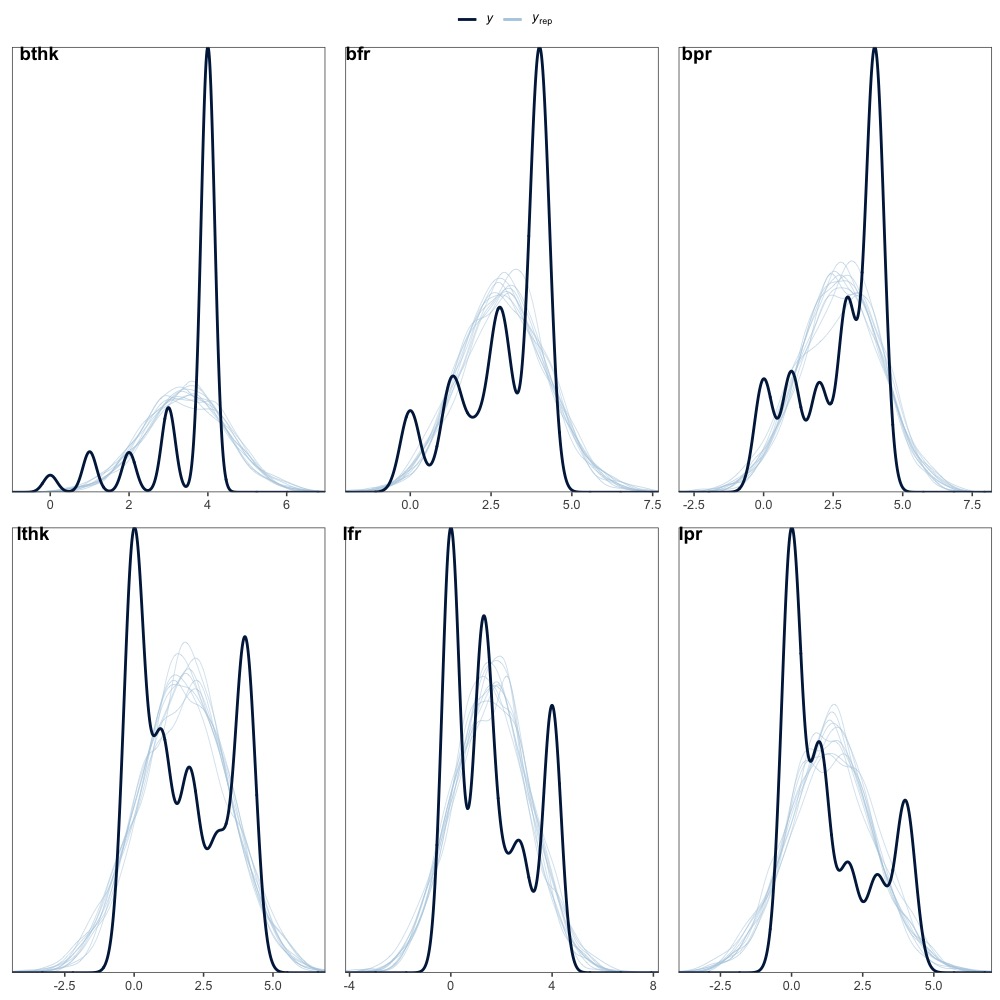

```{r load_libraries, include=FALSE}
# see: https://github.com/rjknell/Ioslides_css
library("tidyverse")
library("easystats")
library("patchwork")
library("kableExtra")
library("ggpubr")
#library("viridis")
#library("wesanderson")
# library("papaja")
library("here")
library("here")
library("brms")
library("rstan")
library("rstanarm")
# library("tidybayes")
library("lubridate")
library("ggdag")
library("viridisLite")
library("bmlm")
library("bayesplot")
library("broom")
library("purrr")
library("lme4")
library("ggeffects")
### Libraries
library("tidyverse")
library("patchwork")
library("lubridate")
library("kableExtra")
library("gtsummary")
library("lubridate")
# installed from previous lectures
library("equatiomatic")
library("tidyverse")
library("ggdag")
library("brms")
library("rstan")
library("rstanarm")
# library("tidybayes")
library("bayesplot")
library("easystats")
library("kableExtra")
library("broom")
# rstan options
rstan_options(auto_write=TRUE)
options(mc.cores=parallel::detectCores ())
theme_set(theme_classic())
#library("cmdstanr")  #multithreading bayesian models
# rstan options
rstan_options(auto_write=TRUE)
options(mc.cores=parallel::detectCores ())
theme_set(theme_classic())
```

```{r setup, include=FALSE}
# See: https://rstudio-pubs-static.s3.amazonaws.com/27777_55697c3a476640caa0ad2099fe914ae5.html#/
# setup
knitr::opts_chunk$set(
  echo = FALSE,
  warning = FALSE,
  message = FALSE #,
#  layout = "l-body-outset" #,
 # fig.width= 12,
 # fig.height= 10,
#  collapse =TRUE,
#  R.options = list(width = 60)
)
```

```{r  nzdata, cache=TRUE, include=FALSE}
# read data

nz_0 <- as.data.frame(readr::read_csv2(
  url(
    "https://raw.githubusercontent.com/go-bayes/psych-447/main/data/nzj.csv"
  )
))

# to relevel kessler 6 variables
f <-
  c(
    "None Of The Time",
    "A Little Of The Time",
    "Some Of The Time",
    "Most Of The Time",
    "All Of The Time"
  )

# get data into shape
nz <- nz_0 %>%
  dplyr::mutate_if(is.character, factor) %>%
  select(
    -c(
      SWB.Kessler01,
      SWB.Kessler02,
      SWB.Kessler03,
      SWB.Kessler04,
      SWB.Kessler05,
      SWB.Kessler06
    )
  ) %>%
  dplyr::mutate(Wave = as.factor(Wave)) %>%
  mutate(FeelHopeless = forcats::fct_relevel(FeelHopeless, f)) %>%
  mutate(FeelDepressed = forcats::fct_relevel(FeelDepressed, f)) %>%
  mutate(FeelRestless = forcats::fct_relevel(FeelRestless, f)) %>%
  mutate(EverythingIsEffort = forcats::fct_relevel(EverythingIsEffort, f)) %>%
  mutate(FeelWorthless = forcats::fct_relevel(FeelWorthless, f)) %>%
  mutate(FeelNervous = forcats::fct_relevel(FeelNervous, f)) %>%
  dplyr::mutate(Wave = as.factor(Wave)) %>%
  dplyr::mutate(male_id = as.factor(Male)) %>%
  dplyr::mutate(date = make_date(year = 2009, month = 6, day = 30) + TSCORE)%>%
  dplyr::filter(Wave == 2018)  # Filter wave 10 of the NZAVS

dplyr::glimpse(nz)
```

```{r figopen, echo=F}

```

## Generalised linear models

## Objectives

1. logistic regression models, which apply to *binary* responses;
2.  Poisson regression models, which apply to *rates*;
3. over-dispersed poisson models.
4. Zero-inflated poisson models, in which rates data contain an over-abundance of zeros.

## Introduction

Our regression workflow is built on two imperatives: 

(1) to clarify our assumptions; 
(2) to clarify our decisions.


## Linear regression: Fit a line 

$$
y_i \sim Normal ( \mu_i, \sigma)\\
\sigma \sim Exponentional (1) \\
\mu_i \sim \alpha + \beta x_i \\
\boldsymbol{\eta} =  \boldsymbol{\alpha} + \boldsymbol{X}\boldsymbol{\beta}\\
$$

## Generalised linear model implies a 'link' function


$g(\cdot)$ = link function
$h(\cdot) = g^-1(\cdot) $ = inverse link function

Where $(\cdot)$ is the linear predictor: $\mathboldsymbol{\eta}$

## Logistic regression

```{r}
hist(nz$HomeOwner)
```


## Link function for logistic regression


The model requires a binomial link function:

$$Home_i \sim Binomial (Ownership_i, Pr)$$

## The binomial link function does two things

-   first, it maps the range $(0, 1)$ to $-(\infty, -\infty)$.
-   second, it maps these values back to the unit range (see: @gelman2020 )

## The logistic function satisfies the first task:

$logit(\cdot) = log_e\frac{p}{(1-p)}$

##  The inverse logit functionsatisfies the second task:

$logit^-1(\cdot) = log\frac{e^\cdot}{(1-e^\cdot)}$

## We write this
$$
\Pr(y_i = 1) = p_i \\
logit(p_i) = \alpha + \beta x_i \\
\Pr(y_i = 1) = logit^{-1}(\alpha + \beta x_i)
$$


## Logistic regression model

```{r}
home <- glm(HomeOwner ~ 1, data = nz, 
            family = "binomial")
```


## Result

```{r}
parameters::model_parameters(home)
```

## Equation form 

```{r eval = TRUE, include = TRUE}
# this is how to quickly generate the equation
equatiomatic::extract_eq(home,  use_coefs = TRUE)
```


### Intepretation using `plogis`

```{r}
plogis(coef(home)[[1]])
```


# Logistic regression with a single co-variate.

## Workflow: center and scale continuous predictors

```{r}
# work around for compatibility issue between ggeffects and dplyr. 
nz['Household.INC_s'] <- as.data.frame( scale(nz$Household.INC) )
```


## Model syntax

```{r}
home2 <- glm(HomeOwner ~ Household.INC_s, data = nz, 
            family = "binomial")
```

## Results

```{r}
rs2<-parameters::model_parameters(home2)
rs2
plot(rs2)
```

## Equation form

```{r eval = TRUE, include = TRUE}
# this is how to quickly generate the equation
equatiomatic::extract_eq(home2,  use_coefs = TRUE)
```

### Interpretation not clear

```{r}
report::report(home2)
```

## Graph your results!

```{r}
plot(nz$Household.INC_s, nz$HomeOwner) 
curve(invlogit(coef(home2)[1] + coef(home2)[2]*x), add=TRUE)
```

## Alternative graph 

```{r}
plot(ggeffects::ggpredict(home2, terms = "Household.INC_s"), add.data = TRUE, alpha =.1)
```

## Spread of income

```{r}
hist(nz$Household.INC, breaks = 1000)
```

## Range of income

The range of incomes is: `r range(nz$Household.INC, na.rm=TRUE)`.


## Sensitivity to outliers?

```{r}
# Select 98 % of the range
nz2 <-  nz%>%
  dplyr::filter(Household.INC_s < 4)
##
nrow(nz2)/nrow(nz)
```

## Alternative model

```{r}
home2.1 <- glm(HomeOwner ~ Household.INC_s, data = nz2, 
            family = "binomial")
parameters::model_parameters(home2.1)
```

## Range of predictors 

```{r}
hist(nz2$Household.INC_s)
```

## Model with extreme values removed

```{r echo = FALSE}
#range(nz$Household.INC_s, na.rm = T)

mp2 <- plot(ggeffects::ggpredict(home2,
                                 terms = "Household.INC_s[all]")) + scale_y_continuous(limits = c(0, 1)) +
  scale_x_continuous(limits = c(-1.2, 4))
mp2.1 <- plot(ggeffects::ggpredict(home2.1,
                                   terms = "Household.INC_s[all]")) + scale_y_continuous(limits = c(0, 1)) +
  scale_x_continuous(limits = c(-1.2, 4))

library(patchwork)
mp2 + mp2.1 + 
  plot_annotation(title = "Comparison of logistic regression models with tranformations",
                              tag_levels = 'a') 
```


## Aside: a trick

`scale_x_continuous(limits = c(-1.2, 4))`

This code allowed me to constrain both graphs to the same x-axis scale. If I left this out the graphs would have looked like this:

```{r echo = FALSE}
#range(nz$Household.INC_s, na.rm = T)

mp2 <- plot(ggeffects::ggpredict(home2,
                                 terms = "Household.INC_s[all]")) + scale_y_continuous(limits = c(0, 1)) 
mp2.1 <- plot(ggeffects::ggpredict(home2.1,
                                   terms = "Household.INC_s[all]")) + scale_y_continuous(limits = c(0, 1)) 

library(patchwork)
mp2 + mp2.1 + plot_annotation(title = "Comparison of logistic regression models with tranformations",
                              tag_levels = 'a') +
  plot_layout(guides = 'collect')
```


## What if we used `lm`

```{r}
home2LM <- lm(HomeOwner ~ Household.INC_s, data = nz)
home2LM_r <-parameters::model_parameters(home2LM)
home2LM_r
plot(home2LM_r)
```

## Compare graphs

```{r}
home2LM_p <- plot(ggeffects::ggpredict(home2LM,
                                   terms = "Household.INC_s[all]"),
                  add.data = TRUE) + 
  scale_y_continuous(limits = c(0, 1.5))  +
  scale_x_continuous(limits = c(-1.2, 4))+ theme_classic()
home2LM_p

home2_p <- plot(ggeffects::ggpredict(home2,
                                   terms = "Household.INC_s[all]"),
                  add.data = TRUE) + 
  scale_y_continuous(limits = c(0, 1.5))  +
  scale_x_continuous(limits = c(-1.2, 4))

home2LM_p + home2_p + plot_annotation(subtitle = "Comparison of ordinary least squares regression \n (a) with logistic regression (b) reveals n\ impossible predictions for OLS") +
  plot_layout(guides = "collect")
```


## Logistic regression with a categorical covariate

```{r}
mg1 <- glm(HomeOwner ~ GenCohort, data = nz, family = "binomial")
parameters::model_parameters(mg1)
```


## Interpretation

```{r}
p_mg1 <-plot(ggeffects::ggpredict(mg1, terms = "GenCohort[all]"))
p_mg1
```

## Stratify by income

```{r}
mg2 <- glm(HomeOwner ~ GenCohort + Household.INC_s, data = nz, family = "binomial")
parameters::model_parameters(mg2)
```

## Results

```{r}
p_mg2 <-plot(ggeffects::ggpredict(mg2, terms = c("GenCohort[all]", "Household.INC_s[c(-1,0,3)]")))
p_mg2
```

<!-- ### Notes -->

<!-- -   Additive indicators on the logit scale are *non-linear* on the data scale. We see this in the previous graph. There's a curve. This is typical of generalised linear models. -->

<!-- -   do not interpret the signs of the coefficients. For example, `plogis(-3)` is `r plogis(-3)`, which is a positive probability. -->

<!-- -   here are is no error term ($\sigma^2$) in logistic regression. We only estimate the mean. The variances cannot be estimated: -->

<!-- ```{r} -->
<!-- sjPlot::tab_model(home2) -->
<!-- ``` -->


## Add data to graph

```{r}
plot(ggeffects::ggpredict(home2, 
                     terms = "Household.INC_s[all]"), add.data = TRUE) + scale_x_continuous(limits= c(-1.2,4))
```


## Counts in cells

```{r}
table(nz$GenCohort)
```

## Graph 

```{r}
ggplot(nz, (aes(GenCohort, Household.INC))) + geom_jitter(alpha = .5)
```

## Model selection
```{r}
per_home <-performance::compare_performance(home2,mg1,mg2)
per_home
```


## Graph 

```{r}
plot(per_home)
```

## Model accuracy: model 1

```{r}
performance_accuracy(mg1)
```

## Model accuracy: model 2

```{r}
performance_accuracy(mg2)
```


# Poisson regression (counts)


## Link function for poisson regression


$$
y_i \sim Poisson(\lambda_i)\\  
log(\lambda_i) = \alpha +\beta x_i\\
E(\lambda|y_i) = exp(\alpha +\beta x_i)
$$


## Example 

```{r}
set.seed(999)
n <- 50
x <- runif(n, -2, 2)
a <- 1
b <- 2
out <- a + b  * x
set.seed(999)
y <- rpois(n,  exp(out)) # mean of poisson is equal to its variance
fake <- data.frame(x=x, y=y)
hist(fake$y)
```

## Model syntax

```{r}
pois1 <- glm(y ~ x, data = fake, family = "poisson")
model_parameters(pois1)
```

## Results

```{r eval = TRUE, include = TRUE}
# this is how to quickly generate the equation
equatiomatic::extract_eq(pois1,  use_coefs = TRUE)
```


## Graph 

```{r}
p_pois1 <- plot(ggeffects::ggpredict(pois1, terms = "x"), add.data = TRUE)
p_pois1
```

## Compare with normal lm

```{r echo = TRUE}
# model
pois2 <- glm(y ~ x, data = fake) # remove "family = `poisson`)
# graph 
p_pois2 <- plot(ggeffects::ggpredict(pois2, terms = "x"),
                add.data = TRUE)
# render
p_pois2
```

# Splines
```{r}
library(splines)
pois3 <- glm(y ~ bs(x), data = fake) # remove "family = `poisson`)
p_pois3<- plot(ggeffects::ggpredict(pois3, terms = "x"), add.data = TRUE)
p_pois3
```

## Graph all three

```{r echo=FALSE}
library(patchwork)
p_pois1 + p_pois2 + p_pois3 + plot_annotation(title = "comparison of three assumed distributions", tag_levels = 'a',
                                              subtitle = "The Poisson model (a) fits \nThe gaussian model (b) underfitsthe \nThe spline model (c) overfits") +
  plot_layout(guides = "collect")
```

## Compare performance

```{r}
per_pois <-performance::compare_performance(pois1,pois2,pois3)
plot(per_pois)
```

# Negative binomial models (over-dispersed Poissons)

### Link function for a negative binomial model 

$$
y_i \sim NegBinomial(\lambda_i,\phi)\\
log(\lambda_i) = \alpha +\beta x_i\\
\phi \sim gamma(.01,.01)
$$


## Example data

```{r}
library(MASS)
n <- 100
x <- runif(n, -2, 2)
a <- 1
b <- 2
out <- a + b  * x

set.seed(999)

y <- rnegbin(n,  mu =exp(out), theta = 2) # mean overdistribution parameter
fake2 <- data.frame(x=x, y=y)
hist(fake2$y, breaks = 50)

```

## Fit model: poisson

```{r}
nb1<- glm(y ~ x, family = poisson, fake2)
performance::check_overdispersion(nb1)

```

## Model syntax: neg.bin

```{r}
nb2<- glm.nb(y ~ x,  data = fake2)
```

## Graph poisson

```{r}
#poisson
plot(ggeffects::ggpredict(nb1,terms="x"), add.data = TRUE)
```

## Graph negative binomial

```{r}
# neg binomial 
plot(ggeffects::ggpredict(nb2,terms="x"), add.data = TRUE)
```

## Linear model? 

```{r}
lmnb<- lm(y ~ x,  fake2)
plot(ggeffects::ggpredict(lmnb,terms="x"), add.data = TRUE)
```

# Zero-inflated poisson/ neg binomial regression


## Link function for zero-inflated poisson

$$
y_i \sim ZIPoisson(p_i, \lambda_i)\\
logit(p_i) = \alpha_p + \beta_p x_i \\
log(\lambda) = \alpha_\lambda + \beta\lambda x_i
$$


## Example: hours volutneering

```{r}
hist(nz$HoursCharity, breaks = 100)
```

## Proportion of non-volunteers

```{r}
sum(nz$HoursCharity ==0, na.rm=TRUE)/nrow(nz)
```

## Crude estimate of overdispersion

```{r}
sd(nz$HoursCharity, na.rm=TRUE)/mean(nz$HoursCharity, na.rm=TRUE)^2
```

There's about 1.68 more dispersion that a poisson model would expect


## Formal zero-inflation check

```{r}
z1 <-glm(HoursCharity ~ 1, family = "poisson", data = nz)
check_zeroinflation(z1)
```

## Formal overdispersion check

```{r}
check_overdispersion(z1)
```

## Model syntax (`brms package`)

```{r echo=FALSE}
# Requires integer output 
nz$HoursCharity <- as.integer(nz$HoursCharity)

# Scale religious id variabile
nz['Relid_s'] = as.data.frame(scale(nz$Relid))
```


```{r}
library(brms)
b0 <- brms::brm(
  HoursCharity ~ Relid_s + Household.INC_s,
  family = "zero_inflated_poisson",
  file = here::here("models", "zeroinflated_poisson_volunteer"),
  data = nz
)
```

## Results

```{r}
summary(b0)
```

## Predicted effects of religion  

```{r echo = FALSE}
plot(
  conditional_effects(
    b0,
    spaghetti = TRUE,
    nsamples = 100,
    select_points = 0.1
  ),
  points = TRUE,
  point_args = list(alpha = 0.1,
                    width = .02)
)[[1]] #  note this command controls which facet 
```

## Predicted effects of income:

```{r echo = FALSE}
plot(
  conditional_effects(
    b0,
    spaghetti = TRUE,
    nsamples = 100,
    select_points = 0.1),
  points = TRUE,
  point_args = list(alpha = 0.1,
                    width = .02)
)[[2]] # note this command controls which facet 
```

## Negative binomial zero-inflated model

```{r}
b1 <- brms::brm(HoursCharity ~ Relid_s + Household.INC_s, 
                family = "zero_inflated_negbinomial",
                file = here::here("models", "zeroinflated_neg_bin_volunteer"),
                data = nz)
```

## Results

```{r}
summary(b1)
```

## Compare models

```{r cache = TRUE}
b0 <- add_criterion(b0, "loo")
b1 <- add_criterion(b1, "loo")
w <-loo_compare(b0, b1, criterion = "loo")
w
```

## Translation

We can translate the `loo_compare` output into a `waic` convention as:

```{r}
cbind(waic_diff = w[, 1] * -2,
      se        = w[, 2] * 2)
```


## What predicts the zeros?

```{r}
summary(b1)
```
## Intepretation 

The probability of non-volunteering in the preferred model for people who are at the mean Religious Identification and mean Household income in this population is `plogis(.35)` or `r plogis(.35)`. More often than not, we should predict zeros in this population. What predicts the zero component of the model? We can use this syntax:

## ZI_NEGBIN Syntax


```{r}
b2 <- brms::brm(
  bf(HoursCharity ~ Relid_s + Household.INC_s, # note: use `bf` when you have more than one model, as we do here
     zi ~ Relid_s + Household.INC_s),
  family = "zero_inflated_negbinomial",
  file = here::here("models", "zeroinflated_nb_2_volunteer"),
  data = nz)
```

## Results

```{r}
sjPlot::tab_model(b2)
```

## Interpretation: relid

```{r}
plot(ggeffects::ggpredict(b2, terms = c("Relid_s")), 
    add.data = TRUE,  # doesn't work
     dot.alpha = .2,  
     facet = TRUE)  + ylim(0, 5)
```

## Interpretation: Household income

```{r}
plot(ggeffects::ggpredict(b2, terms = c("Household.INC_s")), 
    add.data = TRUE,  # doesn't work
     dot.alpha = .2,  
     facet = TRUE)  + ylim(0, 5) +  xlim(0, 5)
```


## Better graphs

```{r}
plot(
  conditional_effects(
    b2,
    spaghetti = TRUE,
    nsamples = 100,
    select_points = 0.1
  ),
  points = TRUE,
 point_args = list(alpha = 0.05,
                    width = .02),
 ask = FALSE
)  + # note this command controls which facet 
  ylim(0,5)

```

## Model selection 

```{r cache = TRUE}
b2 <- add_criterion(b2, "loo")

w <-loo_compare(b0, b1, b2,  criterion = "loo")
w
```

## Model Selection

```{r}

cbind(waic_diff = w[, 1] * -2,
      se        = w[, 2] * 2)
```


## Posterior predictive checks:poisson

```{r}
brms::pp_check(b0) + xlim(0, 5)
```

Zero-inflated negative binomial with no predictors for the zero-inflation part.


## Posterior predictive checks:zipoisson zinegbin

```{r}
brms::pp_check(b1) + xlim(0, 5)
```

## Posterior predictive checks: zinegbin

```{r}
brms::pp_check(b2) + xlim(0, 5)
```


## Appendix 1 {.appendix1}

If you want to graph each predictor separately emply the `[[1]]` or `[[2]` syntax as follows:]


Predicted effects of religious identification


```{r eval=FALSE}
b2_p1 <- plot(
  conditional_effects(
    b2,
    spaghetti = TRUE,
    nsamples = 100,
    select_points = 0.1
  ),
  points = TRUE,
  ask = TRUE,
  point_args = list(alpha = 0.1,
                    width = .02)
)[[1]]  + # note this command controls which facet
  ylim(0, 5) + labs(title = "Better title",
                                 subtitle = "better subtitle") +
  xlab("Religious Identification (SD units)") +
  ylab("Hours volunteering in the last week (reported)")
```


## Aside

```{r eval = FALSE}
b2_p2 <- plot(
  conditional_effects(
    b2,
    spaghetti = TRUE,
    nsamples = 100,
    select_points = 0.1),
  points = TRUE,
  ask = TRUE,
  point_args = list(alpha = 0.1,
                    width = .02)
)[[2]] + # note this command controls which facet
  xlim(0, 5) + ylim(0, 5)
```

```{r include = FALSE}
b2_p1 <- plot(
  conditional_effects(
    b2,
    spaghetti = TRUE,
    nsamples = 100,
    select_points = 0.1
  ),
  points = TRUE,
  ask = TRUE,
  point_args = list(alpha = 0.1,
                    width = .02)
)[[1]]  + # note this command controls which facet
  ylim(0, 5) + labs(title = "Better title",
                                 subtitle = "better subtitle") +
  xlab("Religious Identification (SD units)") +
  ylab("Hours volunteering in the last week (reported)")
b2_p2 <- plot(
  conditional_effects(
    b2,
    spaghetti = TRUE,
    nsamples = 100,
    select_points = 0.1),
  points = TRUE,
  ask = TRUE,
  point_args = list(alpha = 0.1,
                    width = .02)
)[[2]] + # note this command controls which facet
  xlim(0, 5) + ylim(0, 5)
```

## Plot 

```{r}
library("patchwork")
b2_p1 + b2_p2
```

 

## Acknowledgments and References

@gelman2020

@kurz2020

@bürkner2019

## Bibliography
