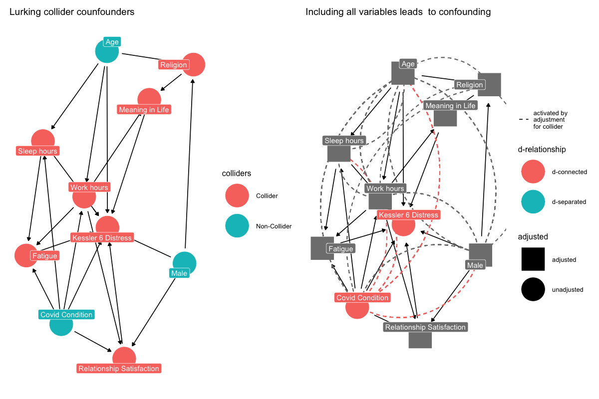

```{r echo=F}

```


```{r setup, include=FALSE}
# setup
knitr::opts_chunk$set(
  echo = TRUE,
  warning = FALSE,
  message = FALSE,
  layout = "l-body-outset",
  fig.width= 12,
  fig.height= 10,
  collapse =TRUE,
  R.options = list(width = 60)
)
```

```{r  libraries, echo=FALSE}
### Libraries
library("tidyverse")
library("ggplot2")
library("patchwork")
library("lubridate")
library("kableExtra")
library("gtsummary")
library("lubridate")
# installed from previous lectures
library("equatiomatic")
library("tidyverse")
library("ggdag")
library("brms")
library("rstan")
library("rstanarm")
# library("tidybayes")
library("bayesplot")
library("easystats")
library("kableExtra")
library("broom")
library("tidybayes")
library("bmlm")
if (!require(tidyLPA)) {
  install.packages("tidyLPA")
}
# rstan options
rstan_options(auto_write=TRUE)
options(mc.cores=parallel::detectCores ())
theme_set(theme_classic())
```

```{r  nzdata, cache=TRUE, include=FALSE}
# read data

nz_0 <- as.data.frame(readr::read_csv2(
  url(
    "https://raw.githubusercontent.com/go-bayes/psych-447/main/data/nzj.csv"
  )
))

# to relevel kessler 6 variables
f <-
  c(
    "None Of The Time",
    "A Little Of The Time",
    "Some Of The Time",
    "Most Of The Time",
    "All Of The Time"
)

# Relevel covid timeline longitudional
# ord_dates_class <- c(
#   "Baseline", 
#   "PreCOVID", 
#   "JanFeb", 
#   "EarlyMarch", 
#   "Lockdown",
#   "PostLockdown")

# Relevel covid timeline 2019
ord_dates_class_2019_only <- c("PreCOVID",
                               "JanFeb",
                               "EarlyMarch",
                               "Lockdown",
                               "PostLockdown")
# get data into shape
nz_cr <- nz_0 %>%
  dplyr::mutate_if(is.character, factor) %>%
  select(
    -c(
      SWB.Kessler01,
      SWB.Kessler02,
      SWB.Kessler03,
      SWB.Kessler04,
      SWB.Kessler05,
      SWB.Kessler06
    )
  ) %>%
  dplyr::mutate(Wave = as.factor(Wave)) %>%
  mutate(FeelHopeless = forcats::fct_relevel(FeelHopeless, f)) %>%
  mutate(FeelDepressed = forcats::fct_relevel(FeelDepressed, f)) %>%
  mutate(FeelRestless = forcats::fct_relevel(FeelRestless, f)) %>%
  mutate(EverythingIsEffort = forcats::fct_relevel(EverythingIsEffort, f)) %>%
  mutate(FeelWorthless = forcats::fct_relevel(FeelWorthless, f)) %>%
  mutate(FeelNervous = forcats::fct_relevel(FeelNervous, f)) %>%
  dplyr::mutate(Wave = as.factor(Wave)) %>%
  dplyr::mutate(male_id = as.factor(Male)) %>%
  dplyr::mutate(date = make_date(year = 2009, month = 6, day = 30) + TSCORE) %>%
  dplyr::mutate(
    FeelWorthless_int = as.integer(FeelWorthless),
    FeelNervous_int =  as.integer(FeelNervous),
    FeelHopeless_int =  as.integer(FeelHopeless),
    EverythingIsEffort_int =  as.integer(EverythingIsEffort),
    FeelRestless_int =  as.integer(FeelRestless),
    FeelDepressed_int =  as.integer(FeelDepressed),
    HLTH.Fatigue_int = as.integer(HLTH.Fatigue + 1)
  ) %>%
  dplyr::mutate(KESSLER6sum = as.integer(KESSLER6sum))


nz <- nz_cr %>%
  dplyr::filter(YearMeasured == 1) %>%
  dplyr::filter(Wave == 2019) %>%
  dplyr::group_by(Id) %>%
  dplyr::ungroup(Id) %>%
  dplyr::mutate(Covid_Timeline_cr =
                  as.factor(ifelse(
                    TSCORE %in% 3896:3921,
                    # feb 29 - march 25th
                    "EarlyMarch",
                    ifelse(
                      TSCORE %in% 3922:3954,
                      "Lockdown",
                      #march 26- Mon 27 April 2020
                      ifelse(
                        TSCORE > 3954,
                        # after april 27th 20202
                        "PostLockdown",
                        ifelse(TSCORE %in% 3842:3895,
                               # jan 6 to feb 28
                               "JanFeb",
                               "PreCOVID")
                      )
                    )
                  ))) %>%
  dplyr::mutate(
    Covid_Timeline_cr = forcats::fct_relevel(Covid_Timeline_cr, ord_dates_class_2019_only)
  )

dplyr::glimpse(nz)
table(nz$Covid_Timeline_cr)

## Long data #####################
ord_dates_class <- c(
  "Baseline", 
  "PreCOVID", 
  "JanFeb", 
  "EarlyMarch", 
  "Lockdown",
  "PostLockdown")


nzl <- nz_cr %>%
  dplyr::filter(YearMeasured == 1) %>%
  dplyr::filter(Wave == 2018 | Wave == 2019) %>%
  dplyr::group_by(Id) %>% 
  dplyr::filter(n() > 1) %>%
  dplyr::filter(n() != 0) %>%
  dplyr::ungroup(Id) %>%
  dplyr::mutate(Covid_Timeline =
                    as.factor(ifelse(
                      TSCORE %in% 3896:3921, # feb 29 - march 25th
                      "EarlyMarch",
                      ifelse(
                        TSCORE %in% 3922:3954,
                        "Lockdown", #march 26- Mon 27 April 2020
                        ifelse(
                          TSCORE > 3954, # after april 27th 20202
                          "PostLockdown",
                          ifelse(
                            TSCORE %in% 3842:3895, # jan 6 to feb 28
                            "JanFeb",
                          ifelse(
                            TSCORE %in% 3665:3841 &
                              Wave == 2019,
                            "PreCOVID",
                            "Baseline"  # 3672 TSCORE or  20 July 2019
                          )
                        )
                      )
                    ) 
                 ) ))%>%
  dplyr::mutate(
    Covid_Timeline = forcats::fct_relevel(Covid_Timeline, ord_dates_class))
table(nzl$Covid_Timeline)
```


## Ordinal outcomes


### Example 

An ordinal model assumes that an observed ordinal indicator measures a latent continuous out \cite{Burkner2019-ie,Hadfield2012-hi}. 


In our NZ-jitter dataset, the Kessler-6 has five ordinal response options for indicating frequency of feeling distress during the past 30 days: "None Of The Time", "A Little Of The Time", "Some Of The Time", "Most Of The Time", "All Of The Time" hence six thresholds. 

The Kessler-6 distress indicators are: "Feeling Hopelessness;" "Feeling so Depressed Nothing Could Cheer You Up;" "Feeling Nervous or Fidgety;" "Feeling Everything is an Effort;" "Feeling Worthless;" "Feeling Nervous." We simultaneously modelled each of these six outcomes within a single model. 


$$\begin{align}
y^k \sim \text{Ordered}(\mu_t^k) \\
\text{CumLogit}(\mu_t^k) = \alpha_t^k +\beta^k \\
\alpha_t^k = \alpha_{t0}^k +\alpha^k_c \\
\alpha_{t0}^k \sim \text{StudentT}(3,0,10)\\
\alpha_c^k \sim \text{StudentT}^+(3,0,10)\\
\boldsymbol{\beta^k}\sim \text{Normal}(0,1) 
\end{align}$$

Below, the superscript $k$ is denotes the $k = 1\dots6$ Kessler-6 outcomes. Residuals for cumulative categorical models are not identified, so are fixed to 1. $\alpha_{j0}^k$ denotes the $t = 1\dots 5$ intercepts estimated for the ordinal model, which assumed a cumulative logit distribution for the outcome, and where the lowest response level is modelled as zero, hence four intercepts are estimated for each Kessler- 6 response indicator. $$\mathbf{\beta}$$ denotes the individual-level predictors.

## Ordinal outcomes

```{r}
system.time(
  m1 <- brm(
    bf(HLTH.Fatigue_int  ~
      Covid_Timeline_cr),
    family = cumulative(link = "logit"),
    data = nz,
    file = here::here("models", "ordinal_fatigue"),
    silent = FALSE
  )

par_m1 <-parameters::model_parameters(m1)
par_m1
plot(par_m1)
```

Plot of the predicted effects, We can see changes in the response across the different time points, with reduction in higher level fatigue levels relative to lower fatigue levels during the New Zealand Covid Lockdown. 


Here is  a graph of using the ggeffects package, revealing that the movements where subtle, but evident, across the range of responses:

```{r}
plot(ggeffects::ggpredict(
  m1, 
  effects = "Covid_Timeline_cr")
  )
```


This is the graph using the BRMS package plotting features, setting "categorical" to FALSE. We only do this to show the average drop.


```{r}
plot(
  conditional_effects(
    m1,
   # spaghetti = TRUE,
   # nsamples = 100,
    categorical = FALSE,
   # select_points = 0.1,
    prob = 0.89,
    re_formula = NA,
  ),
  points = TRUE,
  point_args = list(alpha = 0.1,
                    width = .1,
                    size = .2)
) #
```


## Random intercept

```{r}
system.time(
  m1_l <- brm(
    bf(HLTH.Fatigue_int  ~
      Covid_Timeline + (1|Id),
    family = cumulative(link = "logit")),
    data = nzl,
    file = here::here("models", "ordinal_fatigue_longitudinal"),
    silent = FALSE
  )
)
summary(m1_l)
par_m1_l <-parameters::model_parameters(m1_l)
par_m1_l
plot(par_m1_l)

plot(
  conditional_effects(
    m1_l,
   # spaghetti = TRUE,
  #  nsamples = 100,
    categorical = F,
    prob = 0.89,
    re_formula = NA,
  ),
  points = TRUE,
  point_args = list(alpha = 0.1,
                    width = .02)
) #  note this command controls which facet 

plot(ggeffects::ggpredict(m1_l), add.data= F, dot.alpha = .1)
```


## Dispersional model 

```{r}
system.time(
  m_k6_s <- brm(
    bf(KESSLER6sum  ~
      Covid_Timeline + (1|Id)),
      data = nzl,
    file = here::here("models", "k6_longitudinal_gaussian"),
    silent = FALSE
  )
)

par_m_k6_s <-parameters::model_parameters(m_k6_s,dispersion = TRUE)
par_m_k6_s
plot(par_m_k6_s,  sort = TRUE) 

```


```{r}
system.time(m_k6_p <- brm(
  bf(KESSLER6sum  ~
       Covid_Timeline + (1 | Id),
     family = "poisson"),
  data = nzl,
  file = here::here("models", "k6_longitudinal_p"),
  silent = FALSE
))
summary(m_k6_p)
summary(m_k6_s0)

par_m_k6_p <-parameters::model_parameters(m_k6_p,dispersion = TRUE)
par_m_k6_p
plot(par_m_k6_p, sort = TRUE) 
plot(par_m_k6_s,  type = "fe", sort = TRUE, horizontal = TRUE) 

plot(
  conditional_effects(
    m_k6_p,
    spaghetti = TRUE,
    nsamples = 100,
    categorical = F,
    prob = 0.89,
    re_formula = NA
  ),
  points = TRUE,
  point_args = list(alpha = 0.1,
                    width = .02)
) # 


plot(
  conditional_effects(
    m_k6_s0,
    spaghetti = TRUE,
    nsamples = 100,
    categorical = F,
    prob = 0.89,
    re_formula = NA
  ),
  points = TRUE,
  point_args = list(alpha = 0.1,
                    width = .02)
) # 

plot(ggeffects::ggpredict(m_k6_p), add.data= TRUE, dot.alpha = .1)

```

```{r}
wg <- add_criterion(m_k6_s, "loo")
wp <- add_criterion(m_k6_p, "loo")

w <-loo_compare(wg, wp, criterion = "loo")
w
```


```{r}
brms::pp_check(m_k6_s) + xlim(0, 5)
```

```{r}
brms::pp_check(m_k6_p) + xlim(0, 5)
```


## Multivariate Outcomes 


```{r}
fit1 <- brm(
  mvbind(tarsus, back) ~ sex + hatchdate + (1|p|fosternest) + (1|q|dam),
  data = BTdata, chains = 2, cores = 2
)
```


##  Mediation

-   Manipulate X, measure M and Y
-   Regress M on X; Y on X and M

```{r, layout = "l-body-outset", cache =TRUE}
bmlm::mlm_path_plot(xlab = "Condition\n(X)",
              mlab = "Mediator\n(M)",
              ylab = "Distress\n(Y)")
```

## Assumptions

-   Y does not affect M
-   No 3rd variable on M to Y relationship
-   M is measured without error
-   Y and M residuals are not correlated [@vuorre2020multilevel]


## Set up

```{r echo = TRUE, eval = FALSE}
path_m <- bf(
  mF ~ x + (1 | c | id)
  )
path_y <- bf(
  y ~ x + mF_w + mF_b +
               (1 | c | id)
  )
m1 <- brm(
  path_m + path_y + set_rescor(FALSE),
  data = datF,
  file = here("models/mediation-k6-covid-fatigue")
)
```


## Model form 
```{r echo = FALSE}
x <-nzl$Covid_Timeline
mF <-nzl$HLTH.Fatigue_int
y<- nzl$KESSLER6sum
id <-nzl$Id
datF <-data.frame(x,mF, y,id)
```

```{r echo = FALSE}
path_m <- bf(
  mF ~ x + (1 | c |  id)
  )
path_y <- bf(
  y ~ x + mF +  (1 | c |  id)
  )
f1 <- brm(
  path_m + path_y + set_rescor(FALSE),
  data = datF,
  file = here::here("models/mediation-k6-covid-fatigue")
)

summary(f1)
```


```{r echo=FALSE, cache = FALSE}
post1F <- brms::posterior_samples(f1)
post_marF <- post1F %>% 
  transmute(
    a = b_mF_xLockdown,
    b = b_y_mF,
    cp = b_y_xLockdown,
    me = a * b,
    c = cp + me#,
   # pme = me / c
  )
# posterior_summary(post_marF)
```
```{r}
mcmc_intervals(post_marF)
```

## Hypothesis 

## Excercise: March vs. L4

```{r}
h1 <- c(
  a = "mF_xLockdown  = 0",
  b = "y_mF = 0",
  cp = "y_xLockdown = 0",
  me = "mF_xLockdown * y_xLockdown = 0",
  c = "mF_xLockdown * y_mF + y_xLockdown = 0"
)

plot(
  hypothesis(f1, h1)
)

```


## Ordinal Predictor


## Random Intercept 


## Bonus: Latent Profile Analysis

## Latent Profile Analysis

```{r  cache = TRUE}
library(tidyLPA)
# nzf<-nz %>%
#   select( FeelHopeless, 
#           FeelDepressed,
#           FeelRestless, 
#           EverythingIsEffort,
#           FeelWorthless, 
#           FeelNervous) %>%
#   mutate_if(., is.factor, ~ as.numeric(as.integer(.x)))

# convert to standard deviation units
out<-nz %>%
  dplyr::select(Hours.Internet, 
          Hours.Exercise,
       #   Hours.CompGames, 
       #   Hours.News,
          Hours.Work)%>%
  dplyr::mutate_all(., scale)

out%>%
  single_imputation() %>%
  tidyLPA::estimate_profiles(3) %>%
    plot_profiles(add_line = TRUE)
```
