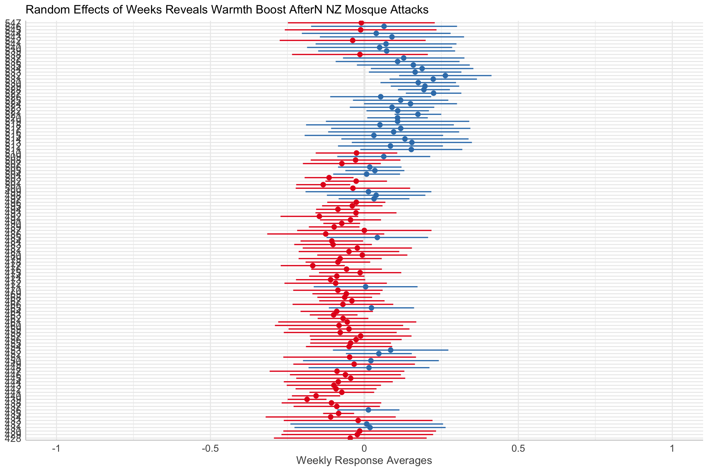

```{r echo=F}

```

## Ordinal outcomes

## Ordinal predictors (Monotonic effects)

<!-- \cite{Burkner2019-ie} and Liddell and Kruschke \cite{Liddell_undated-xr} in advising the use of ordinal models for non-metric data such as the Kessler-6 items. Here we employ a categorical model in which the observed variable y has a probability of being equal to response option + 1 latent thresholds. An ordinal model assumes that an observed ordinal indicator measures a latent continuous variable \cite{Burkner2019-ie,Hadfield2012-hi}. The Kessler-6 has five ordinal response options for indicating frequency of feeling distress during the past 30 days: "None Of The Time", "A Little Of The Time", "Some Of The Time", "Most Of The Time", "All Of The Time" hence six thresholds. The Kessler-6 distress indicators are: "Feeling Hopelessness;" "Feeling so Depressed Nothing Could Cheer You Up;" "Feeling Nervous or Fidgety;" "Feeling Everything is an Effort;" "Feeling Worthless;" "Feeling Nervous." We simultaneously modelled each of these six outcomes within a single model. Below, the superscript $k$ is denotes the $k = 1\dots6$ Kessler-6 outcomes. Residuals for cumulative categorical models are not identified, so are fixed to 1. $\alpha_{j0}^k$ denotes the $t = 1\dots 5$ intercepts estimated for the ordinal model, which assumed a cumulative logit distribution for the outcome, and where the lowest response level is modelled as zero, hence four intercepts are estimated for each Kessler- 6 response indicator. $$\mathbf{\beta}$$ denotes the individual-level predictors, in this case 'Employment' -->

$$\begin{align}
y^k \sim \text{Ordered}(\mu_t^k) \\
\text{CumLogit}(\mu_t^k) = \alpha_t^k +\beta^k \\
\alpha_t^k = \alpha_{t0}^k +\alpha^k_c \\
\alpha_{t0}^k \sim \text{StudentT}(3,0,10)\\
\alpha_c^k \sim \text{StudentT}^+(3,0,10)\\
\boldsymbol{\beta^k}\sim \text{Normal}(0,1) 
\end{align}$$

## Bonus: Latent Profile Analysis

## Latent Profile Analysis

```{r eval=FALSE}
nzf<-nz %>%
  select( FeelHopeless, 
          FeelDepressed,
          FeelRestless, 
          EverythingIsEffort,
          FeelWorthless, 
          FeelNervous) %>%
  mutate_if(., is.factor, ~ as.numeric(as.integer(.x)))

out<-nzf %>%
  dplyr::select( FeelHopeless, 
          FeelDepressed,
          FeelRestless, 
          EverythingIsEffort,
          FeelWorthless, 
          FeelNervous)%>%
  single_imputation() %>%
  tidyLPA::estimate_profiles(4)
out%>%
    plot_profiles(add_line = TRUE)
```
