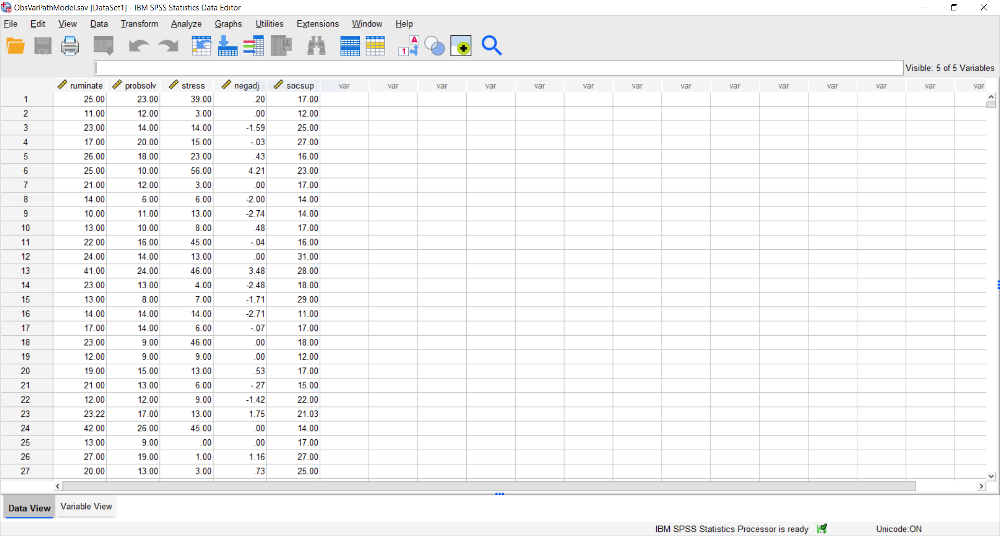

```{r setup, include=FALSE}
knitr::opts_chunk$set(
  echo = FALSE, cache = TRUE, fig.align = 'center'
)
```

```{r functions, include=F, message=F, warning=F}
library(tidyverse)
library(Rmisc)
library(linguisticsdown)
colorize <- function(x, color) {
  if (knitr::is_latex_output()) {
    sprintf("\\textcolor{%s}{%s}", color, x)
  } else if (knitr::is_html_output()) {
    sprintf("<span style='color: %s;'>%s</span>", color, 
      x)
  } else x
}
```

##  Who is this course for? 

For those of you who always wanted to learn R but never thought they could, this course is for you. 


## How will you benefit from this course?

You'll learn how to use R, and Github, and we'll teach you the fundamentals of statistics with a focus thinking not on rules. 

By the end of the course, you'll know how to:

Data skills:

 1. perform your data analysis in R
 2. document your analysis and collaborate in GitHub
 3. create a publication-ready article, with tables and graphs
 4. create a free personal website on github.
 
 Statistical skills:
 
 1. learn the importance of knowing your question
 2. learn how to collect data that bears on your question
 3. learn how to explore your data visually
 4. learn how to avoid common modelling pitfalls
 5. learn how to improve your inference using multi-level models 


## Our approach


This course is designed to develop your skills for independent learning.  Independent learning is important because research tools are constantly changing, To be an applied researcher requires a combination of **modelling skills**, **analytic skills**, **creativity**, and **reasoning**.  This is all in addition to the specialist scientific knowledge that forms the backbone of any scientific research programme.  

If these skills are the engine room of learning, it is an *interest* in learning, that will be essential to your progress in data science. We're both fascinated with learning, and it is this fascination that has motivated us to teach this course for you.  

To summarise this course is designed to provide you with basic understanding, useful tips, and some guide rails for learning. Our main task is to give you the confidence, and the inspiration, for independent learning.

## What is R? 

R is a free programming language and software environment for statistical computing (for download links see here: [Windows](https://cran.r-project.org/bin/windows/base/), [Mac](https://cran.r-project.org/bin/macosx/)). 

R is the brainchild of [Ross Ihaka](https://www.stat.auckland.ac.nz/~ihaka/) and [Robert Gentleman](https://en.wikipedia.org/wiki/Robert_Gentleman_(statistician). It was created at the University of Auckland, where Ross Ihaka remains a professor of statistics.


R was conceived to be a flexible language for data analysis usable by researchers. Since the initial beta release of R in  2000 the language has gained substantial popularity inside and outside of academia ([have a look at this blog post for an interesting analysis](https://stackoverflow.blog/2017/10/10/impressive-growth-r/)). New versions of R are released periodically and can be downloaded and installed to replace the older R version. 

## What is R Studio?

The are many ways for using R on your computer. For the purposes of getting started, we will be useing the Integrated Development Environment (IDE): [R Studio](https://rstudio.com/). 

R Studio provides an interface with a number of user-friendly options, including a separate console and editor that has various help and syntax-auto-complete functions, and various tools for plotting, history, data visualization, debugging and work space management. It is important to remember that R and R Studio are not the same thing. There are a wide range of alternative IDEs that allow you to run R code, such as [Atom](https://atom.io/), [Sublime](https://www.sublimetext.com/), or [Visual Studio Code](https://code.visualstudio.com/), but in this course we will use Rstudio as it is the most straightforward for beginners.

**Our goal this week is to teach you how to use R-Studio.**

## A quick walk through R Studio with Johannes Karl

<iframe width="560" height="315" src="https://www.youtube.com/embed/haYxa3vWA28" frameborder="0" allow="accelerometer; autoplay; clipboard-write; encrypted-media; gyroscope; picture-in-picture" allowfullscreen></iframe>

## Why quantitative psychology has to change (Why can't I use SPSS)

Quantitative psychology has long struggled with replicability of it's results both in substantive and also statistical areas. Concerns around these topics have already been raised on works by authors such as Joseph Banks Rhine the founder of modern parapsychology in the 1930s. Numerous authors, even at the time criticized both methods of the experiment and of the analysis [@gulliksenExtraSensoryPerceptionWhat1938]. In modern times, Deryl Bem's article "Feeling the Future" that reported evidence in favor of Extra Sensory Perception revived this debate and led to an increased uptake of Open Science methods. Importantly, this is not only an issue in psychology, but instead affects all quantitative fields such as [biology](https://journals.plos.org/plosbiology/article?id=10.1371/journal.pbio.3000246), [chemistry](https://www.fosteropenscience.eu/content/what-could-open-science-really-mean-chemistry), and [physics](https://ioppublishing.org/open-access-week-2019/open-science-and-open-physics/). Out of the many issues that are addressed as part of the open science movement (if you are interested in getting active in it have a look at [ANZORN](https://www.anzopenresearch.org/)) we will focus mostly on aspects of reproducability in analysis.  

Until recently IBMs SPSS (Statistical Package for the Social Sciences), which originally launched in 1968 dominated the research space in psychology. If you never had the fortune of working with SPSS this is what it looked like:


```{r spss-old, echo=F}

```

SPSS presented the user with a GUI (Graphical User Interface) through which they could run tests on their data. The big issue was that each statistical test has many different options researchers can choose (you will often hear people talk about researcher degrees of freedom) and a GUI makes it very difficult to accurately record every small setting a researcher has chosen. As a work around researchers could either store their output of the analysis which recorded some settings, but even for moderately complex analysis this output could stretch in the hundredth of pages. Alternatively, researchers could save the underlying code that SPSS used, but this was also very clunky and extremely arcane to understand. To give you a sense of scope below you see a snippet from a widely used analysis in SPSS aimed at examining the similarity of factor structures across groups. This code has a total of 130 lines that researchers would have needed to largely enter by hand and double check for any potential coding errors.

```{r spss-code, echo=F}
knitr::include_graphics("spss-code.PNG")
```


Additionally, some changes made by researchers were extremely difficult to account for. For example, when a researcher recoded a variable say reversing its direction there was no way of knowing that this had taken place if you later looked at the data set. Together with the rise in complex analysis in psychology this has led to a steady decline in the use of SPSS and most psychology departments, as well as private, and governmental stake holder now require a certain fluency in R or similar coding based languages.

<!-- ## Slide deck -->

<!-- Click [here](slides_1.html) to go to the slide deck. -->

<!-- ```{r embed-xaringan, layout="l-body-outset"} -->
<!-- xaringanExtra::embed_xaringan(url = "slides.html", ratio = "4:3") -->
<!-- ``` -->

## Workbook

Click [here](workbook_1.html) to go to this week's workbook


## Key Concepts


## Recommended reading

The three books cited in this lesson are all highly recommended readings. For beginners to Bayesian statistics, I recommend starting with Kruschke [-@kruschke2014], or McElreath [-@mcelreath2020]. Bayesian Data Analysis by Gelman et al. [-@gelman2013] is the definitive textbook on the topic, and recommended for more mathematically oriented and/or advanced readers.


