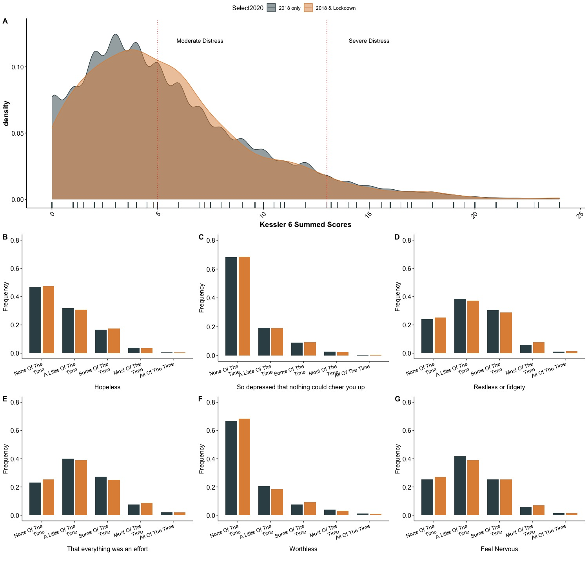

```{r echo =FALSE}

```

## Setup

### Libraries

```{r layout="l-body-outset"}
if (!require(skimr)) install.packages('skimr')
if (!require(lubridate)) install.packages('lubridate')
if (!require(tidyverse)) install.packages('tidyverse')
if (!requireNamespace("devtools")) {
  install.packages("devtools")
}
if (!require(easystats)) devtools::install_github("easystats/easystats")
if (!require(ggthemes)) install.packages('ggthemes')
if (!require(pmdplyr)) install.packages("pmdplyr")
if (!require(kableExtra)) install.packages("kableExtra")
# this should be part of easystats but in case not:
if (!require(report)) install.packages('report')
if (!require(brms)) install.packages('brms')
if (!require(lme4)) install.packages('lme4')
if (!require(table1)) install.packages('table1')
if (!require(modelsummary)) install.packages("modelsummary")
if (!require(naniar)) install.packages("naniar")
if (!require(ggraph)) install.packages("ggraph")
if (!require(gtsummary)) install.packages("gtsummary")
```

```{r eval=FALSE }
# You might need to run this
# easystats::install_easystats_latest()
```

### Import data

```{r  layout="l-body-outset"}
# read data
nz_0 <- 
  readr::read_csv2(
    url("https://raw.githubusercontent.com/go-bayes/psych-447/main/data/nz/nz.csv")
    )

# to relevel kessler 6 variables
f<-c("None Of The Time",
     "A Little Of The Time",
     "Some Of The Time",
     "Most Of The Time",
     "All Of The Time")

# get data into shape
nz <- nz_0 %>%
  dplyr::mutate_if(is.character, factor) %>%
  select(
    -c(
      SWB.Kessler01,
      SWB.Kessler02,
      SWB.Kessler03,
      SWB.Kessler04,
      SWB.Kessler05,
      SWB.Kessler06
    )
  ) %>%
  dplyr::mutate(Wave = as.factor(Wave)) %>%
  mutate(FeelHopeless = forcats::fct_relevel(FeelHopeless, f)) %>%
  mutate(FeelDepressed = forcats::fct_relevel(FeelDepressed, f)) %>%
  mutate(FeelRestless = forcats::fct_relevel(FeelRestless, f)) %>%
  mutate(EverythingIsEffort = forcats::fct_relevel(EverythingIsEffort, f)) %>%
  mutate(FeelWorthless = forcats::fct_relevel(FeelWorthless, f)) %>%
  mutate(FeelNervous = forcats::fct_relevel(FeelNervous, f)) %>%
  dplyr::mutate(Wave = as.factor(Wave)) %>%
  dplyr::mutate(date = make_date(year = 2009, month = 6, day = 30) + TSCORE) 
```

### Q1. Warmup

Using the `nz` dataset, make all the hours variables into integers

### Q2a. Scale, center, transform

Create a new indicator that standardises the `Pol.Orient` variable, create a new indicator that centers the `Pol.Orient` variable, create a new indicator that centres the `Age` variable in decade-long units. Do this in a single piped workflow.

**Print the head of the data frame so that we can see your work**

### Q2b Data wrangle

Select `Hour.Exercise` and filter Wave 2019.

### Q3. Working with dates

What are the maximum number of responses for a single day in 2018 and the maximum number of responses for a single day in 2019?

### Q4 Caculating dates and creating summaries

How many days are there between the date with the highest number of responses and the date with the second highest number of responses?

Bonus: Calculate difference between the number of responses on the highest response date and second highest response date.

### Q5. Working with date intervals

Suppose you were born on Dec 25, 1995 at 5.02:22 am Calculate your age in months on March 20,2021, at 1:22:04pm. (Hint use the `lubridate` package. Look up the `interval` function).

### Q6 Create an ordered factor from numeric data

The `Religion.Church` variable contains responses to the question: "How many times each month do you attend church or religious service?"

Create factor with the following three levels:

1.  People who attend church 0 times per month,
2.  People who attend church 1-3 times per month,
3.  People who attend church 4 or more times per month.

Make sure to re-level the factor so that the ordinal ranking moves from lowest to highest.

### Q7 Make a summary table

Using methods described in Lecture 4, create a table for average hours of sleep by month in the `nz` dataset

### Q7. Make a summary graph

Graph the average hours of sleep by month including 95% confidence intervals

Briefly explain why some intervals are wider than others.

### Q8. Correlation graph

Created a correlation graph for the items in the Kessler 6 scale

These are:

\-`FeelHopeless`, -`FeelDepressed`, -`FeelRestless`, -`EverythingIsEffort`, -`FeelWorthless`, -`FeelNervous`

Hint you must transform the factors into integers.

What do you find most interesting about this plot? Explain.

### Q9 Create a blank `papaja` report

Include your your name, affiliation, contributors and r packages used in your analysis

### Q10 `Patchwork`

Use the `patchwork` library to create a figure with two plots on top of each other. Use the `tag_levels` function to index each of the two plots. The graphs should describe some dimension of the truncated `nz` dataset.
